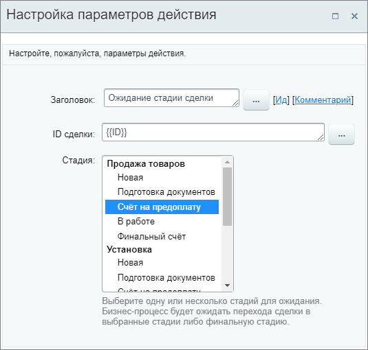

# Ожидание стадии сделки

**Навигация**
- [← Оглавление курса](index.md)
- [← Предыдущий: 23594 — Копировать элемент смарт-процесса](lesson_23594.md)
- [Следующий: 9007 — Ожидание статуса лида →](lesson_9007.md)

Официальная страница урока: https://dev.1c-bitrix.ru/learning/course/index.php?COURSE_ID=57&LESSON_ID=7399

Действие приостанавливает выполнение бизнес-процесса пока не будет достигнута указанная стадия сделки.

**Описание параметров**

**ID сделки** – идентификатор сделки. Для удобства можно использовать форму

			«Вставка значения»

                    При работе с бизнес-процессом в параметрах действий, параметрах шаблона и настройках статуса есть возможность указывать как собственный текст (заданный вручную), так и использовать различные переменные значения (поля документа и прочие данные, которые могут меняться и поэтому не задаются вручную). Для подстановки таких переменных значений используется специальная форма **Вставка значения**.

[Подробнее](lesson_12383.md)...

		.

**Стадия** – выберите одну или несколько стадий для ожидания. Бизнес-процесс будет ожидать перехода сделки в выбранные стадии (если не выбрана ни одна, то в любую

			финальную

                    В любую стадию из тех, что настроены в качестве финальных в воронке продаж. В канбане отображаются внизу при перетаскивании сделки. Подробнее об этом читайте в статье на [helpdesk.bitrix24.ru](https://helpdesk.bitrix24.ru/open/10621898/).

		).

**Важно**: Рекомендуется использовать это действие только для тех шаблонов бизнес-процессов, которые запускаются при добавлении (создании). При использовании действия "Ожидание стадии сделки" на изменение документа бизнес-процесс запускается при каждом изменении и останавливается в ожидании сделки. Таким образом создается несколько экземпляров БП (по количеству изменений), которые одновременно выполняются при достижении нужной стадии.

Пример заполнения: указан **ID сделки**, в которой запущен бизнес-процесс через форму «Вставка значения», и выбрана стадия из списка.

