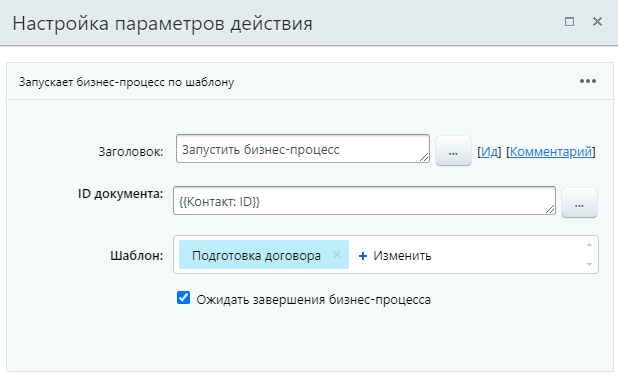
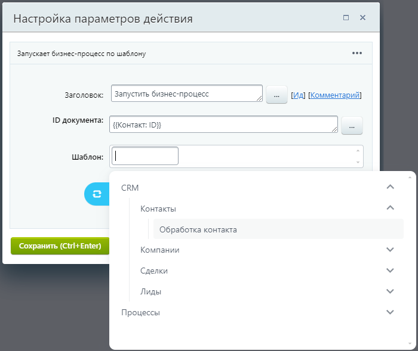
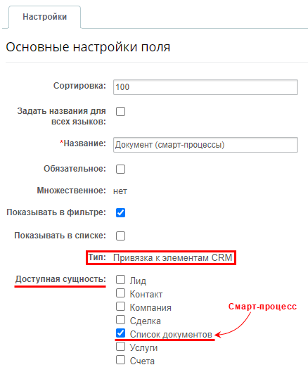
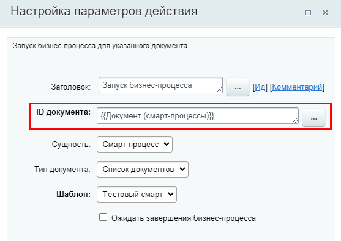
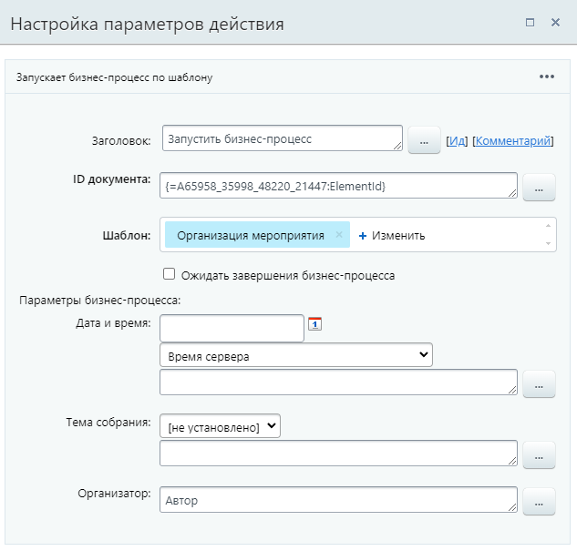
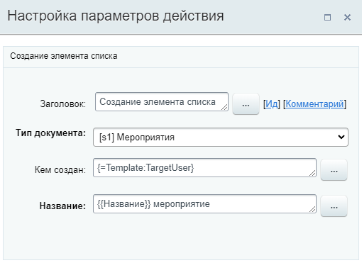

# Запустить бизнес-процесс

**Навигация**
- [← Оглавление курса](index.md)
- [← Предыдущий: 26760 — Запустить умный сценарий](lesson_26760.md)
- [Следующий: 3785 — Изменение документа →](lesson_3785.md)

Официальная страница урока: https://dev.1c-bitrix.ru/learning/course/index.php?COURSE_ID=57&LESSON_ID=7721

Действие запускает новый бизнес-процесс по шаблону.

### Параметры

- **ID документа** — идентификатор
  			документа
                      В системе все бизнес-процессы работают с документами (таким документом может быть файл, элемент инфоблока, элемент CRM) и их версиями. Для каждого документа (из инфоблока, списков или др.) существуют свои шаблоны бизнес-процессов. Поддерживаемые типы документов описаны в уроке [Общая информация](lesson_1708.md).
  		, для которого надо запустить бизнес-процесс. ID можно указать вручную или через форму
  			Вставка значения
                      При работе с бизнес-процессом в параметрах действий, параметрах шаблона и настройках статуса есть возможность указывать как собственный текст (заданный вручную), так и использовать различные переменные значения (поля документа и прочие данные, которые могут меняться и поэтому не задаются вручную). Для подстановки таких переменных значений используется специальная форма **Вставка значения**.
  [Подробнее](lesson_12383.md)...
  		.
  Приведём примеры, как заполнить это поле:

  - Из дополнительных результатов формы Вставка значения. Идентификаторы документов будут там, если в шаблоне используются такие действия, как
    			Создать элемент списка
                        Действие позволяет создать элемент указанного списка.
    [Подробнее](lesson_7122.md)...
    		,
    			Создание новой сделки
                        Действие аналогично действиям в публичной части CRM по созданию новой сделки.
    [Подробнее](lesson_3775.md)...
    		 или другое аналогичное действие;
  - Из параметра шаблона. Добавьте для шаблона параметр типа **привязка к элементам CRM** или **привязка к элементам списка**. Тогда привязанный в этом параметре документ станет доступен для добавления в поле ID документа;
  - Использовать связи текущего документа. Сущность CRM, для которой запущен текущий бизнес-процесс, может иметь связи с другими сущностями (контактами, компаниями и так далее).
- **Шаблон** — выберите какой шаблон бизнес-процесса использовать. Обратите внимание, выбирать нужно шаблон, подходящий для указанного выше документа. Если документ — Контакт из CRM, то и шаблон бизнес-процесса должен быть для
  			контактов
                      
  		;
- **Ожидать завершения бизнес-процесса** — бизнес-процесс дождётся выполнения запущенного им БП и только потом продолжит свое исполнение;
- **Параметры бизнес-процесса** — секция отобразится, если в выбранном шаблоне бизнес-процесса есть
  			параметры
                      Параметры используются для явного указания каких-либо значений во время исполнения бизнес-процесса и задаются пользователем, запустившим бизнес-процесс. Значения параметров запрашиваются непосредственно при запуске бизнес-процесса.
  [Подробнее](lesson_3816.md)...
  		 запуска.
  > **Совет.** Используйте параметры для передачи данных из исходного бизнес-процесса в запускаемый.

**Примечание.** В новом процессе автором будет тот же пользователь, что и в исходном бизнес-процессе.

### Запуск БП для элементов CRM

Запуск бизнес-процессов для связанных элементов CRM выполняется через поля документа формы Вставка значения. В качестве **ID документа** укажите ID связанного элемента CRM. Например, для сделки:

- ID привязанного контакта: `{{Контакт: ID}}`
- ID привязанной компании: `{{Компания: ID}}`
- ID привязанного лида: `{{Лид}}`

## Ранее для запуска бизнес-процесса над элементами CRM использовался специальный синтаксис

Приведенный ниже синтаксис работает как в старых версиях модулей, так и в актуальных:

- если процесс для **Компании**, то

  - `COMPANY_{=Document: ID}` - запустит БП для этой же компании;
  - `LEAD_{=Document: LEAD_ID}` - запустит бизнес-процесс для связанного лида.
- если процесс для **Контакта**, то

  - `CONTACT_{=Document: ID}` - запустит БП для этого же контакта;
  - `LEAD_{=Document: LEAD_ID}` - запустит бизнес-процесс для связанного лида.
- если процесс для **Сделки**, то

  - `DEAL_{=Document: ID}` - запустит БП для этой же сделки;
  - `LEAD_{=Document: LEAD_ID}` - запустит БП для связанного лида;
  - `CONTACT_{=Document: CONTACT_ID}` - запустит БП для связанного контакта;
  - `COMPANY_{=Document: COMPANY_ID}` - запустит бизнес-процесс для связанной компании.
- если процесс для **Лида**, то

  - `LEAD_{=Document: ID}` - запустит бизнес-процесс для этого же лида.

Описанный выше способ запуска через поля документа на текущий момент подходит только для Лидов, Контактов, Компаний и Сделок. Для привязанного элемента Cмарт-процесса или Cчета запустить бизнес-процесс тоже можно, но

			другим способом

                    Т.к. идентификаторы этих элементов отсутствуют в полях документа в шаблоне бизнес-процесса.

		. Потребуется создать специальное

			пользовательское поле

                    Каждый элемент CRM имеет стандартный набор полей, однако у каждого бизнеса есть свои особенности и информация, которую необходимо сохранить. Поэтому вы можете создать дополнительные пользовательские поля - они аналогичны стандартным, по ним так же можно искать и фильтровать элементы.

Подробнее на [helpdesk.bitrix24.ru](https://helpdesk.bitrix24.ru/open/5488795/).

		 типа **Привязка к элементу CRM**, значение которого будет использоваться в дальнейшем в действии.

## Пример: рассмотрим алгоритм действий на примере Сделки и связанным с ней элементом Смарт-процесса

- Создайте в карточке Сделки пользовательское поле типа **Привязка к элементу CRM**:
  
- В карточке Сделки в созданном поле добавьте привязку к нужному элементу Смарт-процесса;
- Новое поле автоматически станет доступно в шаблоне бизнес-процесса в полях документа (формы Вставка значения);
- Вставьте значение поля в параметр **ID документа** действия **Запуск бизнес-процесса** и выберите шаблон БП для смарт-процессов:
  

### Результаты выполнения действия и пример

В результате выполнения действия в секции **Дополнительные результаты** формы **Вставка значения** станет доступен **ID запущенного БП**.

#### Пример

В примере в качестве ID документа добавлен элемент процесса, созданный ранее действием

			Создать элемент списка

                    

		. Выбранный шаблон **Организация мероприятия** имеет три необязательных параметра запуска. При необходимости их можно заполнить.
