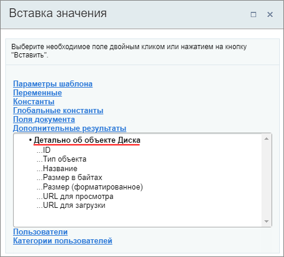
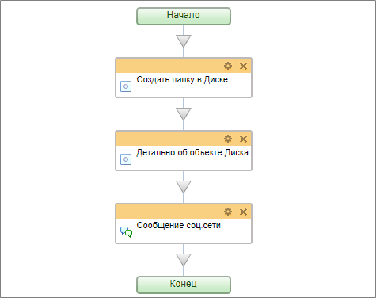
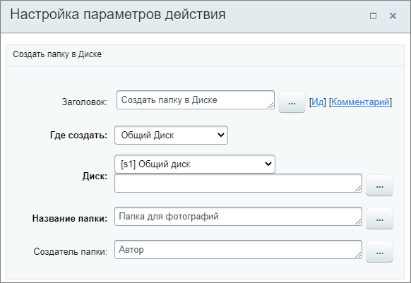
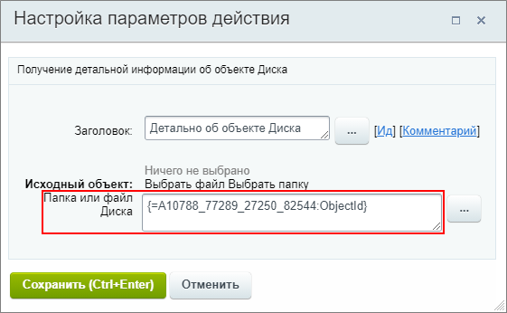
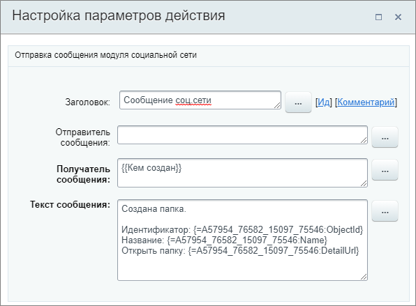
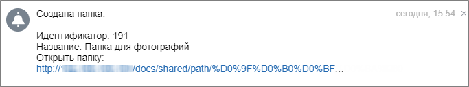

# Детально об объекте Диска

**Навигация**
- [← Оглавление курса](index.md)
- [← Предыдущий: 23584 — Удалить элемент CRM](lesson_23584.md)
- [Следующий: 7727 — Загрузить в Диск →](lesson_7727.md)

Официальная страница урока: https://dev.1c-bitrix.ru/learning/course/index.php?COURSE_ID=57&LESSON_ID=7725

Действие позволяет получить детальную информацию об объекте. Полученная информация используется в качестве дополнительных результатов для других действий.

### Описание параметров

- **Исходный объект** – существующие файл или папка на диске, информацию о которых необходимо получить. Для выбора доступны только один файл или одна папка;
- **Папка или файл Диска** – вместо выбора исходного объекта выше, в этом параметре можно указать ID папки или файла диска, созданных ранее другим действием в этом же бизнес-процессе. Например, с помощью действия
  			Загрузить в Диск
                      Действие загружает файл в хранилище Диска.
  [Подробнее](lesson_7727.md)...
  		 или
  			Создать папку в Диске
                      Действие создает папку в Диске.
  [Подробнее](lesson_7735.md)...
  		.

### Результаты выполнения действия

Результаты выполнения этого действия можно получить с помощью формы **Вставка значения** – **Дополнительные результаты**, в которой они будут доступны  сразу после добавления действия в шаблон.

Доступно:

- ID;
- Тип объекта;
- Название;
- Размер в байтах;
- Размер (форматированное);
- URL для просмотра;
- URL для загрузки.

### Пример

В качестве примера рассмотрим работу со вторым параметром действия **Папка или файл Диска**. Пусть наш простой бизнес-процесс сначала создаст новую папку на Общем диске c названием Папка для фотографий, а затем пришлет в уведомлении информацию об этой папке и ссылку на её просмотр.

Шаблон бизнес-процесса нашего примера состоит их

			трёх действий

                    

		: Создать папку в Диске, Детально об объекте Диска и

			Сообщение соц.сети

                    Действие отправляет уведомление модуля социальной сети.

[Подробнее](lesson_3804.md)...

		.

Действие

			Создать папку в Диске

                    

		 создаст папку, затем в действии **Детально об объекте Диска** станет доступен выбор ID этой папки в дополнительных результатах:

Добавим получение более полной информации по вновь созданной папке из дополнительных результатов в уведомление:

Результат выполнения бизнес-процесса:

