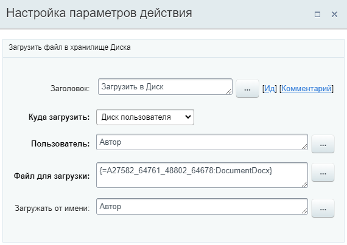

# Загрузить в Диск

**Навигация**
- [← Оглавление курса](index.md)
- [← Предыдущий: 7725 — Детально об объекте Диска](lesson_7725.md)
- [Следующий: 7733 — Загрузить новую версию в Диск →](lesson_7733.md)

Официальная страница урока: https://dev.1c-bitrix.ru/learning/course/index.php?COURSE_ID=57&LESSON_ID=7727

Действие загружает файл в хранилище Диска.

**Описание параметров**

**Куда загрузить** – куда именно нужно загрузить файл. Возможны следующие варианты:

- **Диск пользователя** – в этом случае так же указывается и пользователь, в диск которого будет загружаться файл;
- **Диск группы соцсети** – загрузка в диск указанной группы;
- **Общий диск** – загрузка в выбранный общий диск;
- **Папка диска** – загрузка в указанную папку на Диске.

**Файл для загрузки** – необходимо указать загружаемый файл. Сделать это можно:

- С помощью формы
  			«Вставка значения»
                      При работе с бизнес-процессом в параметрах действий, параметрах шаблона и настройках статуса есть возможность указывать как собственный текст (заданный вручную), так и использовать различные переменные значения (поля документа и прочие данные, которые могут меняться и поэтому не задаются вручную). Для подстановки таких переменных значений используется специальная форма **Вставка значения**.
  [Подробнее](lesson_12383.md)...
  		. Например, из
  			параметра
                      Файл добавляется при запуске БП.
  		 или файл, созданный ранее
  			действием
                      К примеру, DOCX файл из доп. результатов действия [Создание документа CRM](lesson_20776.md).
  		 бизнес-процесса;
- Прямой ссылкой на файл. Просто добавьте ссылку на файл для загрузки его на Диск. Например: https://dev.1c-bitrix.ru/images/portal_user/bizproc/ask_parameters.png.

**Загружать от имени** – от чьего имени будет загружен файл на диск.

#### Результаты выполнения действия

Результаты выполнения этого действия можно получить с помощью формы «Вставка значения» – **Дополнительные результаты**, в которой они будут доступны  сразу после добавления действия в шаблон.

Доступно:

- ID файлов Диска;
- URL для просмотра;
- URL для загрузки.
