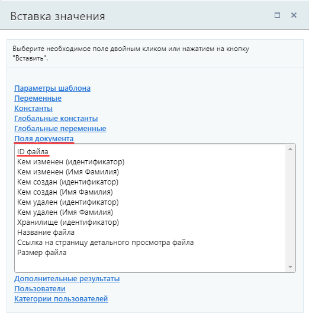
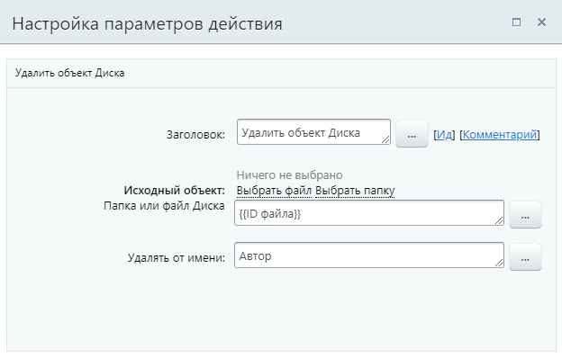

# Удалить объект Диска

**Навигация**
- [← Оглавление курса](index.md)
- [← Предыдущий: 7735 — Создать папку в Диске](lesson_7735.md)
- [Следующий: 3806 — PHP код →](lesson_3806.md)

Официальная страница урока: https://dev.1c-bitrix.ru/learning/course/index.php?COURSE_ID=57&LESSON_ID=7729

Действие удаляет объект Диска.

#### Описание параметров

- **Исходный объект** (Папка или файл Диска) – файл или папка, которые должны быть удалены (перемещены в корзину). Доступен диалог прямого выбора с диска или добавление переменного
  			значения
                      Действие ожидает идентификатор ID объекта.
  		 через форму
  			«Вставка значения»
                      При работе с бизнес-процессом в параметрах действий, параметрах шаблона и настройках статуса есть возможность указывать как собственный текст (заданный вручную), так и использовать различные переменные значения (поля документа и прочие данные, которые могут меняться и поэтому не задаются вручную). Для подстановки таких переменных значений используется специальная форма **Вставка значения**.
  [Подробнее](lesson_12383.md)...
  		. Действием можно удалить только один объект;
- **Удалять от имени** – от имени какого пользователя будет удален файл.

#### Пример

Пусть у нас есть бизнес-процесс, который запускается при добавлении нового файла в общий диск. Тогда в шаблоне можно использовать действие Удалить объект Диска, например, для удаления файла в конце процесса. На скриншоте ниже в качестве исходного объекта указан

			файл

                    

		, для которого запущен бизнес-процесс.

Другие примеры исходного объекта из формы «Вставка значения»:

- доп. результат **ID файлов Диска** действия
  			Загрузить в Диск
                      Действие загружает файл в хранилище Диска.
  [Подробнее](lesson_7727.md)...
  		. Подойдет для удаления файла, ранее добавленного бизнес-процессом;
- доп. результат **ID папки Диска** действия
  			Создать папку в Диске
                      Действие создает папку в Диске.
  [Подробнее](lesson_7735.md)...
  		. Подойдет для удаления папки, ранее созданной бизнес-процессом.
