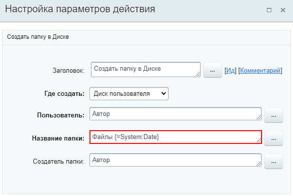
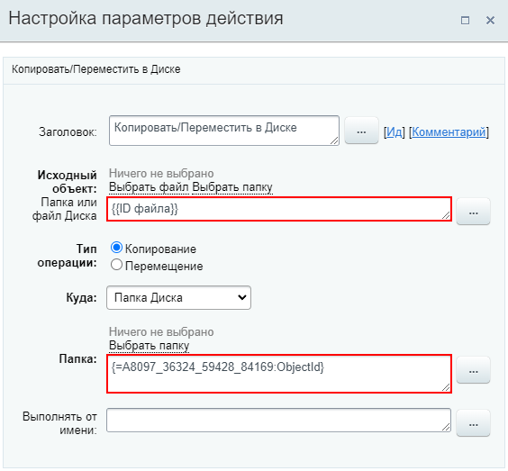
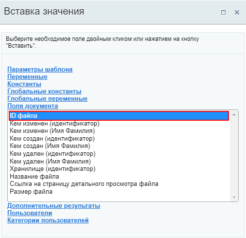
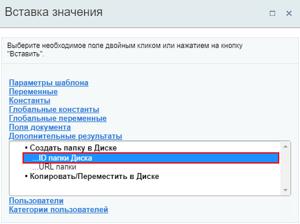
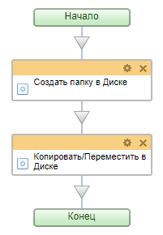

# Копировать/Переместить в Диске

**Навигация**
- [← Оглавление курса](index.md)
- [← Предыдущий: 7733 — Загрузить новую версию в Диск](lesson_7733.md)
- [Следующий: 7735 — Создать папку в Диске →](lesson_7735.md)

Официальная страница урока: https://dev.1c-bitrix.ru/learning/course/index.php?COURSE_ID=57&LESSON_ID=7731

Действие позволяет копировать элементы или перемещать их в Диске.

### Описание параметров

- **Исходный объект** – файл или папка, которые будут скопированы;
- **Папка или файл Диска** – можно указать дополнительные данные для действия, например ID созданной ранее папки;
- **Тип операции** – какая операция будет производиться: **Перемещение** или **Копирование**.
- **Куда** – куда будет произведено копирование/перемещение. Возможны следующие варианты:

  - **Диск пользователя** – в этом случае так же указывается и **Пользователь** в, диск которого будет загружаться файл;
  - **Диск группы соцсети** – файл будет загружен в диск указанной **Группы**;
  - **Общий диск** – файл будет загружаться в выбранный общий **Диск**;
  - **Папка диска** – необходимо указать **Папку**, в которую будет загружен файл.
- **Выполнять от имени** – от чьего имени будет выполняться операция.

### Пример работы с действием

**Задача**: копировать все файлы, которые загружаются в **Общий диск** пользователем, в его личную папку. Каждый день для этих целей должна создаваться новая папка с датой в названии, но только если пользователь загружает файлы.

Шаблон для ознакомления: [Скачать](/images/admin_expert/bizproc/activities/bp-disk-1.bpt).

Создадим в бизнес-процессах Общего

			диска

                    Бизнес-процессы на диске организуют автоматическую обработку файлов.
Подробнее на [helpdesk.bitrix24.ru](https://helpdesk.bitrix24.ru/open/5505017/).

		 новый шаблон последовательного бизнес-процесса. Для создания новой папки используем действие

			Создать папку в Диске

                    Действие создает папку в Диске.
[Подробнее](lesson_7735.md)...

		:

Новая папка будет создавать в Диске пользователя, запустившего бизнес-процесс (Автора). В название создаваемой папки подставится текущая дата. При этом если папка с таким названием уже будет существовать, новая создаваться не будет.

Следующим добавим действие **Копировать/переместить в папку Диска**:

Исходным объектом, который нужно скопировать, является загружаемый файл. Добавляем его через форму

			Вставка значения

                    

		. А в качестве папки, в которую будем копировать файлы, укажем

			ранее созданную

                    

		 папку.

В результате получим такой простой шаблон:

Таким образом, при загрузке файла в **Общий диск**, будет автоматически запущен бизнес-процесс, который скопирует загружаемый файл в указанную папку на личном диске пользователя. При этом если папка с текущей датой уже существует, файл будет скопирован в существующую папку.
