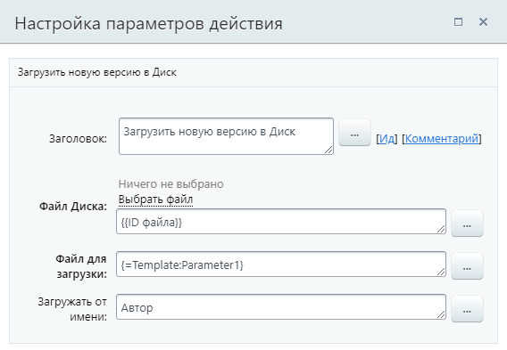
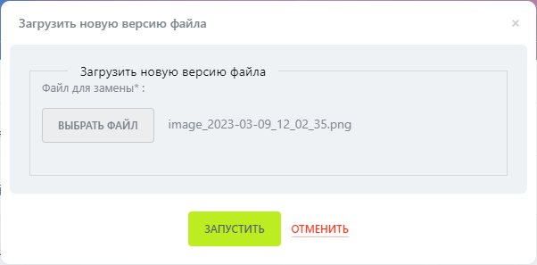
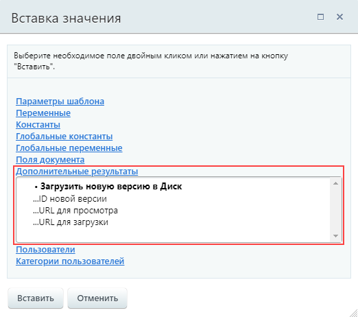
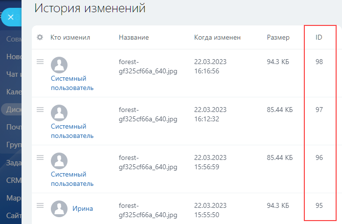

# Загрузить новую версию в Диск

**Навигация**
- [← Оглавление курса](index.md)
- [← Предыдущий: 7727 — Загрузить в Диск](lesson_7727.md)
- [Следующий: 7731 — Копировать/Переместить в Диске →](lesson_7731.md)

Официальная страница урока: https://dev.1c-bitrix.ru/learning/course/index.php?COURSE_ID=57&LESSON_ID=7733

Загружает новую версию файла (документа) на Диск. При этом название останется таким же как у исходного документа.

#### Описание параметров

- **Файл Диска** – документ на диске, который будет обновлен. Доступно добавление напрямую с Диска или подстановка через форму Вставка значения (нужен ID файла);
- **Файл для загрузки** – новая версия обновляемого документа. Добавляется через форму Вставка значения. Документ для загрузки должен иметь тип
  			**Файл**
                      Передавать здесь ID файла диска некорректно.
  		;
- **Загружать от имени** – от имени какого пользователя будет произведено обновление. Если оставить параметр пустым, то изменение выполнится от имени «Системного пользователя».

#### Пример

Здесь в качестве файла диска указан ID файла, для которого запущен бизнес-процесс. Файл для загрузки –

			параметр

                    

		 шаблона БП типа **Файл**, который будет

			заполнять

                    

		 пользователь при запуске БП.

#### Результаты выполнения действия

Результаты выполнения этого действия можно получить с помощью формы **Вставка значения** –

			**Дополнительные результаты**

                    

		, в которой они будут доступны сразу после добавления действия в шаблон:

- ID новой версии
                      Содержится информации именно об идентификаторе версии файла, а не ID файла. Посмотреть версии
  и их ID можно в истории изменений:
  
  		;
- URL для просмотра;
- URL для загрузки.
