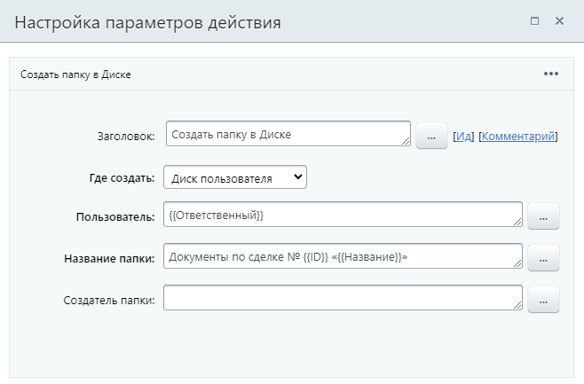

# Создать папку в Диске

**Навигация**
- [← Оглавление курса](index.md)
- [← Предыдущий: 7731 — Копировать/Переместить в Диске](lesson_7731.md)
- [Следующий: 7729 — Удалить объект Диска →](lesson_7729.md)

Официальная страница урока: https://dev.1c-bitrix.ru/learning/course/index.php?COURSE_ID=57&LESSON_ID=7735

Действие создает папку в Диске.

**Описание параметров**

**Где создать** – выберите из списка место, где необходимо создать новую папку:

- **Диск пользователя** – в диске указанного пользователя;
- **Диск группы соцсети** – в диске указанной **Группы**;
- **Общий диск** – в указанном общем **Диске**;
- **Папка диска** – в конкретной указанной **Папке** на одном из дисков, в которой будет создана новая папка (подпапка).

**Название папки** – пропишите желаемое название;

**Создатель папки** – укажите, от чьего имени будет создана папка.

**Примечание:** Действие ничего не выполнит, если название создаваемой папки, указанное в действии БП, совпадёт с названием уже существующей папки в указанном месте Диска. Существующая папка останется без изменений, а новая создана не будет.

#### Пример

Создадим папку на диске пользователя, ответственного за сделку, где будут храниться документы сделки:

#### Результаты выполнения действия

Результаты выполнения этого действия можно получить с помощью формы **Вставка значения** – **Дополнительные результаты**, в которой они будут доступны  сразу после добавления действия в шаблон.

Доступно:

- ID папки Диска;
- URL папки.
