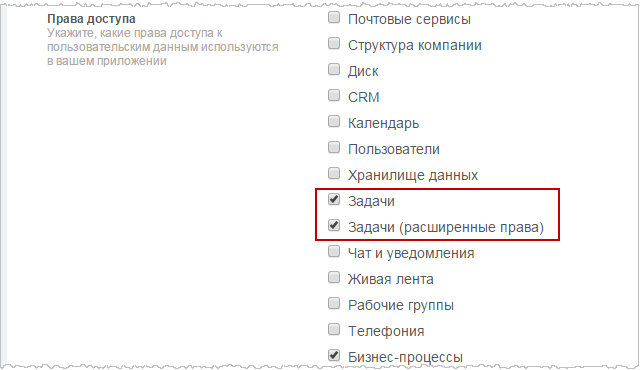
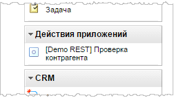
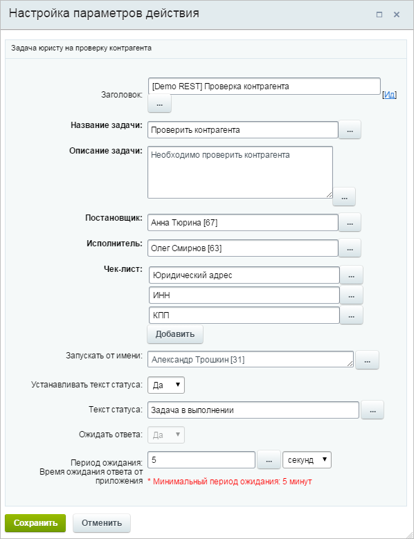
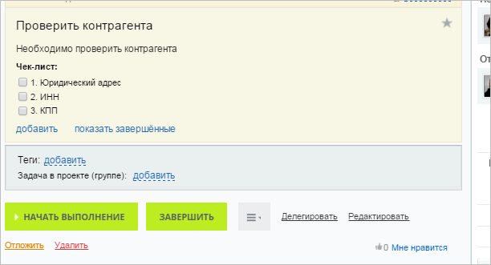
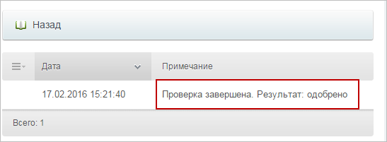

# Пример использования REST в процессах

**Навигация**
- [← Оглавление курса](index.md)
- [← Предыдущий: 23036 — REST в бизнес-процессах](lesson_23036.md)
- [Следующий: 23038 — Общие советы →](lesson_23038.md)

Официальная страница урока: https://dev.1c-bitrix.ru/learning/course/index.php?COURSE_ID=57&LESSON_ID=7771

Стандартное действие [Задача](lesson_3805.md) не позволяет нам работать с чек-листами. Однако, используя [rest-методы работы с задачами](http://dev.1c-bitrix.ru/rest_help/tasks/index.php), это сделать можно. К тому же в данном примере работа будет вестись не через задания бизнес-процессов, а саму задачу, что так же нельзя реализовать, используя штатное действие.


**Задание.** Необходимо поставить задачу юристу организации проверить данные контрагента. Задача должна содержать чек-лист со списком проверяемых данных. Если юрист утверждает какие-либо данные, то он вычеркивает этот пункт чек-листа. В противном случае – пункт остается незакрытым. После завершения задачи принимается решение относительно одобрения данного контрагента.


### Использование rest-методов


С помощью метода [task.item.add](https://dev.1c-bitrix.ru/rest_help/tasks/task/item/add.php) задача будет создаваться. Чек-лист для задачи будет создан методом [task.checklistitem.add](https://dev.1c-bitrix.ru/rest_help/tasks/task/checklistitem/add.php). Этот чек-лист юристу и нужно будет выполнить.


```
if (!empty($_REQUEST['workflow_id']))
{
	if (empty($_REQUEST['auth']))
		die;

	$taskId = (int) callB24Method($_REQUEST['auth'], 'task.item.add', array(
		'TASKDATA' => array(
			'TITLE' => $_REQUEST['properties']['taskName'],
			'DESCRIPTION' => $_REQUEST['properties']['taskDescription'],
			'CREATED_BY' => str_replace('user_', '', $_REQUEST['properties']['taskCreator']),
			'RESPONSIBLE_ID' => str_replace('user_', '', $_REQUEST['properties']['taskUser'])
		)
	));

	$ar = array();
	foreach ($_REQUEST['properties']['checkList'] as $i => $checklist)
	{
		$ar[] = 'task.checklistitem.add?'.http_build_query(array(
			'TASKID' => $taskId,
			'FIELDS' => array(
				'TITLE' => $checklist,
				'IS_COMPLETE' => 'N',
				'SORT_INDEX' => 10*($i+1)
			)
		));
	}
	callB24Method($_REQUEST['auth'], 'batch', array('cmd' => $ar));

	$PDO->exec('INSERT INTO bp_events (WORKFLOW_ID, TASK_ID, EVENT_DATA) VALUES('
		.$PDO->quote($_REQUEST['workflow_id']).','.$taskId.' ,'.$PDO->quote(serialize($_REQUEST)).')');
	die;
}
```


Очень важно также зафиксировать, каким именно процессом будет создаваться задача. Выполнение задачи будет зависеть от вызова события [OnTaskUpdate](http://dev.1c-bitrix.ru/rest_help/tasks/events_tasks/ontaskupdate.php), и нам нужно чтобы необходимый процесс реагировал на изменения именно той задачи, что была им создана. Для этого необходимо зарегистрировать обработчик события.


```

BX24.callBind('OnTaskUpdate', '<?=ВР_APP_HANDLER?>');
```


Задание будет выполнено, только если задача будет закрыта, поэтому другие изменения задачи будут игнорироваться. Как только задача будет закрыта, действие будет анализировать чек-лист. Если все пункты чек-листа выполнены, то принимается решение об одобрении контрагента. Если хотя бы один пункт не закрыт, то контрагент одобрен не будет.


```
if (!empty($_REQUEST['data']['FIELDS_BEFORE']['ID']))
{
	if (empty($_REQUEST['auth']))
		die;

	$taskId = (int) $_REQUEST['data']['FIELDS_BEFORE']['ID'];

	$workflowData = $PDO->query('SELECT * FROM bp_events WHERE TASK_ID = '.$taskId.' LIMIT 1')->fetch(PDO::FETCH_ASSOC);
	if (!$workflowData)
		die;

	$taskData = callB24Method($_REQUEST['auth'], 'task.item.getdata', array(
		'TASKID' => $taskId
	));

	if ($taskData['REAL_STATUS'] != 5)
		die;

	$checklistData = callB24Method($_REQUEST['auth'], 'task.checklistitem.getlist', array(
		'TASKID' => $taskId
	));

	$checkStatus = 'Y';

	foreach ($checklistData as $item)
	{
		if ($item['IS_COMPLETE'] == 'N')
		{
			$checkStatus = 'N';
			break;
		}
	}

	$workflowEvent = unserialize($workflowData['EVENT_DATA']);

	callB24Method($_REQUEST['auth'], 'bizproc.event.send', array(
		"EVENT_TOKEN" => $workflowEvent["event_token"],
		"RETURN_VALUES" => array(
			'checkStatus' => $checkStatus
		),
		'LOG_MESSAGE' => 'Проверка завершена. Результат: '.($checkStatus=='Y'? 'одобрено' : 'отклонено')
	));

	$PDO->query('DELETE FROM bp_events WHERE ID = '.$workflowData['ID']);
	die;
}
```


### Установка и применение


Во время установки приложения обязательно установите разрешение приложению на работу с задачами, иначе оно работать не будет.





После установки действие отобразится в дизайнере бизнес-процессов в разделе **Действия приложений** и его можно будет размещать в шаблонах.





В настройках действия отобразятся созданные нами поля.





После того, как процесс будет запущен действие создаст задачу с заданным чек-листом.





Когда юрист завершит выполнение задачи, в логе бизнес-процесса будет отображено решение относительно одобрения контрагента.





Полностью ознакомиться с действием можно [здесь](https://dev.1c-bitrix.ru/images/portal_admin/bizproc/examples/task.zip).
