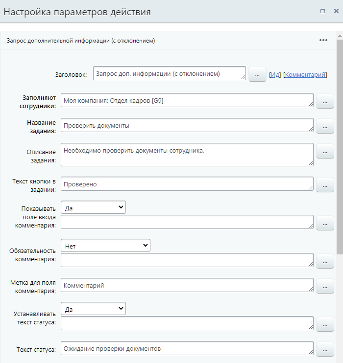
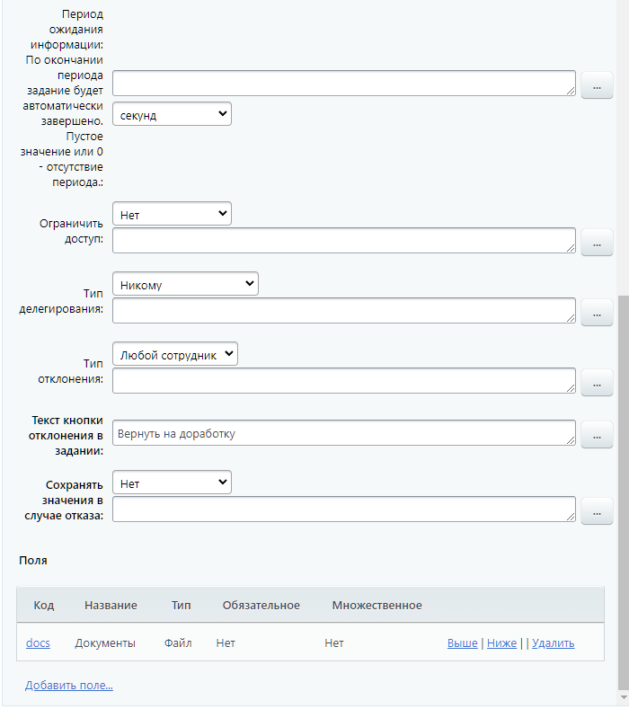
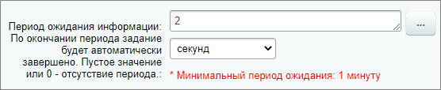

# Запрос доп.информации (с отклонением)

**Навигация**
- [← Оглавление курса](index.md)
- [← Предыдущий: 3779 — Удаление документа](lesson_3779.md)
- [Следующий: 3782 — Запрос дополнительной информации →](lesson_3782.md)

Официальная страница урока: https://dev.1c-bitrix.ru/learning/course/index.php?COURSE_ID=57&LESSON_ID=7839

Действие создаст задание, в ходе которого у пользователя (или пользователей) запрашивается дополнительная информация, необходимая для выполнения бизнес-процесса. В отличие от стандартного действия

			Запрос дополнительной информации

                    Действие создает задание, в ходе которого у пользователя запрашивается дополнительная информация, необходимая для выполнения бизнес-процесса.
[Подробнее](lesson_3782.md)...

		, пользователь имеет возможность отклонить ввод информации.

### Описание параметров

## Пример заполнения параметров действия

- **Заполняют сотрудники** – указываются пользователи, один из которых (
  			первый
                      Другими словами задание будет доступно всем указанным пользователям до тех пор, пока кто-то один не начнет его выполнять. После этого оно автоматически отменится у всех остальных сотрудников.
  		, кто приступит к его выполнению) должен указать дополнительную информацию.
- **Название задания** – задается название, которое отобразится в интерфейсе для пользователей.
- **Описание задания** – указывается описание или пояснения к заданию. Содержимое данного поля отобразится в интерфейсе для пользователей. Рекомендуется в этом поле указывать полную информацию о действии, которое необходимо выполнить пользователю. Это поможет избежать путаницы в случае нескольких однотипных действий.
- **Текст кнопки в задании** – позволяет задать собственный текст для кнопки, соответствующей вводу информации.
- **Показывать поле ввода комментария** – опция позволяет разрешить пользователям оставлять собственные комментарии к назначенному заданию. Например, какие-либо примечания касаемо задания. Содержимое поля можно получить после выполнения действия с помощью соответствующей опции в форме **Вставка значения** – **Дополнительные результаты** (см. ниже).
- **Обязательность комментария** – опция позволяет установить добавление комментария при выполнении задания обязательным. Помимо простых вариантов **Да** и **Нет**, с версии 21.400.0 модуля Бизнес-процессы, доступны варианты:

  - **Только при утверждении** – комментарий обязателен только при утверждении задания;
  - **Только при отклонении** – комментарий обязателен только при отклонении задания.
- **Метка для поля комментария** – подпись для поля с комментарием.
- **Устанавливать текст статуса** – позволяет изменить текст статуса документа на произвольный. Это может, например, позволить отслеживать на каком этапе сейчас находится бизнес-процесс.
- **Текст статуса** – задается текст статуса.
- **Период ожидания информации:** – позволяет
  			установить время
                      В выбранных единицах: секундах, минутах, часах или днях. Например, 86400 секунд, 36 часов или 5 дней.
  		, в течение которого действие будет ожидать выполнения. По окончании периода задание будет автоматически завершено. Пустое значение или 0 – отсутствие периода. Минимальное значение периода зависит от настроек модуля Бизнес-процессы, параметр [Минимальное время ожидания для действий](https://dev.1c-bitrix.ru/user_help/service/bizproc/settings.php). Если в настройках действия указать период меньше этого минимального значения – появится соответствующее
  			предупреждение
                      
  		.
- **Ограничить доступ** – делает текст задания видимым только для исполнителя задания и не показывает его в живой ленте. Это очень полезная опция, если нужно, например, передать исполнителю конфиденциальную информацию: пароли, пин-коды и т.п.
- **Тип делегирования** – выбирается из списка кому доступно делегировать запрос:

  - **Только подчиненным**;
  - **Всем сотрудникам**;
  - **Никому**.
- **Текст кнопки отклонения в задании** – позволяет задать собственный текст для кнопки, соответствующей отклонению ввода информации.
- **Сохранять значения в случае отказа** – если выбрано **Да**, то все введенные данные будут сохранены даже в случае отклонения запроса. Сохраненные данные останутся доступны для использования в бизнес-процессе. Параметр доступен с версии **20.200.0** модуля Бизнес-процессы.
- Раздел **Поля** позволяет добавить собственные поля, которые будет необходимо заполнить пользователям в ходе выполнения задания. Содержимое полей после выполнения действия можно получить в форме **Вставка значения** – **Переменные**.

### Переменные и результаты

#### Переменные

В этом разделе можно получить содержимое дополнительных полей, созданных в разделе **Поля**.

#### Результаты выполнения действия

Результаты выполнения этого действия можно получить с помощью формы **Вставка значения** – **Дополнительные результаты**, в которой они будут доступны  сразу после добавления действия в шаблон:

- ID;
- Комментарий;
- Автоматическое завершение;
- Пользователь, предоставивший информацию.
