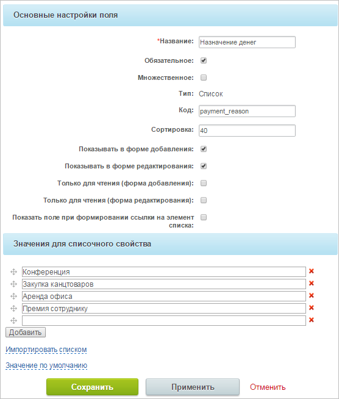
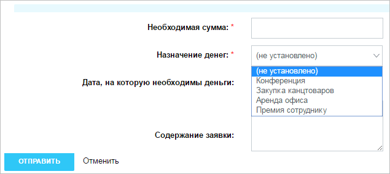
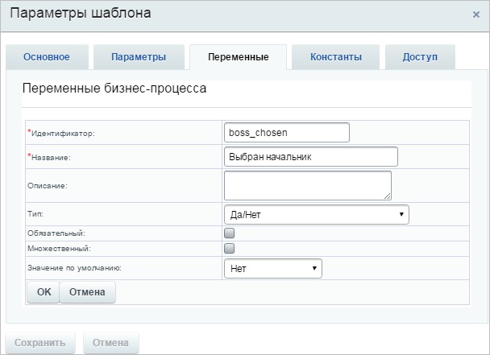
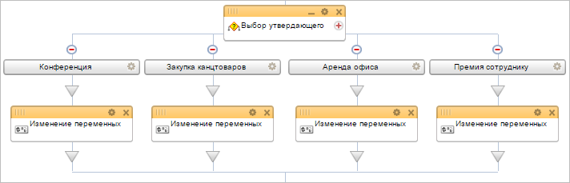
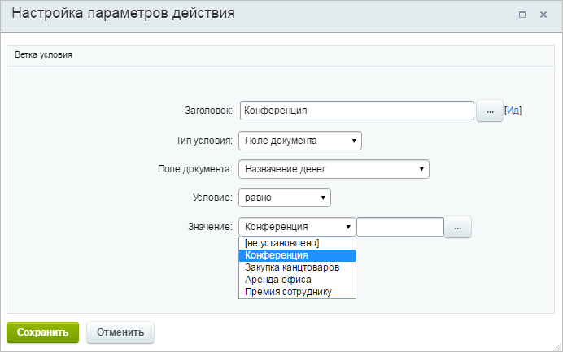
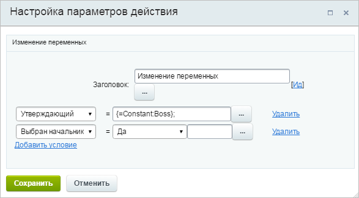
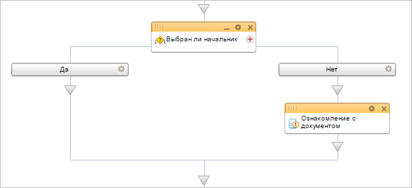

# Пример изменения процесса Выдача наличных

**Навигация**
- [← Оглавление курса](index.md)
- [← Предыдущий: 5368 — Добавление информации в инфоблок из бизнес-процесса](lesson_5368.md)
- [Следующий: 8387 — Пример изменения процесса Заявление на отпуск →](lesson_8387.md)

Официальная страница урока: https://dev.1c-bitrix.ru/learning/course/index.php?COURSE_ID=57&LESSON_ID=7993

Модифицируем стандартный бизнес-процесс **Выдача наличных**.

> **Вопрос с форума:**
> Здравствуйте) Недавно начали работать в Битрикс, и есть нужда в БП. Но не получается самому все сделать) Нужно усложнить стандартный БП на выдачу наличных таким образом, чтобы была возможность при создании БП указать категорию финансирования из выпадающего списка. Каждой категорией будет заведовать отдельный человек и соответственно утверждать или отклонять заявку. В то же время одной из категорий ведует Руководитель компании, таким образом при оформлении заявки на него приходит запрос на утверждение, если заявка подана на другую категорию – Руководитель должен лишь ознакомиться с заявкой).

### Создание нового поля

В первую очередь добавим новое поле элемента процесса и назовем его **Назначение денег**. Поле должно быть обязательным иначе теряется весь его смысл в данной задаче. Также укажем, что поле должно отображаться в форме добавления и редактирования.

Теперь при вызове бизнес-процесса нужно будет сразу указать назначение денег.

### Редактирование шаблона

Рассмотрим ключевые изменения шаблона. Добавим переменную **Выбран начальник**, в которой мы будем хранить информацию, является ли утверждающим сотрудником сам руководитель компании. По умолчанию выставим ей значение **Нет**. Эта переменная нам пригодится в дальнейшем.

В стандартном шаблоне бизнес-процесса для того, чтобы выбрать утверждающего платеж используется действие [Выбор сотрудника](lesson_3809.md), чтобы выбрать непосредственного начальника запрашивающего деньги сотрудника. В нашем случае заведовать каждым из назначений выдаваемых денег будет отдельный человек, поэтому данная схема не решит задачу. Мы воспользуемся [Условием](lesson_3789.md), чтобы назначать утверждающего в зависимости от указанного назначения.

Настроим каждую из веток условия, чтобы она выполнялась при выборе того или иного значения поля.

Таким образом, когда при запуске процесса будет указано некоторое значение поля, будет сразу выбрана соответствующая ветка условия. В каждой ветке добавим действие [Изменение переменных](lesson_3812.md), в которой будет присваиваться значение переменной **Утверждающий**. Для ветки **Премия сотруднику** изменим значение переменной **Выбран начальник** на **Да**, потому что ей будет заведовать сам руководитель компании.

После того, как по платежу будет принято какое-то решение, нужно проверить, кто является утверждающим сотрудником. Осуществим это, используя **Условие**, зависящее от значения переменной **Выбран начальник**. Если утверждающий пользователь не является руководителем компании, то нам необходимо его ознакомить с деталями платежа, используя действие [Ознакомление с документом](lesson_3783.md).

Подробнее ознакомиться с измененным шаблоном можно [здесь](/images/admin_expert/bizproc/activities/example/bp-168.bpt).
