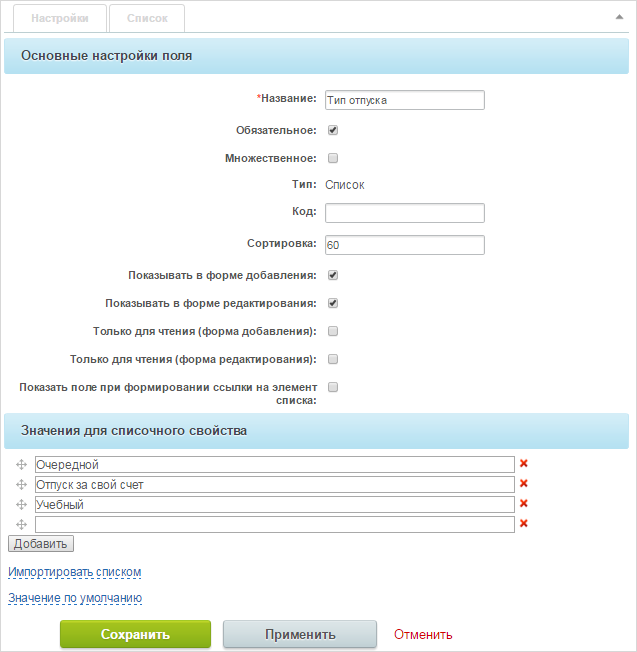
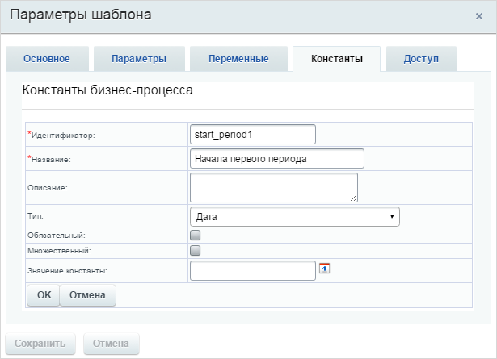
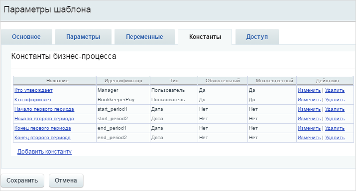
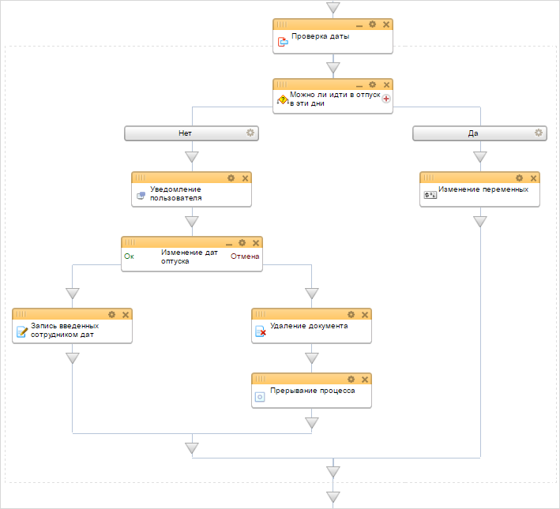
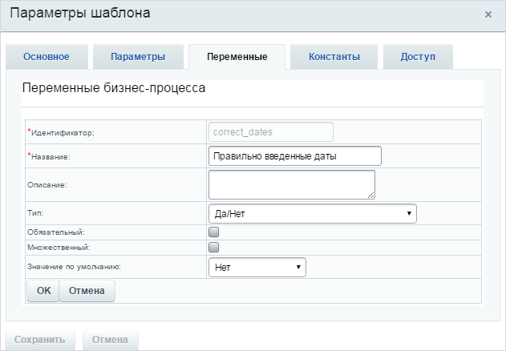

# Пример изменения процесса Заявление на отпуск

**Навигация**
- [← Оглавление курса](index.md)
- [← Предыдущий: 7993 — Пример изменения процесса Выдача наличных](lesson_7993.md)
- [Следующий: 8391 — Пример изменения процесса Исходящие документы →](lesson_8391.md)

Официальная страница урока: https://dev.1c-bitrix.ru/learning/course/index.php?COURSE_ID=57&LESSON_ID=8387

Модифицируем стандартный бизнес-процесс **Заявление на отпуск**.

> **Сообщение от пользователя:**
> Здравствуйте. Надеюсь, мое сообщение не останется без внимания. Только недавно изучаю бизнес-процессы, не могу понять. Есть стандартный процесс  заявления на отпуск. У нас в компании 2 раза в год проводятся важные мероприятия, во время которых оговорено, что в отпуск никто не уходит. Можно как-то автоматизировать чтобы процесс был недоступен в это время или заявка на отпуск автоматически отклонялась, а то постоянно кто-то забывает? И можно ли как-то в стандартный процесс добавить категорию отпуска – для бухгалтерии это важно. Спасибо

### Создание нового поля

Сделать процесс недоступным вполне можно административно – просто скрыв его из **Живой ленты** или, например, изменив права доступа к нему для всех сотрудников компании. Если по какой-либо причине такой вариант неприемлем, то для выполнения данной задачи можно внести изменения в стандартный бизнес-процесс.

Для начала надо создать еще одно поле бизнес-процесса, в котором будет содержаться список категорий отпусков. В дальнейшем эта категория будет указываться при уведомлении бухгалтерии.

### Создание констант

Для того, чтобы автоматически отклонять заявление об отпуске, сначала необходимо задать периоды, в течение которых отпуск взять нельзя. Создадим константы, в которых мы будем хранить даты начала и концов этих периодов.

Итоговый список констант бизнес-процесса (включающий кроме созданных уже существующие) будет выглядеть следующим образом.

### Редактирование шаблона

Внесем корректировки в шаблон бизнес-процесса. Добавим в начало цикл проверки введенных пользователем дат.

Проверку дат осуществим с помощью действия

			Условие

                    Конструкция позволяет направить бизнес-процесс по разным сценариям в зависимости от заданного типа условия.

[Подробнее](lesson_3789.md)...

		. Для ветки условий **Нет**, настроим зависимость даты отпуска от запрещенных для отпуска периодов. Т.к. выбранные для отпуска даты записываются в поля, то будем использовать тип условия **Поле документа**. Рассматривать будем следующие варианты:

- Дата начала отпуска попадает в один из запрещенных периодов.
- Дата завершения отпуска попадает в один из запрещенных периодов.
- Сам запрещенный период целиком попадает в даты отпуска.

**Примечание**: даты начала и завершения в периоды не объединяются, поэтому каждую из дат нужно отдельно сравнивать с другой. Для объединения условий необходимо использовать логические операторы **И/ИЛИ**.

Добавим уведомление пользователя о том, что он выбрал некорректные даты для отпуска. Пользователю будет также предложено выбрать другие даты для своего отпуска. Используем для этого действие [Запрос доп.информации (с отклонением)](lesson_7839.md). Если пользователь введет новые даты и сохранит их, то новые даты мы запишем в поле документа и цикл опять будет их проверять. Если пользователь не захочет по какой-либо причине вводить даты и отклонит ввод информации, то мы удалим его заявление на отпуск и прервем выполнение процесса.

Для ветки **Да** укажем условие выполнения **Истина**. Таким образом, она выполнится в том случае, если процесс не пойдет по первой ветке. В этой ветке мы настроим выход из цикла. Зададим переменную, которая будет указывать, правильно ли введены данные.

Созданный цикл будет работать пока у данной переменной будет значение **Нет**. Если пользователь введет правильные даты, то изменим значение переменной на **Да**, чтобы выйти из цикла. Если пользователь ввел подходящие для отпуска даты, то бизнес-процесс заявления на отпуск продолжит свое обычное выполнение.

Скачать созданный шаблон бизнес-процесса можно [здесь](/images/admin_expert/bizproc/activities/example/bp-196.bpt).
