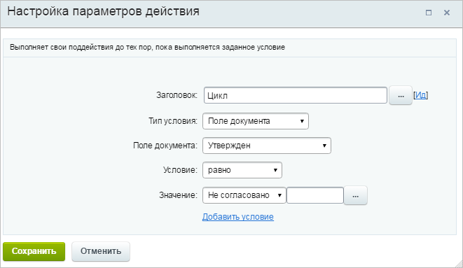
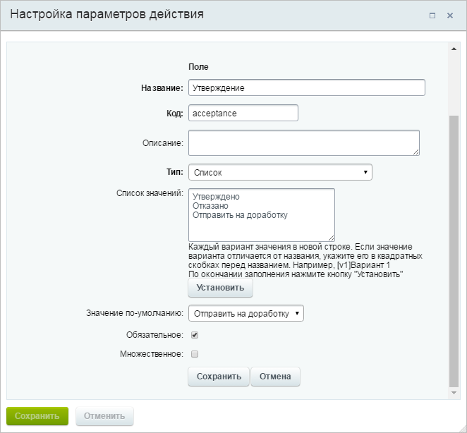
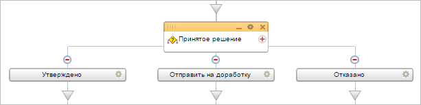
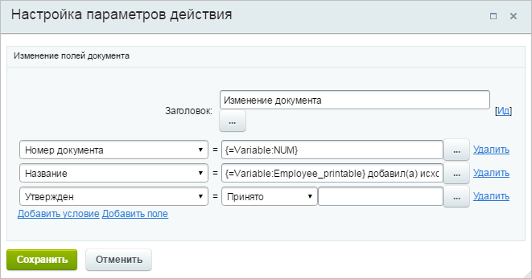
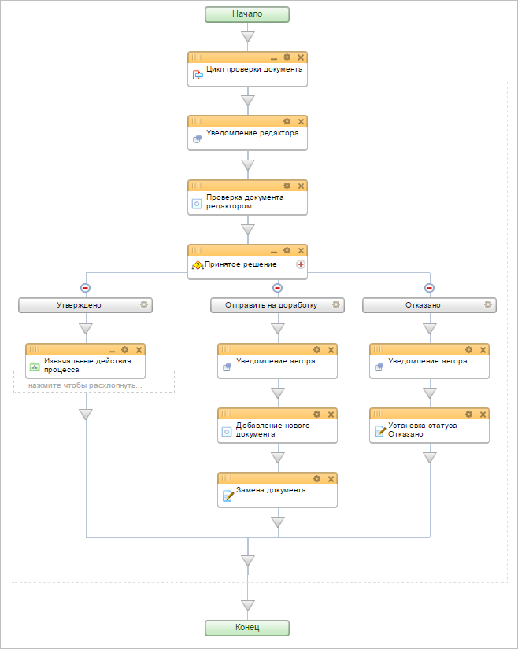

# Пример изменения процесса Исходящие документы

**Навигация**
- [← Оглавление курса](index.md)
- [← Предыдущий: 8387 — Пример изменения процесса Заявление на отпуск](lesson_8387.md)
- [Следующий: 8411 — Создание задачи с приоритетом с помощью PHP-кода →](lesson_8411.md)

Официальная страница урока: https://dev.1c-bitrix.ru/learning/course/index.php?COURSE_ID=57&LESSON_ID=8391

Модифицируем стандартный бизнес-процесс **Исходящие документы**.

> **Полученное сообщение:**
> У меня компания заполняет сайт контентом, на портале можно сказать авторы, я редактирую. Пользуемся исходящими документами, но приходится постоянно запускать новый процесс, если нужно дорабатывать. У меня поэтому документов в списке тьма, потом ничего найти невозможно. Можно же проверку в рамках одного процесса как-то по идее сделать.

### Создание нового поля

Чтобы выполнить данную задачу отредактируем типовой бизнес-процесс **Исходящие документы**. Для начала, добавим поле со статусом документа. Пользователю не нужно будет заполнять это поле - оно будет изменяться в ходе исполнения процесса. Установим значение по умолчанию **Не согласовано**:

### Редактирование шаблона

Отредактируем шаблон бизнес-процесса. Для того, чтобы автоматизировать процесс проверки документа, будем использовать цикл. Установим, что он должен выполняться, пока созданное нами поле документа не изменит свое значение.

Добавим действие [Запрос дополнительной информации](lesson_3782.md), в котором редактору будет представлена возможность либо утвердить документ, либо отправить его на доработку, либо вовсе отклонить. Выполнить это ему нужно, выбрав значение созданной переменной типа **Список**:

Добавим условие с тремя ветками, каждая из которых будет выполняться в зависимости от решения редактора.

В ветку условий **Утверждено** мы перенесем все действия, которые изначально были в процессе, чтобы документ фиксировался в списке. Добавим только изменение созданного нами поля документа, чтобы статус документа поменялся на **Принято** и цикл прекратил выполнение.

В ветке **Отправить на доработку** добавим уведомление автору, что его документ необходимо доработать. После того как коррективы будут внесены, с помощью действия **Запрос дополнительной информации** ему будет предложено загрузить новую версию документа. С помощью действия [Изменение документа](lesson_3785.md) заменим изначально присутствующий в документе файл на вновь загруженный.

В ветке **Отказано** добавим уведомление автору, что его документу отказано в публикации. Также изменим статус документа.

Подробнее ознакомиться с созданным шаблоном можно [здесь](/images/admin_expert/bizproc/activities/example/bp-200.bpt).

## Шаблон бизнес-процесса (для ознакомления)

