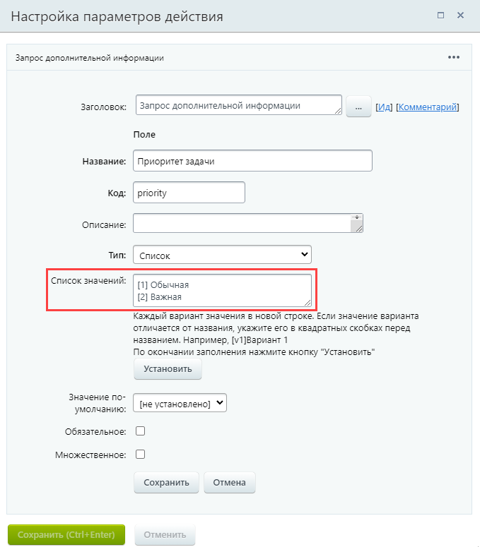
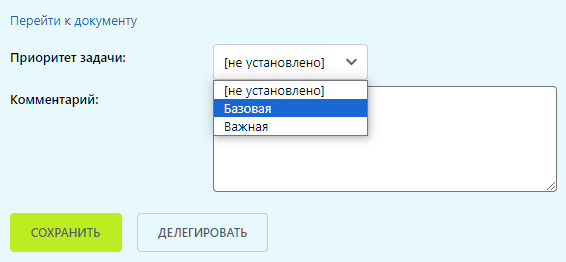

# Создание задачи с приоритетом с помощью PHP-кода

**Навигация**
- [← Оглавление курса](index.md)
- [← Предыдущий: 8391 — Пример изменения процесса Исходящие документы](lesson_8391.md)
- [Следующий: 5518 — Пример бизнес-процесса для подачи заявки на отпуск →](lesson_5518.md)

Официальная страница урока: https://dev.1c-bitrix.ru/learning/course/index.php?COURSE_ID=57&LESSON_ID=8411

|  | ### Используем PHP-код |
| --- | --- |


> **Задание:** создать задачу с помощью действия PHP-код. При этом приоритет задачи зависит от выбранного значения переменной бизнес-процесса.


Выбирать приоритет задачи будем через действие [Запрос дополнительной информации](lesson_3782.md). Приоритет задачи может принимать значения `1` или `2`, что соответствует обычному и важному приоритету (подробнее смотрите в описании метода [CTasks::Add](https://dev.1c-bitrix.ru/api_help/tasks/classes/ctasks/add.php)).


В задании создадим переменную типа **Список**. Варианты списка мы обозначим текстом, а значения каждого из вариантов укажем в квадратных скобках:





Когда пользователю придет задание, он сможет выбрать вариант в понятной ему форме. Значение переменной будет численное, 1 или 2.





Теперь, когда действие [PHP код](lesson_3806.md) будет создавать задачу, приоритет задачи будет зависеть от выбранного пользователем варианта. Добавим следующий код в действие:


```
{
	$root = $this->GetRootActivity();
	$priority_var= $root->GetVariable('priority');

	$arFields = Array(
		"TITLE" => "Рriority task",
		"DESCRIPTION" => "Task description",
		"RESPONSIBLE_ID" => 2,
		"CREATED_BY" => 1,
		"PRIORITY" => $priority_var
	);

	$obTask = new CTasks;
	$obTask->Add($arFields);
}
```
