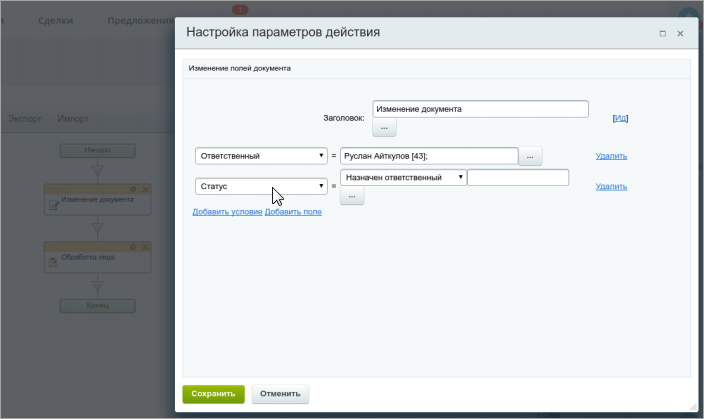
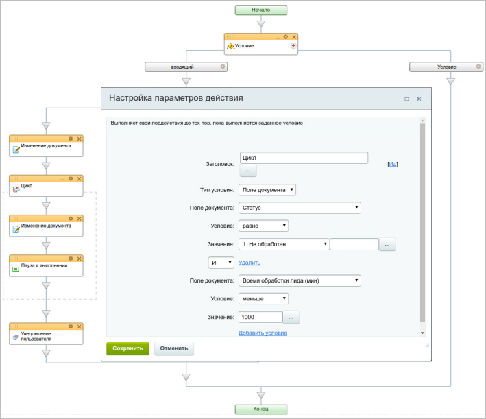
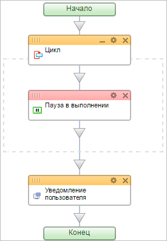
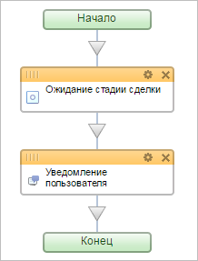
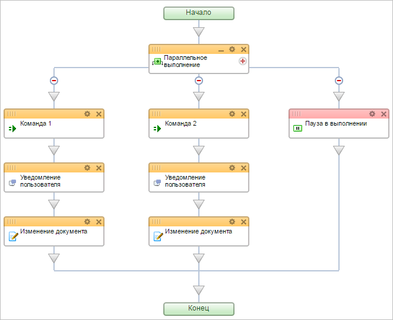

# Распространенные ошибки при работе с бизнес-процессами

**Навигация**
- [← Оглавление курса](index.md)
- [← Предыдущий: 13044 — Практические задания](lesson_13044.md)
- [Следующий: 20090 — Проверьте себя →](lesson_20090.md)

Официальная страница урока: https://dev.1c-bitrix.ru/learning/course/index.php?COURSE_ID=57&LESSON_ID=8445

|  | ### Постараемся не делать ошибок |
| --- | --- |

> Бизнес процессы — инструмент, который автоматизирует рабочие процессы компании, но может создавать высокую нагрузку на проект.

На каждом физическом сервере в *Битрикс24* одновременно работает несколько порталов. Аномальная нагрузка от одного из них негативно влияет на остальные.

			Бизнес-процессы

                    **Внимание!** Для предотвращения подобных ситуаций были введены технические ограничения количества запущенных экземпляров бизнес процесса на одном документе — не более двух. Это означает, что всего одновременно работающих экземпляров бизнес-процессов может быть много, но на каждый конкретный документ — не более двух.

		 — одна из причин. В связи с этим, рекомендуется проверить и скорректировать свои бизнес-процессы. При выявлении аномальной нагрузки создаваемой бизнес-процессами, портал **блокируется** согласно пункту 8.6 [лицензионного соглашения](https://www.bitrix24.ru/about/agreement.php).

#### Распространенные ошибки

Рассмотрим наиболее распространенные ошибки при проектирование бизнес-процессов, которые увеличивают нагрузку на портал:

1. **Изменения различных полей документа несколькими действиями**. Изменять каждое поле документа отдельным действием не запрещено, но такой подход значительно увеличивает количество выполняемых запросов при работе бизнес-процесса.
  **Как правильно**: Изменять все необходимые поля документа
  			одним действием
                      Правильное изменение документа
  
  		.
2. **Зацикливание**. Проверяйте отсутствие зацикливания бизнес-процессов. Особенно при использовании
  			паузы
                      В этом случае бизнес процесс не зависнет во время выполнения, а значит ошибку можно не заметить.
  		.
  При запуске бизнес-процесса на создание документа с ошибкой в условии выхода из цикла постепенно накопится большое количество экземпляров бизнес-процесса, запущенных для разных документов. А запуск бизнес-процессов на изменение документа — ещё более опасный вариант. В этом случае очень быстро накапливается большое количество работающих экземпляров бизнес-процесса даже на небольшом количестве документов (один документ может быть изменен большое количество раз).
  **Как правильно**: продумывать и проверять корректность выхода из цикла. По возможности использовать дополнительное условие для выхода из цикла (например, условие выхода по истечению времени). С версии 25.100.0 в коробочной версии можно ограничить количество итераций цикла в параметре *Максимальное количество итераций цикла в рамках одного запуска* в настройках модуля. Значение по умолчанию — 1000.
  **Примечание.** В некоторых случаях лучше предусмотреть отдельное условие для прерывания цикла. Такое условие обеспечит выход из цикла, даже если основное условие по каким-либо причинам не было выполнено за разумное время/циклы. Приведем пример такого условия: бизнес-процесс
  			прекращается
                      Для такого условия понадобится создать новое поле в карточке Лида, в которое будет записываться время
  обработки с помощью действия **Изменение документа** (вычислением между текущей датой/временем
  и началом цикла. Действие **Пауза в выполнении** позволит проверять время обработки раз
  в указанный промежуток времени (к примеру, раз в 1 час).
  
  		 после того как время обработки лида становится больше 1000 минут, несмотря на то, что статус лида еще не изменился на нужный (указанный в цикле). Это позволит остановить бизнес-процесс, если он не был обработан в рамках указанного времени (например, по причине увольнения ответственного).
3. **Использование проверки статуса в цикле с паузой**. В шаблонах иногда вместо действия
  			Ожидание стадии сделки
                      Действие приостанавливает выполнение бизнес-процесса пока не будет достигнута указанная стадия сделки.
  [Подробнее](lesson_7399.md)...
  		 используют
  			цикл с паузой
                      
  		. В этом случае при запуске процесса на создание документа, накапливается большое число запущенных экземпляров шаблона бизнес-процесса, для разных документов. Бизнес-процессы часто поднимаются из Паузы и создают нагрузку, что в определенный момент может привести к неработоспособности проекта.
  **Как правильно**: Правильнее в таких случаях использовать действие
  			Ожидание стадии сделки
                      
  		. В этом случае бизнес-процесс проснется только во время смены статуса документа на нужный, а значит не будет создавать нагрузку все остальное время.
  **Некорректное использование пауз и заданий**. Ошибка случается часто для бизнес-процессов, которые запускаются
  			при изменении документа
                      
  		.
  Использование таких действий может нарушить идеологию и целостность бизнес-процесса. Пока бизнес-процесс ожидает их исполнения, исходный документ может быть снова изменен. Поэтому бизнес-процессы, запускаемые на изменение, должны отрабатывать без каких-либо ожиданий и пауз и прекращать свое существование. Если же в бизнес-процессе, запускаемом на изменение, есть паузы, ожидание действий, запрос информации, то смело говорим, что бизнес-процесс работает неправильно.
  **Как правильно**: Не использовать действия с паузами или ожиданием в бизнес-процессах, запускаемых на изменение.
  **Ошибки при работе с Параллельным ожидания действия**. Очень часто возникают сложности при работе с
  			этой конструкцией
                      Конструкция позволяющая направить бизнес-процесс по разным сценариям в зависимости от того, какое из событий наступит раньше.
  [Подробнее](lesson_3790.md)...
  		. При ее использовании процесс выполняется по той ветке, которая следует за первой выполненной
  			Командой
                      Действие, выполнение которого зависит от пользователей. Для них будет создан соответствующий элемент управления.
  [Подробнее](lesson_3788.md)...
  		. Но если ни одна из команд не выполнена, то и процесс зависнет и исполняться дальше не будет. Чтобы такого не происходило, всегда стоит добавлять ветку, содержащую
  			Паузу в выполнении
                      Действие позволяет отложить выполнение следующего действия на заданное время.
  [Подробнее](lesson_3807.md)...
  		. Таким образом,
  			бизнес-процесс
                      Добавление паузы в Параллельное ожидание действия
  
  		 продолжит свое исполнение по истечению указанного в нем времени, даже если ни одна из команд не будет выполнена.
  **Как правильно**: Использовать действие **Пауза в выполнении** в конструкции **Параллельное ожидание действия**.
