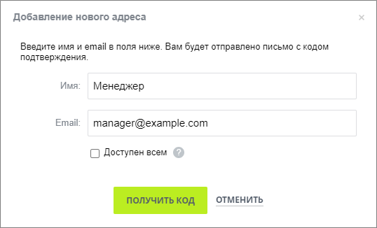
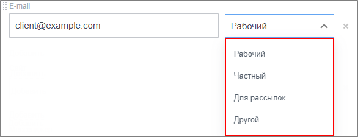
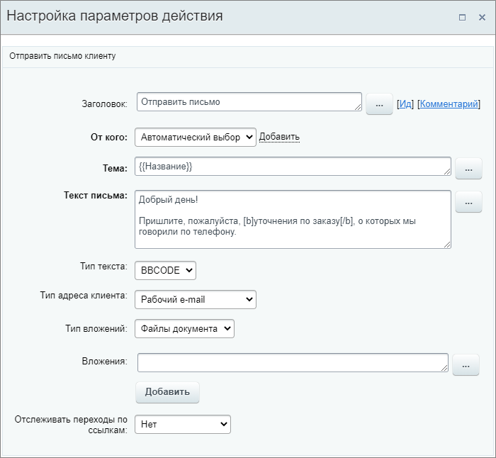

# Отправить письмо клиенту

**Навигация**
- [← Оглавление курса](index.md)
- [← Предыдущий: 9009 — Отправить СМС](lesson_9009.md)
- [Следующий: 23592 — Получить информацию о привязанном элементе →](lesson_23592.md)

Официальная страница урока: https://dev.1c-bitrix.ru/learning/course/index.php?COURSE_ID=57&LESSON_ID=8529

Действие отправляет письмо клиенту, чтобы передать информацию или сообщить об изменениях.

**Примечание:** Действие аналогично [отправке писем из CRM](https://helpdesk.bitrix24.ru/open/2099711) в публичной части **CRM** Битрикс24.

#### Параметры действия

- **От кого** – укажите отправителя письма. Отправитель выбирается автоматически: почтовый адрес берется по ответственному из списка доступных для отправки адресов (первый по списку). Также можно добавить
  			дополнительного отправителя
                      На указанный почтовый адрес придет проверочное письмо с кодом проверки.
  После подтверждения владения этим почтовым адресом, вы сможете выбирать
  в поле **От кого** этот адрес.
  
  		 (почтовый ящик, который не подключен к Битрикс24). Если у пользователя, который является отправителем, нет доступной почты для отправки, то письмо не будет отправлено, а в логе бизнес-процесса вы увидите информацию о том, что свойство «Отправитель не указано». В таком случае проверьте, что у сотрудника есть доступный
  			подключенный адрес
                      Первым делом нужно подключить почтовый ящик: перейдем в раздел Почта в левом меню. В Битрикс24 доступно подключение основных почтовых провайдеров и сервисов.
  Подробнее на [helpdesk.bitrix24.ru](https://helpdesk.bitrix24.ru/open/8233895/).
  		 для отправки писем, который должен быть указан как контактный в
  			профиле
                      У каждого пользователя Битрикс24 есть своя персональная страница с личной информацией.
  Подробнее на [helpdesk.bitrix24.ru](https://helpdesk.bitrix24.ru/open/5392179/).
  		;
- **Тема** – внесите тему письма;
- **Текст письма** – напишите текст письма для клиента. Способ форматирования текста зависит от следующего параметра **Тип текста** (html или bbcode);
- **Тип текста** – выберите тип текста, на основании которого будет выполнено форматирование текста письма. Доступны **BBCODE** и **HTML**;
- **Тип адреса клиента** – выберите из списка
  			тип адреса
                      Тип e-mail адреса указан в карточке клиента (Контакта, Компании или Лида) для поля E-mail:
  
  		 клиента:
  Если адрес выбранного типа отсутствует в карточке (не заполнен), действие не сработает (письмо не будет отправлено). В параметре можно использовать только перечисленные типы адресов. Подстановка значений через форму «Вставка значения» не предусмотрена.

  - Автоматический выбор;
  - Рабочий e-mail;
  - Частный e-mail;
  - E-mail для рассылок;
  - Другой e-mail.
- **Использовать адрес** – выберите на какой адрес, первый добавленный или последний добавленный, отправить письмо. В зависимости от настройки параметра «Тип адреса клиента» работает следующим образом:
  **Примечание**: Если в карточке привязано несколько контактов, система всегда выбирает первый добавленный контакт, а уже у него – первый или последний добавленный адрес (в соответствии с настройкой параметра «Использовать адрес»).

  - если выбран определённый тип, то параметр пригодится, когда у клиента добавлено несколько адресов этого типа;
  - при автоматическом выборе письмо будет отправлено на первый или последний адрес, указанный в карточке клиента, независимо от его типа.
- **Тип вложений** – укажите тип вложения. От типа меняется вид следующего поля **Вложения**;
- **Вложения**

  - Файлы документа – укажите файл с помощью формы
    			«Вставка значения»
                        При работе с бизнес-процессом в параметрах действий, параметрах шаблона и настройках статуса есть возможность указывать как собственный текст (заданный вручную), так и использовать различные переменные значения (поля документа и прочие данные, которые могут меняться и поэтому не задаются вручную). Для подстановки таких переменных значений используется специальная форма **Вставка значения**.
    [Подробнее](lesson_12383.md)...
    		. С помощью кнопки Добавить можно добавлять необходимое количество файлов;
  - Диск – выберите файл с диска.
- **Отслеживать переходы по ссылкам** – опция включает отслеживание переходов клиента по ссылкам в письме.

#### Пример настройки:

