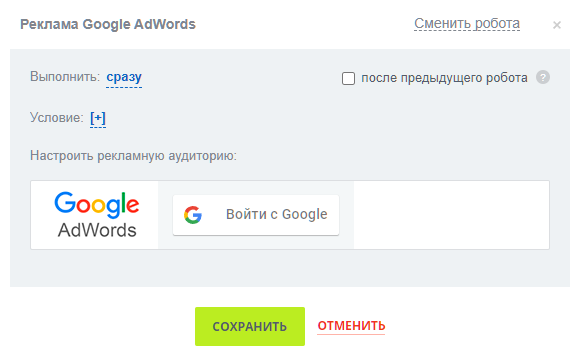

# Добавить клиента в рекламную аудиторию Google AdWords

**Навигация**
- [← Оглавление курса](index.md)
- [← Предыдущий: 9003 — Выбор данных crm](lesson_9003.md)
- [Следующий: 8535 — Добавить клиента в рекламную аудиторию Вконтакте →](lesson_8535.md)

Официальная страница урока: https://dev.1c-bitrix.ru/learning/course/index.php?COURSE_ID=57&LESSON_ID=8533

Добавляет обезличенные данные клиентов (e-mail и телефонные номера) в рекламную аудиторию Google AdWords.

**Внимание**! Роботы рекламы не настраиваются через дизайнер бизнес-процессов. Они настраиваются отдельно в роботах CRM. Роботов можно открыть в канбане или списке элементов CRM. Подробнее читайте в статьях поддержки Битрикс24 на [helpdesk.bitrix24.ru](https://helpdesk.bitrix24.ru/open/6908975/).

Таким образом, в дизайнере бизнес-процессов вы не увидите параметры в этом действии, только сообщение о необходимости выполнения настроек в Роботах. В роботах же отобразится такое окно настроек:

Настройка рекламы аналогична такой же в интерфейсе Битрикс24: [Создание рассылок](https://helpdesk.bitrix24.ru/open/10840210/).
