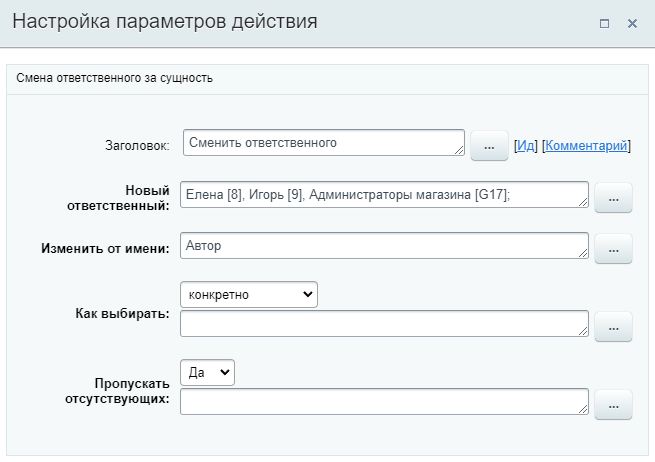

# Изменить ответственного

**Навигация**
- [← Оглавление курса](index.md)
- [← Предыдущий: 20768 — Изменить наблюдателей](lesson_20768.md)
- [Следующий: 23590 — Изменить привязанный элемент →](lesson_23590.md)

Официальная страница урока: https://dev.1c-bitrix.ru/learning/course/index.php?COURSE_ID=57&LESSON_ID=8539

Действие изменяет ответственного в элементе, для которого был запущен бизнес-процесс.

**Примечание**: Действие аналогично

			cмене ответственного

                    В CRM ответственный сотрудник может быть у лидов, сделок, контактов, компаний, предложений, счетов и CRM-форм.

Подробнее читайте на [helpdesk.bitrix24.ru](https://helpdesk.bitrix24.ru/open/12519248/).

		 в публичной части CRM.

#### Параметры действия

Все перечисленные параметры являются обязательными для заполнения.

- **Новый ответственный** – указывается новый ответственный за сущность (т.е. лид, сделку, контакт и т.д.). В параметре могут быть указаны пользователи или группы (в том числе совместно), из которых будет сформирован общий список и выбран ответственный. Алгоритм выбора зависит от параметров **Как выбирать** и **Пропускать отсутствующих**;
- **Изменить от имени** – указывается от имени кого будет проведено назначение (например, от имени начальника отдела или автора, запустившего бизнес-процесс);
- **Как выбирать** – каким образом выбирать ответственного из списка пользователей:

  - **Случайно** – пользователь выбирается из списка случайным образом;
  - **Конкретно** – всегда выбирается первый пользователь из списка;
  - **Последовательно** – пользователь выбирается из списка последовательно, т.е. при каждом новом запуске процесса будет выбран следующий по порядку в списке пользователь.
- **Пропускать отсутствующих** – если в параметре указано **Да**, то при выборе ответственного будут пропущены отсутствующие пользователи.

**Примечание**: Параметры **Как выбирать** и **Пропускать отсутствующих** доступны с версии 21.400.0 модуля Бизнес-процессы.

#### Пример

В качестве ответственных выбраны два пользователя и одна группа. В параметре «Как выбирать» указан способ **Конкретно** и включен пропуск отсутствующих. С такими настройкам выбор ответственного будет происходить так:

1. Всегда в качестве ответственного будет выбираться пользователь **Елена**;
2. В случае отсутствия **Елены** установится следующий по порядку пользователь **Игорь**;
3. При отсутствии указанных двух пользователей, выбор ответственного перейдет к пользователям группы **Администраторы магазина**.

