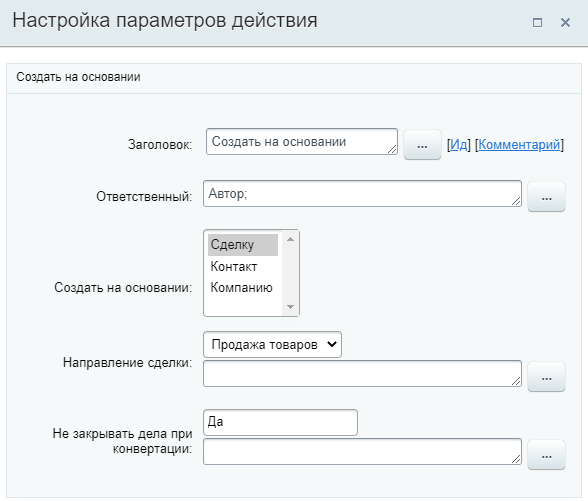
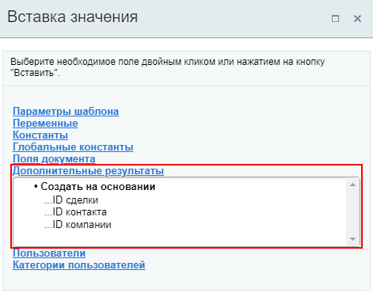
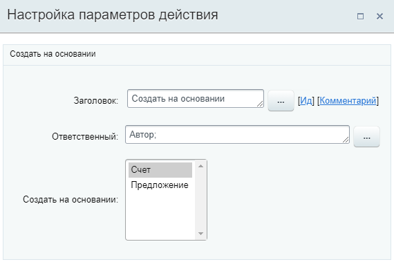
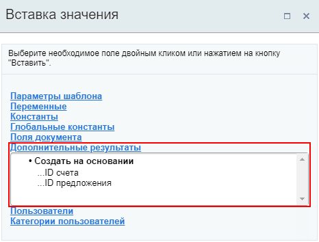

# Создать на основании

**Навигация**
- [← Оглавление курса](index.md)
- [← Предыдущий: 20824 — Создать Контакт к Лиду](lesson_20824.md)
- [Следующий: 20864 — Создать повторный Лид →](lesson_20864.md)

Официальная страница урока: https://dev.1c-bitrix.ru/learning/course/index.php?COURSE_ID=57&LESSON_ID=8541

Действие позволяет создать новый элемент CRM на основании лида / сделки, в которой запущен бизнес-процесс.

**Примечание:** Действие доступно в шаблонах бизнес-процессов

			Лидов

                    **Лид** - это самый-самый «холодный контакт», зацепка, которая может стать клиентом, а может и не стать.

Подробнее на [helpdesk.bitrix24.ru](https://helpdesk.bitrix24.ru/open/1357950/).

		 и

			Сделок

                    **Сделка** - один из основных элементов CRM, это процесс продажи товара или услуги клиенту.

Подробнее на [helpdesk.bitrix24.ru](https://helpdesk.bitrix24.ru/open/5493461/).

		.

### Действие в БП лидов

В бизнес-процессах лидов действие позволяет создать новый элемент CRM на основании лида: Сделку, Контакт и/или Компанию. Действие аналогично

			конвертации Лида

                    Лид в Битрикс24 - это любая зацепка или связь с возможным клиентом. Лид может стать контактом, компанией или сделкой - это зависит от вашего сценария продаж.

Что же такое конвертация? **Конвертация** - это и есть превращение лида в другие элементы CRM.

Подробнее на [helpdesk.bitrix24.ru](https://helpdesk.bitrix24.ru/open/1484389/).

		).

#### Параметры действия

- **Ответственный** – укажите ответственного за создаваемый элемент;
- **Создать на основании** – из списка выберите тип создаваемого элемента. В списке доступен множественный выбор:

  - Сделка;
  - Контакт;
  - Компания.
- **Направление сделки** – указывается направление создаваемой сделки.
- **Не закрывать дела при конвертации** – если установлено **Да**, то дела связанные с лидом НЕ будут закрыты (например, задачи или встречи).

#### Пример

В результате выполнения действия в секции **Дополнительные результаты** формы **Вставка значения** станут доступны идентификаторы **ID** сделки, контакта и компании для использования в других действиях:

### Действие в БП сделок

В бизнес-процессах сделок действие позволяет создать на основании сделки

			Cчет

                    В Битрикс24 **счёт** - финальный этап процесса продаж. Когда сделка заключена, мы создаём счет и выставляем его клиенту для оплаты.

Подробнее на [helpdesk.bitrix24.ru](https://helpdesk.bitrix24.ru/open/5493481/).

		 и/или

			Предложение

                    **Коммерческое предложение** - это элемент CRM с информацией о компании, товарах и услугах, а также предложением сотрудничества. Это следующая стадия работы с клиентом после создания сделки.

Подробнее на [helpdesk.bitrix24.ru](https://helpdesk.bitrix24.ru/open/5450649/).

		.

#### Параметры действия

- **Ответственный** - укажите ответственного за создаваемый элемент;
- **Создать на основании** - из списка выберите что создать на основании сделки: **Счет** или **Предложение**. Можно выбрать оба варианта.

#### Пример

В результате выполнения действия в секции **Дополнительные результаты** формы **Вставка значения** станут доступны идентификаторы **ID** счета и предложения для использования в других действиях:

