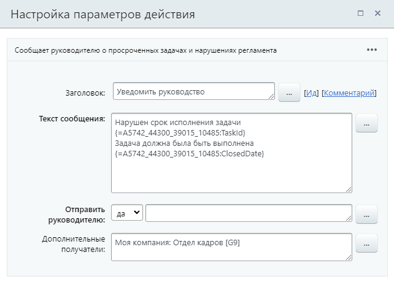

# Уведомить руководство

**Навигация**
- [← Оглавление курса](index.md)
- [← Предыдущий: 3804 — Сообщение соц.сети](lesson_3804.md)
- [Следующий: 3862 — Уведомление пользователя →](lesson_3862.md)

Официальная страница урока: https://dev.1c-bitrix.ru/learning/course/index.php?COURSE_ID=57&LESSON_ID=8543

Действие позволяет отправить уведомление руководителю ответственного за сущность менеджера и сообщить ему, например, о просроченных задачах и нарушениях регламента.

**Примечание**: данное действие доступно  для **Сделок** и **Лидов** в бизнес-процессах в **CRM** (Битрикс24).

#### Параметры действия

- **Текст сообщения** – текст уведомления;
- **Отправить руководителю** – выбирать ли непосредственного начальника ответственного менеджера, согласно структуре компании;
- **Дополнительные получатели** – дополнительные пользователи, которым отправится уведомление. Если руководителем не является непосредственный начальник, то здесь указывается нужный пользователь.

#### Пример

