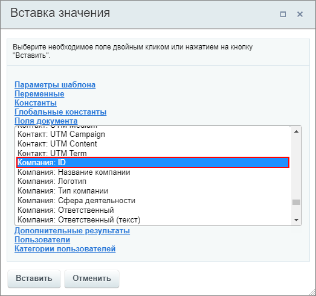
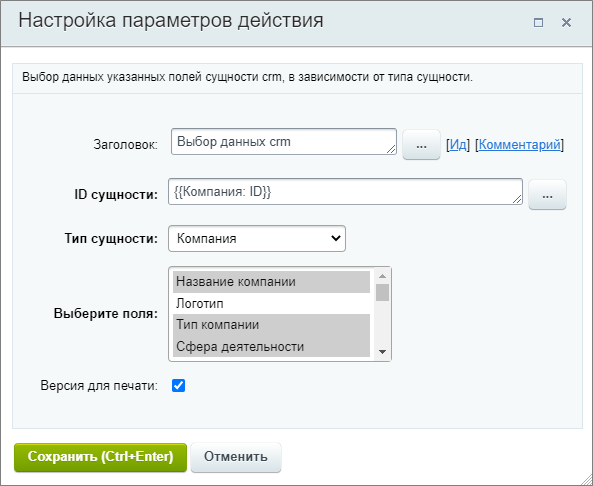
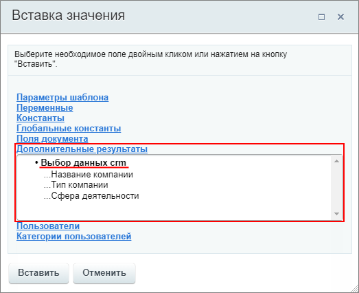

# Выбор данных crm

**Навигация**
- [← Оглавление курса](index.md)
- [← Предыдущий: 3803 — Установить текст статуса](lesson_3803.md)
- [Следующий: 8533 — Добавить клиента в рекламную аудиторию Google AdWords →](lesson_8533.md)

Официальная страница урока: https://dev.1c-bitrix.ru/learning/course/index.php?COURSE_ID=57&LESSON_ID=9003

Действие позволяет получить данные полей указанной сущности CRM в зависимости от её типа.

#### Описание параметров

- **ID сущности** – укажите идентификатор сущности, для которой необходимо получить значения полей;
- **Тип сущности** – выберите из списка, для какого типа сущности CRM осуществляeтcя выборка: **Контакты**, **Лиды**, **Сделки**, **Компании**;
- **Выберите поля** – укажите нужные поля из списка (список зависит от выбранного типа сущности);
- **Версия для печати** – включите эту опцию, если вы хотите получить значения выбранных полей в форме понятной человеку. Например, для поля **Ответственный** с отключенной опцией значением будет ID пользователя, а с включенной опцией - имя пользователя.

#### Пример

Бизнес-процесс для сделки. В качестве ID сущности указываем

			ID компании

                    

		, связанной со сделкой, через форму Вставка значения. Соответственно тип сущности - Компания. Поля, значения которых требуется получить: Название компании, тип и сфера деятельности.

Таким образом, при запуске бизнес-процесса для конкретной сделки, это действие получит значения указанных нами полей для той компании, которая связана с этой сделкой.

В результате выполнения действия в секции **Дополнительные результаты** формы **Вставка значения** станут доступны значения полей выбранной сущности. Результат для примера выше:

Полученные значения доступны для использования в других действиях бизнес-процессов.
