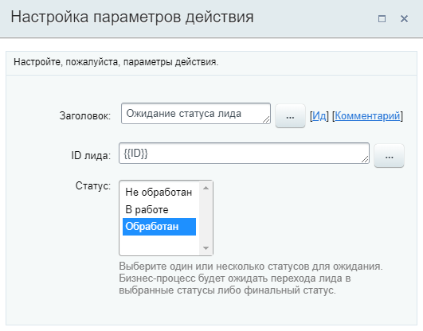

# Ожидание статуса лида

**Навигация**
- [← Оглавление курса](index.md)
- [← Предыдущий: 7399 — Ожидание стадии сделки](lesson_7399.md)
- [Следующий: 20772 — Отменить бронирование →](lesson_20772.md)

Официальная страница урока: https://dev.1c-bitrix.ru/learning/course/index.php?COURSE_ID=57&LESSON_ID=9007

Действие приостанавливает выполнение бизнес-процесса, пока не будет достигнут указанный статус

			Лида

                    **Лид** – это один из основных элементов CRM. Лидом мы называем потенциального клиента, у которого ещё не сформирована окончательная потребность в ваших товарах или услугах.

Подробнее на [helpdesk.bitrix24.ru](https://helpdesk.bitrix24.ru/open/1357950/).

		.

#### Описание параметров

- **ID лида** – идентификатор лида. Для удобства можно использовать форму
  			«Вставка значения»
                      При работе с бизнес-процессом в параметрах действий, параметрах шаблона и настройках статуса есть возможность указывать как собственный текст (заданный вручную), так и использовать различные переменные значения (поля документа и прочие данные, которые могут меняться и поэтому не задаются вручную). Для подстановки таких переменных значений используется специальная форма **Вставка значения**.
  [Подробнее](lesson_12383.md)...
  		.
- **Статус** – укажите статус, по достижении которого процесс продолжит свое выполнение. Бизнес-процесс будет ожидать перехода лида в выбранный статус либо финальный статус.

**Важно**: Рекомендуется использовать это действие только для тех шаблонов бизнес-процессов, которые запускаются при добавлении (создании). При использовании действия "Ожидание статуса лида" на изменение документа бизнес-процесс запускается при каждом изменении и останавливается в ожидании статуса лида. Таким образом создается несколько экземпляров БП (по количеству изменений), которые одновременно выполняются при достижении нужной стадии.

#### Пример

Пример заполнения: через форму «Вставка значения» указан **ID лида**, для которого запущен бизнес-процесс, и выбран статус из списка статусов.

