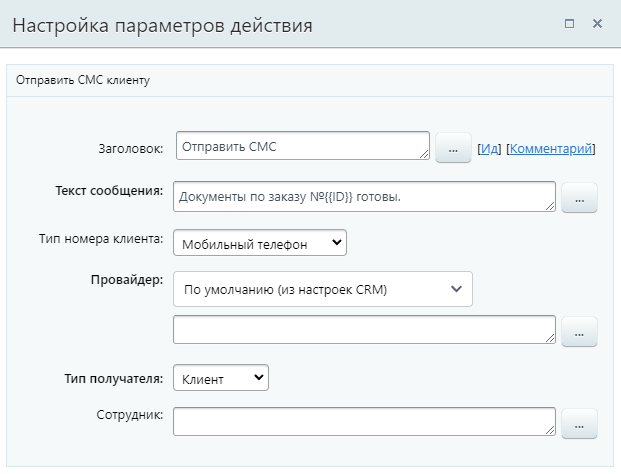

# Отправить СМС

**Навигация**
- [← Оглавление курса](index.md)
- [← Предыдущий: 20772 — Отменить бронирование](lesson_20772.md)
- [Следующий: 8529 — Отправить письмо клиенту →](lesson_8529.md)

Официальная страница урока: https://dev.1c-bitrix.ru/learning/course/index.php?COURSE_ID=57&LESSON_ID=9009

Действие позволяет отправить СМС клиенту или сотруднику.

#### Описание параметров

- **Текст сообщения** – текст, который будет отправлен клиенту в СМС;
- **Тип номера клиента** –  тип номера получателя сообщения (рабочий, домашний и т.д.);
- **Провайдер** – выберите, с помощью какого провайдера отправится сообщение: установленного в настройках CRM, стандартного из
  			служб сообщений
                      Модуль Служба сообщений позволит Вам осуществлять маркетинговую рассылку не только на электронную почту, но посредством SMS-сообщений, а также регистрироваться на сайте по номеру телефона! Все, что для этого нужно - установить сам модуль и подключить хотя бы одну из служб отправки SMS.
  Подробнее в курсе [Администратор сервиса Битрикс24 (коробочная версия)](https://dev.1c-bitrix.ru/learning/course/index.php?COURSE_ID=48&CHAPTER_ID=011227).
  		 или стороннего из предложенных в Маркете. Если выбранный провайдер не настроен, в форме отобразится предупреждение *Провайдер не настроен и не готов к работе*. Настройки провайдеров находятся по пути CRM &gt; Настройки &gt; Настройки CRM &gt; Интеграции в публичной части и по пути Настройки &gt; Настройки продукта &gt; Настройки модулей &gt; Служба сообщений в административной части (для коробочной версии);
- **Тип получателя** –  получателем СМС может быть выбран **Клиент** или **Сотрудник**. При выборе первого варианта, сообщение будет направлено клиенту, привязанному к документу бизнес-процесса. При выборе второго варианта – заполните следующее поле формы настроек;
- **Сотрудник** –  укажите сотрудника, которому будет отправлено сообщение. Поле нужно заполнять, только если в предыдущем параметре типом получателя выбран Сотрудник.

#### Пример

Действие настраивается в шаблоне бизнес-процесса Сделки. Значит, сообщение будет отправлено клиенту, связанному со сделкой. Номер телефона получателя действие возьмет из поля «Мобильный телефон», а провайдера – из настроек CRM. В тексте сообщения содержится информация для клиента о готовности документов.
