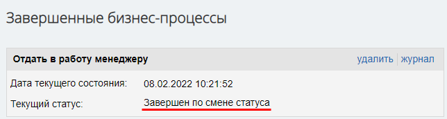
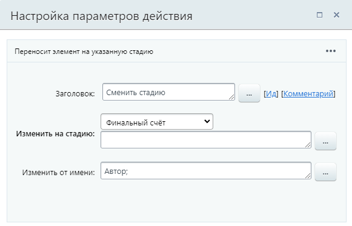
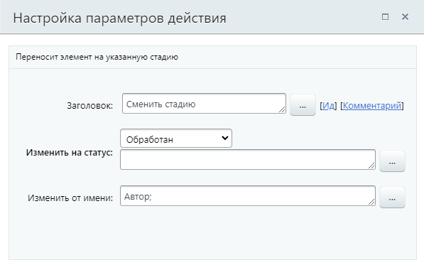

# Сменить стадию

**Навигация**
- [← Оглавление курса](index.md)
- [← Предыдущий: 20826 — Сменить воронку](lesson_20826.md)
- [Следующий: 3774 — Создание нового контакта →](lesson_3774.md)

Официальная страница урока: https://dev.1c-bitrix.ru/learning/course/index.php?COURSE_ID=57&LESSON_ID=9011

Действие переносит элемент на указанную стадию в бизнес-процессах Сделок с завершением бизнес-процесса.

В бизнес-процессах [Лидов](https://helpdesk.bitrix24.ru/open/1357950/), [Коммерческих предложений](https://helpdesk.bitrix24.ru/open/5450649/), [Счетов](https://helpdesk.bitrix24.ru/open/14795982/) и [Смарт-процессов](https://helpdesk.bitrix24.ru/open/13315798/) действие выполняет

			смену статуса

                    В CRM стадии есть у сделок, а у лидов, предложений и счетов стадии называются статусами.

Подробнее о статусах и как их добавить / изменить в статье на [helpdesk.bitrix24.ru](https://helpdesk.bitrix24.ru/open/6837847/).

		.

#### Описание параметров

- **Изменить на стадию** – выберите из списка стадию, на которую нужно перенести элемент. В списке доступны стадии всех воронок продаж;
  В шаблонах бизнес-процессов для Лидов, Коммерческих предложений, Счетов и Смарт-процессов параметр действия имеет название **Изменить на статус**.
- **Изменить от имени** – укажите пользователя, от имени которого выполнится смена стадии / статуса.

Для обоих параметров доступна подстановка значения через форму

			«Вставка значения»

                    При работе с бизнес-процессом в параметрах действий, параметрах шаблона и настройках статуса есть возможность указывать как собственный текст (заданный вручную), так и использовать различные переменные значения (поля документа и прочие данные, которые могут меняться и поэтому не задаются вручную). Для подстановки таких переменных значений используется специальная форма **Вставка значения**.

[Подробнее](lesson_12383.md)...

		.

После выполнения действия, бизнес-процесс сразу завершается. При этом в журнале в текущем статусе БП отобразится запись, что бизнес-процесс **Завершен по смене статуса**:

#### Пример настройки:

Смена стадии Сделки:

Смена статуса Лида. Обратите внимание на другое название параметра в бизнес-процессе Лидов:

