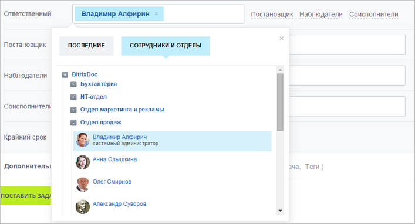

# FinderDestTable

Источник: https://dev.1c-bitrix.ru/api_d7/bitrix/main/finderdesttable/index.php

### Описание

**FinderDestTable** - класс для работы с таблицей сущностей, выбираемые в диалоге выбора, в списке **Последние**.

Обращается к пространству имён:

- [\Main](../index.php.md);
- [\Main\Localization\Loc](https://dev.1c-bitrix.ru/api_d7/bitrix/main/localization/loc/index.php);
- [\Main\DB\SqlExpression](https://dev.1c-bitrix.ru/api_d7/bitrix/main/db/sqlexpression/index.php);

#### Цепочка наследования

Является наследником класса [Bitrix\Main\ORM\Data\DataManager](https://dev.1c-bitrix.ru/learning/course/index.php?COURSE_ID=43&CHAPTER_ID=05748&LESSON_PATH=3913.5062.5748) (до версии 18.0.2 модуля **Main** - класса [Bitrix\Main\Entity\DataManager](https://dev.1c-bitrix.ru/api_d7/bitrix/main/entity/datamanager/index.php)).

### Методы и Поля

| Метод | Описание | С версии |
| --- | --- | --- |
| [merge](https://dev.1c-bitrix.ru/api_d7/bitrix/main/finderdesttable/merge.php) | Метод добавляет или обновляет данные |  |

#### Поля таблицы данных класса

| Поле | Описание | Тип | Обяз. |
| --- | --- | --- | --- |
| USER_ID | Идентификатор пользователя. | Int | Да |
| CODE | Идентификатор сообщения. | Int | Да |
| CODE_USER_ID | Служебное. | Int | Нет |
| CODE_TYPE | Тип сущности сообщения. | String | Да |
| CONTEXT | Тип сообщения. | String | Да |
| LAST_USE_DATE | Дата последнего обращения к пользователю. | Datetime | Да |
