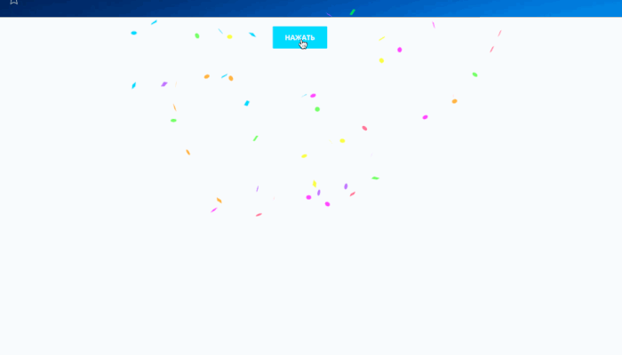

# Конфетти

Источник: https://dev.1c-bitrix.ru/api_d7/bitrix/ui/confetti/index.php

### Подключение

Подключение на странице:

```
\Bitrix\Main\UI\Extension::load("ui.confetti");
```



Через импорт:

```
import { Confetti } from 'ui.confetti';
```

### Пример вызова

```
import { Confetti } from 'ui.confetti';

Confetti.fire();
Confetti.create();

С параметрами:
Confetti.fire({
	particleCount: 100,
	spread: 70,
	origin: { y: 0.6 }
});

Глобально:
BX.UI.Confetti.fire();
BX.UI.Confetti.create();
```

Можно ограничить место появления конфетти, создав собственный элемент **canvas** и передав его в **create**:

```
var canvas = document.getElementById('my-canvas');
var confetti = new BX.UI.Confetti.create(canvas);

confetti({
	spread: 70
});
```

Весь список доступных параметров можно посмотреть [здесь](https://github.com/catdad/canvas-confetti).
