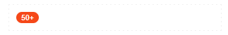

# Счётчики

Источник: https://dev.1c-bitrix.ru/api_d7/bitrix/ui/counter/index.php

Расширение обновлено до ES6.

### Подключение

Подключение на PHP-странице

```
\Bitrix\Main\UI\Extension::load("ui.cnt");
// or
\Bitrix\Main\UI\Extension::load("ui.counter");
```

### Базовый шаблон

Подключение шаблона:



```
<!-- .ui-counter > .ui-counter-inner -->
<div class="ui-counter">
	<div class="ui-counter-inner">50+</div>
</div>
```

### Основные параметры

#### Опция value

```
let myCounter = new BX.UI.Counter({
	value: 50
});

// or

myCounter.setValue(50)
```

#### Метод для обновления значения value.

```
myCounter.update();
```

#### Максимальное значение maxValue {number}

По умолчанию 99. При превышении значением `value` заданного значения `maxValue` будет отображено значение второго со знаком +. Установите в качестве значения *false* что бы отключить лимит.

```
let myCounter = new BX.UI.Counter({
	maxValue: 99
});

// or

myCounter.setMaxValue(99)
```

#### Анимация animation {boolean}

По умолчанию false.

```
let myCounter = new BX.UI.Counter({
	animation: true
});
```

#### Метод show()

```
myCounter.show();
```

#### Метод hide()

```
myCounter.hide();
```

### Размеры

Установление размеров `size {string}`

```
let myCounter = new BX.UI.Counter({
	size: BX.UI.Counter.Size.LARGE
});

// or

myCounter.setSize(BX.UI.Counter.Size.LARGE)
```

#### LARGE

Модификатор `.ui-counter-lg`.

```
BX.UI.Counter.Size.LARGE
```

```
<!-- .ui-counter.ui-counter-lg > .ui-counter-inner -->
<div class="ui-counter ui-counter-lg">
	<div class="ui-counter-inner">50+</div>
</div>
```

#### MEDIUM

Модификатор `.ui-counter-md`. Размер по умолчанию.

```
BX.UI.Counter.Size.MEDIUM
```

```
<!-- .ui-counter.ui-counter-md > .ui-counter-inner -->
<div class="ui-counter ui-counter-md">
	<div class="ui-counter-inner">50+</div>
</div>
```

#### SMALL

Модификатор `.ui-counter-sm`.

```
BX.UI.Counter.Size.SMALL
```

```
<!-- .ui-counter.ui-counter-sm > .ui-counter-inner -->
<div class="ui-counter ui-counter-sm">
	<div class="ui-counter-inner">50+</div>
</div>
```

### Цвета

Установка цвета.

```
let myCounter = new BX.UI.Counter({
	color: BX.UI.Counter.Color.DANGER
});

// or

myCounter.setColor(BX.UI.Counter.Color.DANGER)
```

#### PRIMARY

Модификатор `.ui-counter-primary`.

```
BX.UI.Counter.Color.PRIMARY
```

```
<!-- .ui-counter.ui-counter-primary > .ui-counter-inner -->
<div class="ui-counter ui-counter-primary">
	<div class="ui-counter-inner">50+</div>
</div>
```

#### SUCCESS

Модификатор `.ui-counter-success`.

```
BX.UI.Counter.Color.SUCCESS
```

```
<!-- .ui-counter.ui-counter-success > .ui-counter-inner -->
<div class="ui-counter ui-counter-success">
	<div class="ui-counter-inner">50+</div>
</div>
```

#### DANGER

Модификатор `.ui-counter-danger`.

```
BX.UI.Counter.Color.DANGER
```

```
<!-- .ui-counter.ui-counter-danger > .ui-counter-inner -->
<div class="ui-counter ui-counter-danger">
	<div class="ui-counter-inner">50+</div>
</div>
```

#### GRAY

Модификатор `.ui-counter-gray`.

```
BX.UI.Counter.Color.GRAY
```

```
<!-- .ui-counter.ui-counter-gray > .ui-counter-inner -->
<div class="ui-counter ui-counter-gray">
	<div class="ui-counter-inner">50+</div>
</div>
```

#### LIGHT

Модификатор `.ui-counter-light`.

```
BX.UI.Counter.Color.LIGHT
```

```
<!-- .ui-counter.ui-counter-light > .ui-counter-inner -->
<div class="ui-counter ui-counter-light">
	<div class="ui-counter-inner">50+</div>
</div>
```

#### WHITE

Модификатор `.ui-counter-white`.

```
BX.UI.Counter.Color.WHITE
```

```
<!-- .ui-counter.ui-counter-white > .ui-counter-inner -->
<div class="ui-counter ui-counter-white">
	<div class="ui-counter-inner">50+</div>
</div>
```

#### DARK

Модификатор `.ui-counter-dark`.

```
BX.UI.Counter.Color.DARK
```

```
<!-- .ui-counter.ui-counter-dark > .ui-counter-inner -->
<div class="ui-counter ui-counter-dark">
	<div class="ui-counter-inner">50+</div>
</div>
```
