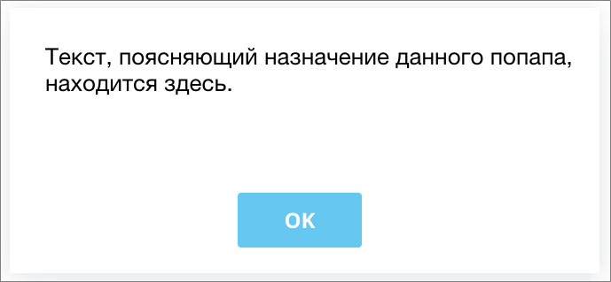
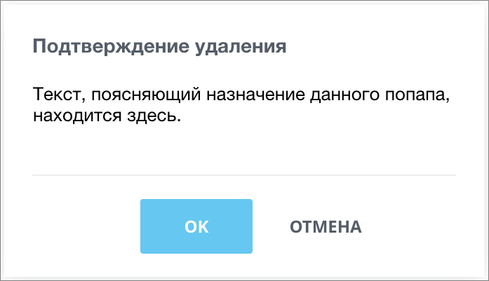

# Стандартные диалоги Alert и Confirm

Источник: https://dev.1c-bitrix.ru/api_d7/bitrix/ui/dialogs/index.php

#### JS-расширение ui.dialogs.messagebox

JS расширение **ui.dialogs.messagebox** предоставляет API для создания стандартных диалогов типа

			alert

                    

		 и

			confirm

                    

		 (модуль UI с версии 19.0.500).

- [Работа с диалогами](https://dev.1c-bitrix.ru/api_d7/bitrix/ui/dialogs/dialogs.php)
- [класс MessageBox](https://dev.1c-bitrix.ru/api_d7/bitrix/ui/dialogs/messagebox.php)
