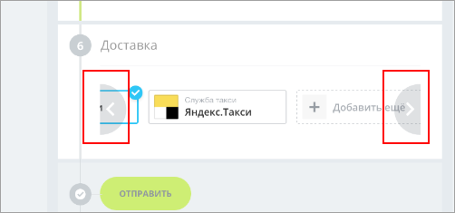
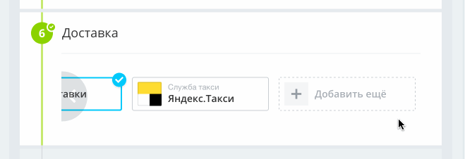

# Кнопки прокрутки («уши»)

Источник: https://dev.1c-bitrix.ru/api_d7/bitrix/ui/ears/index.php

### Подключение

Javascript-расширение `ui.ears` позволяет подключить для нужного элемента на странице кнопки прокрутки («уши»).

Доступно с **ui 20.5.400**.



```
\Bitrix\Main\UI\Extension::load("ui.ears");
```

### Использование

В js-коде необходимо инициализировать «ушки».

```
<div class="container"></div>

const ears = new Ears({
	container: document.querySelector('.container'),
	smallSize: true,
	noScrollbar: true
});

ears.init();
```

В параметр `container` необходимо передать класс контейнера, где хранятся те элементы, которые нужно прокручивать.

Дополнительные параметры:

- `smallSize`. Параметр, влияющий на размер «ушей». По умолчанию высота «ушей» 94px. Если передать smallSize, то размер будет 75px.
- `noScrollbar`. По умолчанию скроллбар виден, с помощью этого параметра можно его скрыть.
- `className`. Через него можно задать свой класс.

Дополнительно есть возможность автоматической прокрутки к выбранному элементу, если он скрыт за пределами видимости. Для этого нужному элементу необходимо добавить атрибут `data-role="ui-ears-active"`.

Пример работы:


