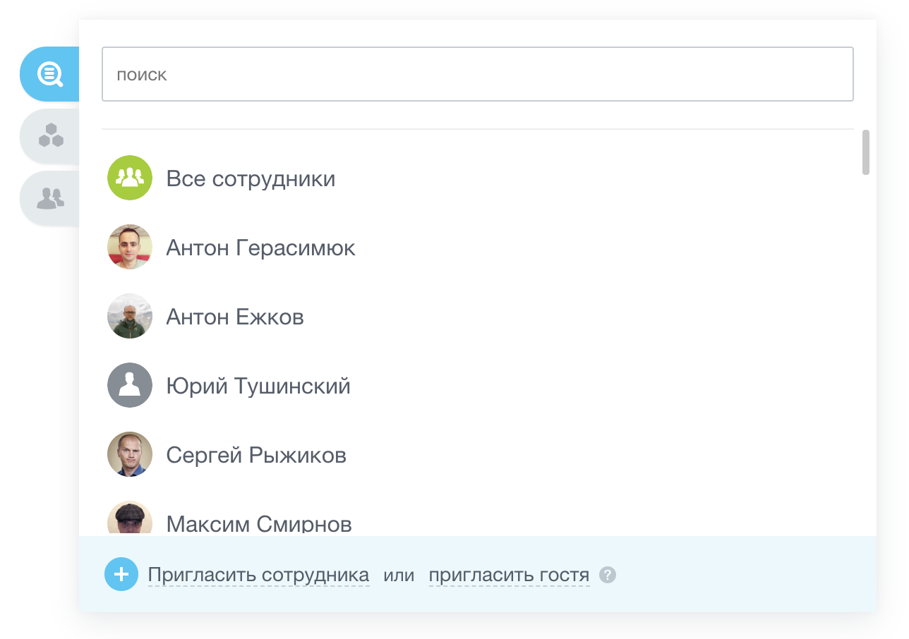
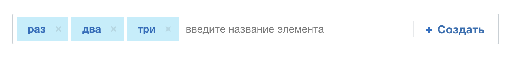
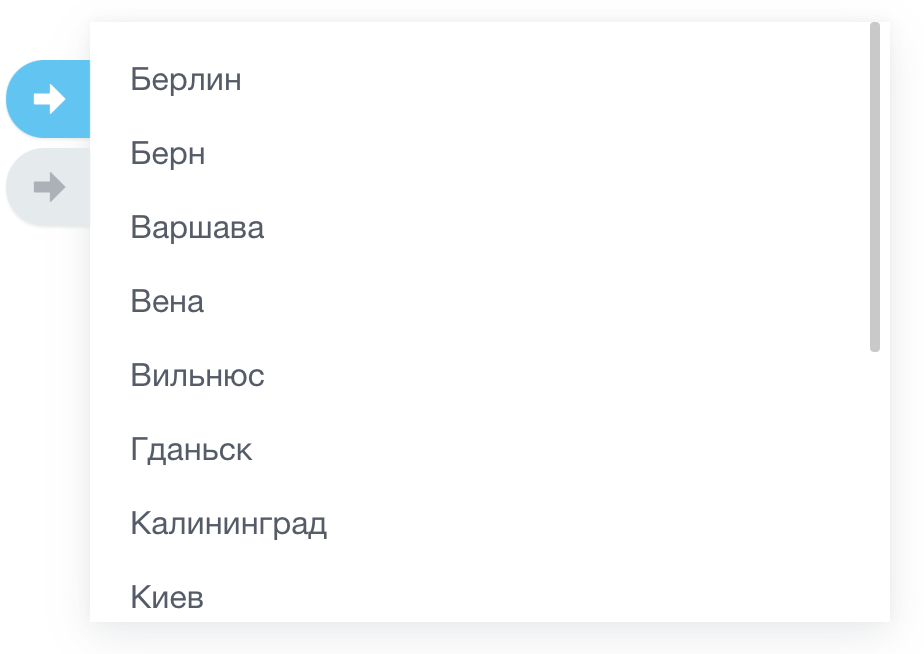
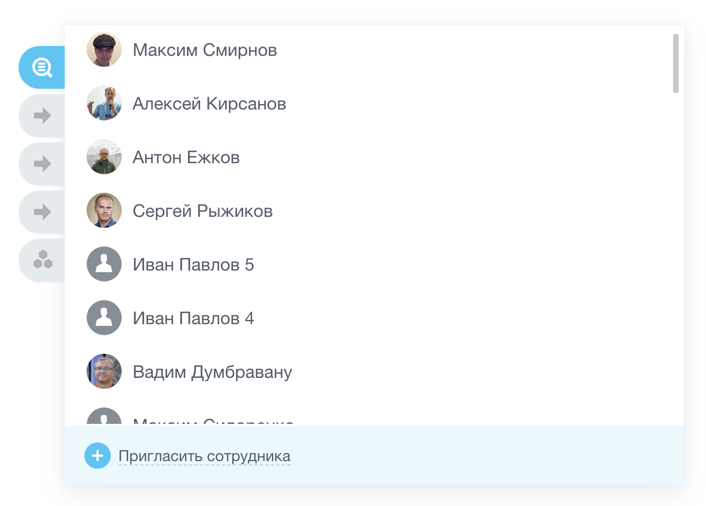
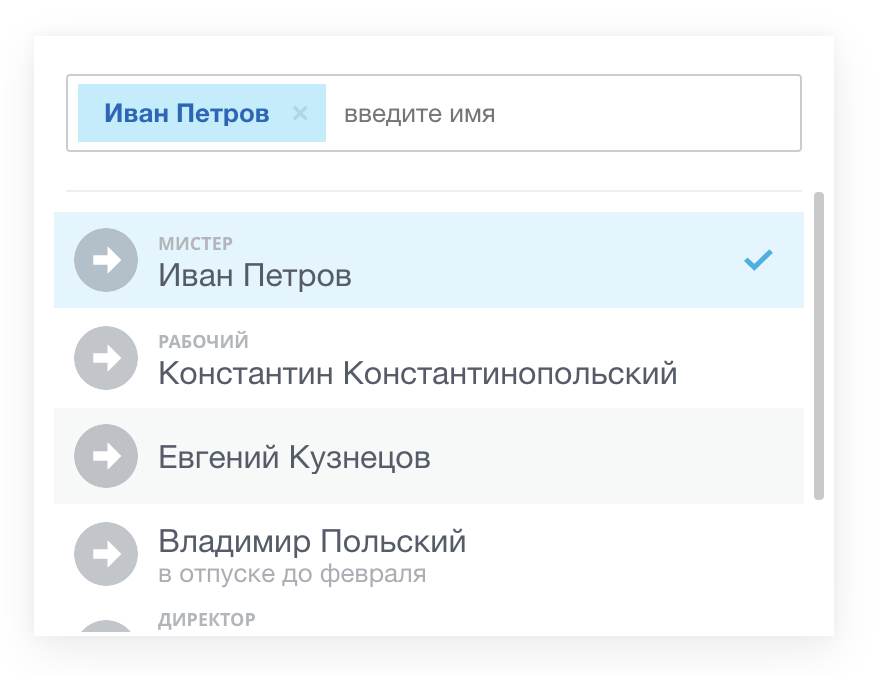
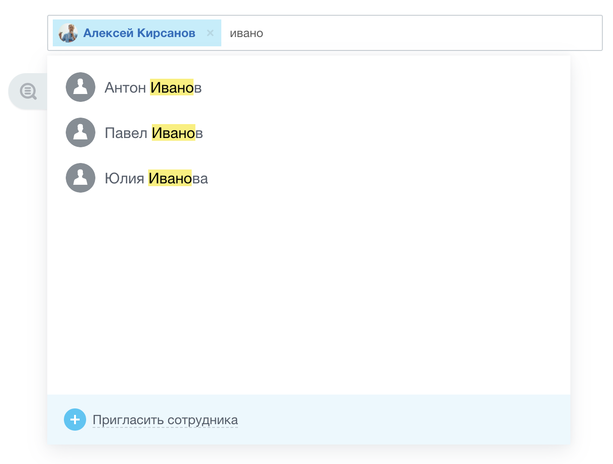

# Диалог выбора сущностей

Источник: https://dev.1c-bitrix.ru/api_d7/bitrix/ui/entity_selector/index.php

<!-- С версии 20.5.500 (разработчик просил не указывать версию в документации) -->

### Начало работы

JavaScript-расширение `ui.entity-selector` предоставляет 2 виджета:

- [Диалог выбора сущностей](https://dev.1c-bitrix.ru/api_d7/bitrix/ui/entity_selector/dialog/index.php) :
  
- [Виджет TagSelector](https://dev.1c-bitrix.ru/api_d7/bitrix/ui/entity_selector/tag_selector/index.php) :
  

Эти виджеты могут использоваться как по отдельности, так и совместно:

- Простой диалог (dropdown) без поиска:
  
  
- Диалог с поиском (с TagSelector):
  
- Виджет TagSelector c диалогом:
  

### Подключение в коде

При работе с виджетами рекомендуется "ленивая" загрузка `ui.entity-selector`.

### Динамическая (ленивая) загрузка в JavaScript

```
Runtime.loadExtension('ui.entity-selector').then(exports => {
	const { Dialog, TagSelector } = exports;
});
```

### Импорт в ES6

```
import { Dialog, TagSelector } from 'ui.entity-selector';
```

### Использование в ES5

```
var selector = new BX.UI.EntitySelector.TagSelector(options);
var dialog = new BX.UI.EntitySelector.Dialog(options);
```

### Подключение на PHP-странице

```
\Bitrix\Main\UI\Extension::load('ui.entity-selector');
```

### Примеры использования

### Выбор "Кому" в Живой Ленте

```
const tagSelector = new TagSelector({
	dialogOptions: {
		context: 'MY_MODULE_CONTEXT',
		entities: [
 			{
				id: 'user', // пользователи
 			},
 			{
				id: 'project', // группы и проекты
 			},
 			{
				id: 'department', // структура компании
				options: {
					selectMode: 'usersAndDepartments' // выбор пользователей и отделов
				}
 			},
 			{
				id: 'meta-user',
				options: {
					'all-users': true // Все сотрудники
				}
 			},
		],
	}
});

tagSelector.renderTo(document.getElementById('container'));
```

### Диалог выбор пользователя

```
const button = document.getElementById('responsible-button');
const dialog = new Dialog({
	targetNode: button,
	enableSearch: true,
	context: 'MY_MODULE_CONTEXT',
	entities: [
		{
			id: 'user', // пользователи
		},
		{
			id: 'department', // структура компании: выбор только пользователей
		},
	],
});

button.addEventListener('click', function() {
	dialog.show();
});
```

### Выбор группы соц. сети

```
const tagSelector = new TagSelector({
	dialogOptions: {
		context: 'MY_MODULE_CONTEXT',
		entities: [
			{
				id: 'project', // группы и проекты
			},
		],
	}
});

tagSelector.renderTo(document.getElementById('container'));
```

### Диалог выбора экстранет-групп, где есть сервис "Задачи"

```
const button = document.getElementById('select-project');
const dialog = new Dialog({
	targetNode: button,
	enableSearch: true,
	context: 'MY_MODULE_CONTEXT',
	entities: [
		{
			id: 'project',
			options: {
				extranet: true, // только экстранет
				features: {
					tasks: ['view'] // права доступа к группе
				 }
			}
		},
	],
});

button.addEventListener('click', function() {
	dialog.show();
});
```

### Выбор отделов

```
const tagSelector = new TagSelector({
	dialogOptions: {
		context: 'MY_MODULE_CONTEXT',
		entities: [
			{
				id: 'department',
				options: {
					selectMode: 'departmentsOnly', // только выбор отделов
				}
			},
		],
	 }
});

tagSelector.renderTo(document.getElementById('container'));
```
