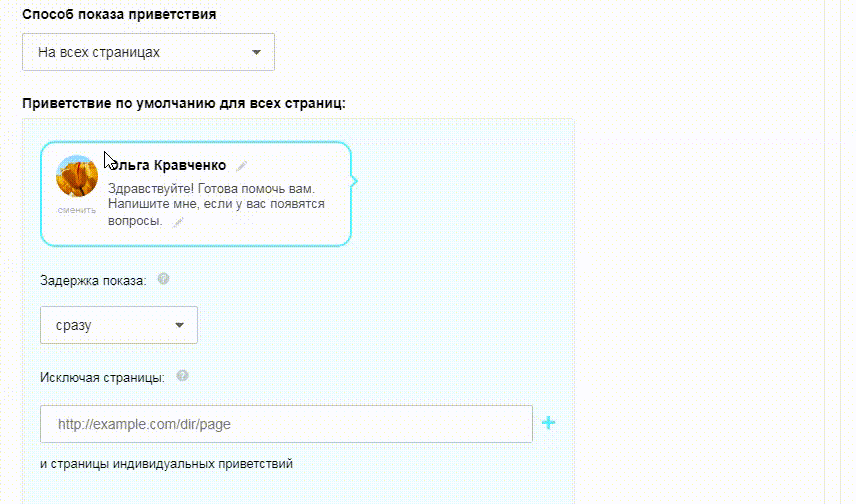

# Начало работы

Источник: https://dev.1c-bitrix.ru/api_d7/bitrix/ui/hint/index.php

### Подключение и использование

Javascript-расширение `ui.hint` позволяет показывать подсказки на странице.

 

#### Подключение на PHP-странице

```
\Bitrix\Main\UI\Extension::load("ui.hint");
```

#### Использование

В html-коде достаточно указать у элемента атрибут data-hint c текстом:

```
<span data-hint="Моя первая подсказка"></span>
```

### Кастомизация

Если присутствует атрибут `data-hint-no-icon`, то подсказка будет показываться при наведении на блок, который содержит атрибут data-hint (без добавления иконки).

```
<div data-hint="Моя вторая подсказка" data-hint-no-icon>Я - блок</div>
```

**Содержимое как HTML**

Если присутствует атрибут `data-hint-html`, то текст из data-hint будет выводиться "как есть", без санитайзера, позволяя добавить, например, переносы строк.

**Будьте внимательны, помните о безопасности!**

```
<div data-hint="Моя подсказка<br>с переносом строки" data-hint-html>Я - блок</div>
```

**Интерактивная подсказка**

Если необходимо, чтобы подсказка не пропадала при наведении (например если в подсказке есть ссылка, на которую нужно нажать), можно добавить атрибут `data-hint-interactivity`.

```
<div data-hint="Текст подсказки. <a href='#'>Подробнее</a>" data-hint-html data-hint-interactivity>Блок с ссылкой</div>
```

### Инициализация

В js-коде необходимо инициализировать подсказку. Будут созданы подсказки для всех дочерних элементов контейнера:

```
BX.UI.Hint.init(BX('container'));
```

**Пример**

```
<?
\Bitrix\Main\UI\Extension::load("ui.hint");
?>

<script type="text/javascript">
	BX.ready(function() {
		BX.UI.Hint.init(BX('my-container'));
	})
</script>

<div id="my-container">
	<div>
		Подсказка 1
		<span data-hint="<?=Loc::getMessage('MY_HINT_1')?>"></span>
	</div>

	<div>
		Подсказка 2
		<span data-hint="<?=Loc::getMessage('MY_HINT_2')?>"></span>
	</div>
</div>
```

### Использование в JavaScript

При формировании верстки в js, можно получить элемент для вставки из текста:

```
containerElement.appendChild(
	BX.UI.Hint.createNode("Моя вторая подсказка.")
);
```
