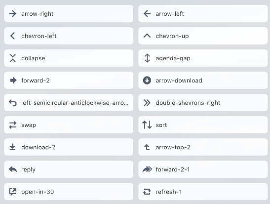
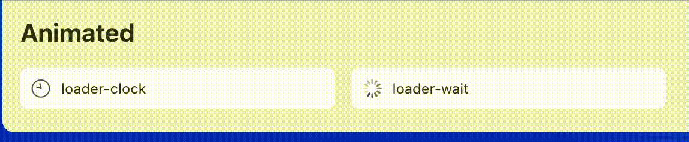

# Сет иконок

Источник: https://dev.1c-bitrix.ru/api_d7/bitrix/ui/icon_set/index.php

Доступно с версии **ui 23.100.0**

Компонент `ui.icon-set` предназначен для удобного использования

			иконок из библиотеки

                    Например:



		. Предполагает использование как JS, VUE компонентами или просто HTML элементами в шаблонах.

### Начало работы

Компонент разбит на разные сеты для более удобного использования и подключения. При использовании JS или VUE компонента необходимо подключать CSS сет с необходимым набором иконок.

`ui.icon-set.api.core` - js экстеншен

`ui.icon-set.api.vue` - vue экстеншен

`ui.icon-set.actions`, `ui.icon-set.main`, `ui.icon-set.social`, `ui.icon-set.contact-center`, `ui.icon-set.crm`, `ui.icon-set.editor`,

			ui.icon-set.animated

                    С версии **ui 24.200.0**



		 - css стили для соответствующих сетов.

### Подключение на PHP-странице

Для использования подключаем НЕОБХОДИМЫЙ сет.

```
\Bitrix\Main\UI\Extension::load([
	'ui.icon-set.api.core',
	'ui.icon-set.api.vue',
	'ui.icon-set.actions',
	'ui.icon-set.main',
	'ui.icon-set.social',
	'ui.icon-set.contact-center',
	'ui.icon-set.crm',
	'ui.icon-set.editor',
]);
```

### Подключение в jS

```
import {Icon, Set} from 'ui.icon-set.api.core';
import {BIcon, Set} from 'ui.icon-set.api.vue';
import 'ui.icon-set.actions';
import 'ui.icon-set.main';
import 'ui.icon-set.social';
import 'ui.icon-set.contact-center';
import 'ui.icon-set.crm';
import 'ui.icon-set.editor';
```

### Базовое использование

По умолчанию нужно использовать тег `div` с базовым классом `ui-icon-set` и к этому классу добавить класс модификатор необходимой иконки, например `--person-arrow-down`.

```
<div class="ui-icon-set --person-arrow-down"></div>
```

По умолчанию все иконки имеют размер блока 24px на 24px. Цвет иконок `-ui-color-base-90 (#525c69);`.

Для изменения размера иконки необходимо в div добавить стиль с необходимым размером: `style="--ui-icon-set__icon-size: 62px;"`.

Для изменения цвета выводимой иконки необходимо добавить стиль с необходимым цветом: `style="--ui-icon-set__icon-color: red;"`.

```
<div class="ui-icon-set --person-location" style="--ui-icon-set__icon-size: 62px; --ui-icon-set__icon-color: red;"></div>
```

Если у вас в контейнере много иконок, которым необходимо изменить цвет, то `--ui-icon-set__icon-color` можно задать родительскому блоку, это свойство наследуемое.

### JS экстеншен

Для использования JS-экстеншена вам необходимо подключить JS и CSS компоненты

```
import {Icon, Set} from 'ui.icon-set.api.core';
import 'ui.icon-set.actions';
```

Далее создаете необходимую иконку:

```
const icon = new Icon({
	icon: Main.INFO_1,
	color: getComputedStyle(document.body).getPropertyValue('--ui-color-base-40'),
	size: 16,
})
```

Параметр `icon` (*string*) обязательный, передается ключ для отображения иконки.

Параметр `color` (*string*) необязательный, передается цвет из дизайн-токенов или в любом формате цвета.

Параметр `size` (*number*) необязательный, передается размер блока с иконкой.

Метод `render(): Node` возвращает блок с иконкой.

Метод `renderTo(node: HTMLElement): void` отображает элемент в ноде.

### VUE экстеншен

Для использовани VUE-экстеншен вам необходимо подключить VUE и CSS компоненты:

```
import {Icon, Set} from 'ui.icon-set.api.vue';
import 'ui.icon-set.actions';
```

Далее добавить BIcon в components:

```
components: {
	BIcon,
}
```

Далее в вычисляемое свойство добавить свой сет:

```
computed: {
	set() {
		return Set;
	}
}
```

И в шаблоне использовать необходимый компонент иконок:

```
<BIcon
	:name="set.MORE"
	:size="50"
	color="red"
></BIcon>
```
