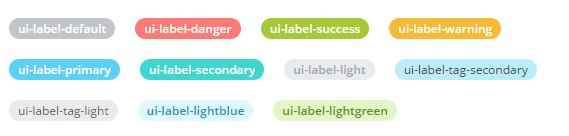
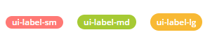
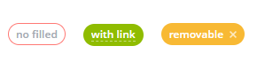

# Метки

Источник: https://dev.1c-bitrix.ru/api_d7/bitrix/ui/labels/index.php

### Описание

Javascript-расширение `ui.label` позволяет показывать информационные метки (labels, badges) на странице.

	**Предустановленные цвета:**



	**Предустановленные размеры:**



	**Другие вариации:**



### Использование в js-расширениях

	**Базовый сценарий**

```
import {Tag} from 'main.core';
import {Label, LabelColor} from 'ui.label';

const label = new Label({
	text: 'Заказ оплачен',
	color: LabelColor.SUCCESS,
	fill: true
});

const domNode = Tag.render`
	<div class="container">
		${label.render()}
	</div>
`;
```

	**Расширенный сценарий**

```
import {Label, LabelColor, LabelSize} from 'ui.label';

const label = new Label({
	text: 'Заказ оплачен',
	color: LabelColor.SUCCESS,
	size: LabelSize.LG, // доступны размеры LabelSize.SM, LabelSize.MD, LabelSize.LG
	fill: false, // можно убрать заливку, оставить только контур
	link: '/crm/deal/details/123/', // можно сделать лейбл кликабельным
	customClass: 'additional-css-class' // на этот css-класс можно повесить дополнительную стилизацию
});
```

### Иконка закрытия

Можно передать в конструктор лейбла опцию `icon`. Она должна быть объектом, ключами которого являются стандартные js-события, а значениями - функции-обработчики. В этом случае у лейбла будет выведена иконка-крестик.

Пример, как можно удалить лейбл при нажатии на эту иконку:

```
import {Label, LabelColor} from 'ui.label';

const label = new Label({
	text: 'Заказ оплачен',
	color: LabelColor.SUCCESS,
	fill: true,
	icon: {
		click: e => e.target.parentNode.remove()
	}
});
```
