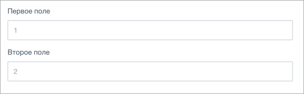
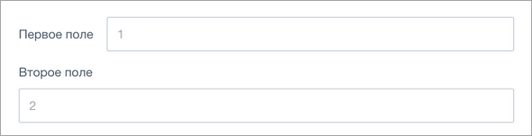
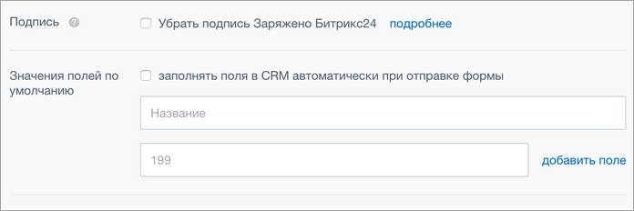
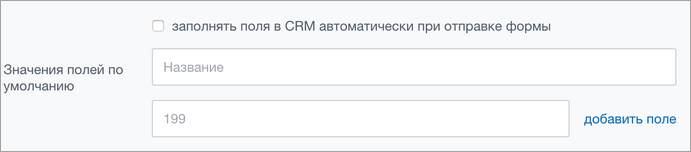
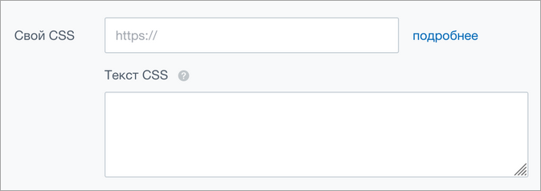
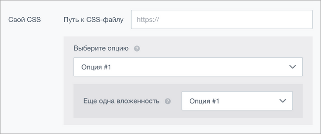
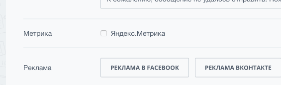
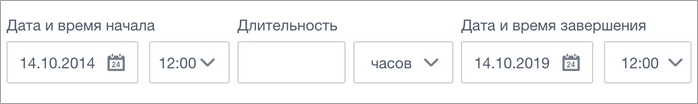

# Формы.Сетка

Источник: https://dev.1c-bitrix.ru/api_d7/bitrix/ui/layout_form/index.php

### Подключение и базовая структура

Javascript-расширение `ui.layout-form` содержит стили для построения сетки для форм.

 **Базовая html-структура формы:**

```
<div class="ui-form">
	<div class="ui-form-row">
		<div class="ui-form-label">
			<div class="ui-ctl-label-text">Первое поле</div>
		</div>
		<div class="ui-form-content">
			<div class="ui-ctl ui-ctl-textbox ui-ctl-w100">
				<input type="text" class="ui-ctl-element" placeholder="1">
			</div>
		</div>
	</div>
	<div class="ui-form-row">
		<div class="ui-form-label">>
			<div class="ui-ctl-label-text">Второе поле</div>
		</div>
		<div class="ui-form-content">
			<div class="ui-ctl ui-ctl-textbox ui-ctl-w100">
				<input type="text" class="ui-ctl-element" placeholder="2">
			</div>
		</div>
	</div>
</div>
```

где

	`ui-form` - Основной контейнер формы, обязательный элемент.
	`ui-form-row` - Ряд формы.
	`ui-form-label` - Подпись к полю формы.
	`ui-form-content` - Обертка-контейнер для поля формы. Внутри можно размещать поля из `ui.forms`, `ui-form-row` или кастомный контент.

Внешний вид:



### Модификаторы формы и ряда

По умолчанию элементы формы имеют вертикальное направление, как в примере выше. Для установки горизонтального направления существуют два модификатора:

1. **ui-form-line**. Модификатор формы (ui-form). Он установит горизонтальное направление для всех ui-form-row внутри формы.
  
  ```
  <div class="ui-form ui-form-line">
  	<div class="ui-form-row">
  		<div class="ui-form-label">
  			<div class="ui-ctl-label-text">Первое поле</div>
  		</div>
  		<div class="ui-form-content">
  			<div class="ui-ctl ui-ctl-textbox ui-ctl-w100">
  				<input type="text" class="ui-ctl-element" placeholder="1">
  			</div>
  		</div>
  	</div>
  	<div class="ui-form-row">
  		<div class="ui-form-label">
  			<div class="ui-ctl-label-text">Второе поле</div>
  		</div>
  		<div class="ui-form-content">
  			<div class="ui-ctl ui-ctl-textbox ui-ctl-w100">
  				<input type="text" class="ui-ctl-element" placeholder="2" pre="">
  ```
2. **ui-form-row-line**. Модификатор ряда (ui-form-row). Установит горизонтальное направление для конкретного ui-form-row.
  
  ```
  <div class="ui-form">
  	<div class="ui-form-row ui-form-row-line">>
  		<div class="ui-form-label">
  			<div class="ui-ctl-label-text">Первое поле</div>
  		</div>
  		<div class="ui-form-content">
  			<div class="ui-ctl ui-ctl-textbox ui-ctl-w100">
  				<input type="text" class="ui-ctl-element" placeholder="1">
  			</div>
  		</div>
  	</div>
  	<div class="ui-form-row">
  		<div class="ui-form-label">
  			<div class="ui-ctl-label-text">Второе поле</div>
  		</div>
  		<div class="ui-form-content">>
  			<div class="ui-ctl ui-ctl-textbox ui-ctl-w100">
  				<input type="text" class="ui-ctl-element" placeholder="2">
  			</div>
  		</div>
  	</div>
  </div>
  ```

### Формы внутри блока

Частый кейс использования форм - внутри блока «Дополнительно» (в задачах, настройках сайтов и т.д.). Для этого создан специальный класс-модификатор **ui-form-section**. Пример такой формы:



```
<div class="ui-form ui-form-section">
	<div class="ui-form-row">
		<div class="ui-form-label">
			<div class="ui-ctl-label-text">
				Подпись
				<span data-hint="Моя первая подсказка" data-hint-init="y" class="ui-hint">
			<span class="ui-hint-icon"></span>
		</span>
			</div>
		</div>
		<div class="ui-form-content">
			<div class="ui-form-row">
				<label class="ui-ctl ui-ctl-checkbox">
					<input type="checkbox" class="ui-ctl-element">
					<div class="ui-ctl-label-text">Убрать подпись Заряжено Битрикс24</div>
				</label>
				<a href="#" class="ui-form-link">подробнее</a>
			</div>
		</div>
	</div>
	<div class="ui-form-row">
		<div class="ui-form-label">
			<div class="ui-ctl-label-text">Значения полей по умолчанию</div>
		</div>
		<div class="ui-form-content">
	<div class="ui-form-row">
		<label class="ui-ctl ui-ctl-checkbox ui-ctl-w100">
			<input type="checkbox" class="ui-ctl-element">
			<div class="ui-ctl-label-text">заполнять поля в CRM автоматически при отправке формы</div>
		</label>
	</div>
	<div class="ui-form-row">
		<div class="ui-ctl ui-ctl-textbox ui-ctl-w100">
			<input type="text" class="ui-ctl-element" placeholder="Название">
		</div>
	</div>
	<div class="ui-form-row">
		<div class="ui-ctl ui-ctl-textbox ui-ctl-w100">
			<input type="text" placeholder="199" class="ui-ctl-element">
		</div>
		<a class="ui-form-link" href="">добавить поле</a>
	</div>
		</div>
	</div>
</div>
```

### Вертикальное выравнивание

По умолчанию правой и левой колонкам задано вертикальное выравнивание по верхнему краю. Для изменения есть следующие модификаторы:

- **ui-form-row-middle** - выравнивает элементы посередине.
  
  ```
  <div class="ui-form ui-form-section">
  	<div class="ui-form-row ui-form-row-middle">>
  		<div class="ui-form-label">
  			<div class="ui-ctl-label-text">Значения полей по умолчанию</div>
  		</div>
  		<div class="ui-form-content">
  	<div class="ui-form-row">
  		<label class="ui-ctl ui-ctl-checkbox ui-ctl-w100">
  			<input type="checkbox" class="ui-ctl-element">
  			<div class="ui-ctl-label-text">заполнять поля в CRM автоматически при отправке формы</div>
  		</label>
  	</div>
  	<div class="ui-form-row">
  		<div class="ui-ctl ui-ctl-textbox ui-ctl-w100">
  			<input type="text" class="ui-ctl-element" placeholder="Название">>
  		</div>
  	</div>
  		</div>
  	</div>
  </div>
  ```
- **ui-form-row-middle-input** - выравнивает левую колонку по центру первого поля в правой колонке. Визуально выглядит так:
  
  ```
  <div class="ui-form ui-form-section">
  	<div class="ui-form-row ui-form-row-middle-input">
  		<div class="ui-form-label">
  			<div class="ui-ctl-label-text">Свой CSS</div>
  		</div>
  		<div class="ui-form-content">
  			<div class="ui-form-row">
  				<div class="ui-ctl ui-ctl-textbox">
  					<input type="text" class="ui-ctl-element" placeholder="https://">
  				</div>
  				<a href="#"" class="ui-form-link">подробнее</a>
  			</div>
  			<div class="ui-form-row">
  				<div class="ui-form-label">
  					<div class="ui-ctl-label-text">
  						Текст CSS
  						<pan data-hint="Моя первая подсказка" data-hint-init="y" class="ui-hint">
  							<span class="ui-hint-icon"></span>
  						</span>
  					</div>
  				</div>
  				<div class="ui-ctl ui-ctl-textarea">
  					<textarea class="ui-ctl-element ui-ctl-resize-y"></textarea>
  				</div>
  			</div>
  		</div>
  	</div>
  </div>
  ```

### Вложенные блоки

В «Дополнительно» можно добавлять вложенные блоки с помощью контейнера **ui-form-row-group**, он задает нужные отступы и серую подсветку. Внутрь него можно добавлять ряды (**ui-form-row**) и еще **ui-form-row-group**. Например:



```
<div class="ui-form ui-form-section">
	<div class="ui-form-row ui-form-row-middle-input">
		<div class="ui-form-label">
			<div class="ui-ctl-label-text">Свой CSS</div>
		</div>
		<div class="ui-form-content">
			<div class="ui-form-row">
				<div class="ui-form-label">
					<div class="ui-ctl-label-text">Путь к CSS-файлу</div>
				</div>
				<div class="ui-ctl ui-ctl-textbox ui-ctl-w100">
					<input type="text" class="ui-ctl-element" placeholder="https://">
				</div>
			</div>
			<div class="ui-form-row-group">
				<div class="ui-form-row">
					<div class="ui-form-label">
						<div class="ui-ctl-label-text">
							Выберите опцию
							<span data-hint="Моя первая подсказка" data-hint-init="y" class="ui-hint"><span class="ui-hint-icon">></span></span>
						</div>
					</div>
					<div class="ui-ctl ui-ctl-after-icon ui-ctl-dropdown ui-ctl-w100">
						<div class="ui-ctl-after ui-ctl-icon-angle"></div>
						<select class="ui-ctl-element">
							<option value="">Опция #1</option>
						</select>
					</div>
				</div>
				<div class="ui-form-row-group">
					<div class="ui-form-row">
						<div class="ui-form-label">
							<div class="ui-ctl-label-text">
								Еще одна вложенность
								<span data-hint="Моя первая подсказка" data-hint-init="y" class="ui-hint"><span class="ui-hint-icon"></span></span>
							</div>
						</div>
						<div class="ui-ctl ui-ctl-after-icon ui-ctl-dropdown ui-ctl-w100">
							<div class="ui-ctl-after ui-ctl-icon-angle"></div>
							<select class="ui-ctl-element">
								<option value="">Опция #1</option>
							</select>
						</div>
					</div>
				</div>
			</div>
		</div>
	</div>
</div>
```

**Показ/скрытие вложенного блока по чекбоксу**

Еще один частый кейс - показ блока, если отмечен чекбокс.

Для этого в html-коде достаточно указать у элемента с классом **ui-form-label** атрибут **data-form-row-hidden** и инициировать запуск через **new BX.UI.LayoutForm();**.

В конструктор можно передать объект параметров. Сейчас поддерживается только указание контейнера. По умолчанию ноды `[data-form-row-hidden]` ищутся по всему документу, если задан контейнер - только внутри него.

```
new BX.UI.LayoutForm({
	container: node // HTMLElement for search hidden rows
});
```



HTML-структура будет следующая. Обратите внимание, что добавлен блок **ui-form-row-hidden** - это контейнер для скрытого блока.

```
<div class="ui-form ui-form-section">
	<div class="ui-form-row">
		<div class="ui-form-label">
			<div class="ui-ctl-label-text">Метрика</div>
		</div>
		<div class="ui-form-content">
			<div class="ui-form-row">
				<div class="ui-form-label" data-form-row-hidden="">
					<label class="ui-ctl ui-ctl-checkbox">
						<input type="checkbox" class="ui-ctl-element">
						<div class="ui-ctl-label-text">Яндекс.Метрика</div>
					</label>
				</div>
				<div class="ui-form-row-hidden">
					<div class="ui-form-row">
						<div class="ui-ctl ui-ctl-textbox ui-ctl-w25">
							<input type="text" placeholder="Введите ID" class="ui-ctl-element">
						</div>
						<a href="#" class="ui-form-link">подробнее</a>
					</div>
				</div>
			</div>
		</div>
	</div>
</div>
<script type="text/javascript">
	BX.ready(function() {
		new BX.UI.LayoutForm();
	});
</script>
```

### Поля в одну строку

Иногда необходимо расположить несколько полей в одну строку. Для этого есть специальный контейнер **ui-form-row-inline**. Внутрь него достаточно положить несколько **ui-form-row**. Пример:


```
<div class="ui-form">
	<div class="ui-form-row-inline">
		<div class="ui-form-row">
			<div class="ui-form-label">
				<div class="ui-ctl-label-text">Первое поле</div>
			</div>
			<div class="ui-form-content">
				<div class="ui-ctl ui-ctl-textbox ui-ctl-w100">
					<input type="text" class="ui-ctl-element" placeholder="1">
				</div>
			</div>
		</div>
		<div class="ui-form-row">
			<div class="ui-form-label">
				<div class="ui-ctl-label-text">Второе поле</div>
			</div>
			<div class="ui-form-content">
				<div class="ui-ctl ui-ctl-textbox ui-ctl-w100">
					<input type="text" class="ui-ctl-element" placeholder="2">
				</div>
			</div>
		</div>
		<div class="ui-form-row">
			<div class="ui-form-label">
				<div class="ui-ctl-label-text">Третье поле</div>
			</div>
			<div class="ui-form-content">
				<div class="ui-ctl ui-ctl-textbox ui-ctl-w100">
					<input type="text" class="ui-ctl-element" placeholder="3">
				</div>
			</div>
		</div>
	</div>
</div>
```

Еще пример:



```
<div class="ui-form">
	<div class="ui-form-row-inline">
		<div class="ui-form-row">
			<div class="ui-form-label">
				<div class="ui-ctl-label-text">Дата и время начала</div>
			</div>
			<div class="ui-form-content">
				<div class="ui-ctl ui-ctl-after-icon ui-ctl-date">
					<div class="ui-ctl-after ui-ctl-icon-calendar"></div>
					<div class="ui-ctl-element">14.10.2014</div>
				</div>
				<div class="ui-ctl ui-ctl-after-icon ui-ctl-dropdown">
					<div class="ui-ctl-after ui-ctl-icon-angle"></div>
					<select class="ui-ctl-element">
						<option value="">12:00</option>
						<option value="">13:00</option>
						<option value="">14:00</option>
					</select>
				</div>
			</div>
		</div>
		<div class="ui-form-row">
			<div class="ui-form-label">
				<div class="ui-ctl-label-text">Длительность</div>
			</div>
			<div class="ui-form-content">
				<div class="ui-ctl ui-ctl-textbox">
					<input type="text" class="ui-ctl-element" placeholder="">
				</div>
				<div class="ui-ctl ui-ctl-after-icon ui-ctl-dropdown">
					<div class="ui-ctl-after ui-ctl-icon-angle"></div>
					<select class="ui-ctl-element">
						<option value="">часов</option>
						<option value="">минут</option>
					</select>
				</div>
			</div>
		</div>
		<div class="ui-form-row">
			<div class="ui-form-label">
				<div class="ui-ctl-label-text">Дата и время завершения</div>
			</div>
			<div class="ui-form-content">
				<div class="ui-ctl ui-ctl-after-icon ui-ctl-date">
					<div class="ui-ctl-after ui-ctl-icon-calendar"></div>
					<div class="ui-ctl-element">14.10.2019</div>
				</div>
				<div class="ui-ctl ui-ctl-after-icon ui-ctl-dropdown">
					<div class="ui-ctl-after ui-ctl-icon-angle"></div>
					<select class="ui-ctl-element">
						<option value="">12:00</option>
						<option value="">13:00</option>
						<option value="">14:00</option>
					</select>
				</div>
			</div>
		</div>
	</div>
</div>
```
