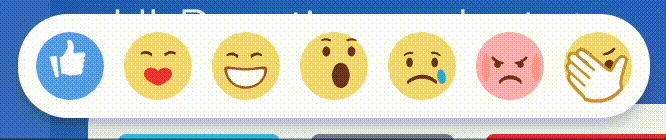

# Компонент для выбора реакции

Источник: https://dev.1c-bitrix.ru/api_d7/bitrix/ui/reactions_select/index.php

### Подключение

ReactionsSelect - компонент для выбора реакции.



### JS

```
import {ReactionsSelect} from 'ui.reactions-select';
```

### PHP

```
\Bitrix\Main\UI\Extension::load("ui.reactions-select");
<script>
const reactionsSelect = new BX.Ui.ReactionsSelect({
	position: {
		top: 0,
		left: 0,
	},
});
</script>
```

### Экспорты

```
export const reactionLottieAnimations = Object.freeze({
	like: likeAnimatedEmojiData,
	laugh: laughAnimatedEmojiData,
	wonder: wonderAnimatedEmojiData,
	cry: cryAnimatedEmojiData,
	angry: angryAnimatedEmojiData,
	facepalm: facepalmAnimatedEmojiData,
	kiss: admireAnimatedEmojiData,
});

export const reactionCssClass = Object.freeze({
	like: "reaction-icon_like",
	laugh: "reaction-icon_laugh",
	wonder: "reaction-icon_wonder",
	cry: "reaction-icon_cry",
	angry: "reaction-icon_angry",
	facepalm: "reaction-icon_facepalm",
	kiss: "reaction-icon_kiss",
});

export const reactionSelectEvents = Object.freeze({
	show: 'show',
	hide: 'hide',
	mouseenter: 'mouseenter',
	mouseleave: 'mouseleave',
	select: 'select',
	touchenter: 'touchenter',
	touchleave: 'touchleave',
	touchend: 'touchend',
	touchmove: 'touchmove',
})
```

### Параметры

	`name: string` – уникальное имя селекта, если не задано, то генерируется автоматически.
	`position: ReactionsSelectPosition` – позиция. Указывается либо HTML–элемент, рядом с которым появится селект, либо задается точная позиция с помощью top и left.
	`containerClassname: string` – дополнительный класс для контейнера с реакциями.

### Методы

	`show(): void` – отображает селект.
	`hide(): void` – скрывает селект (селект удаляется из DOM).
	`isShown(): boolean` – возвращает флаг, показывается ли в текущий момент селект.
	`getName(): string` – возвращает имя данного селекта.

### События

### Для десктопа

	`reactionSelectEvents.show` – эмитится каждый раз, когда вызывается метод **show**. Т.е. даже если селект уже показан и был вызван метод `show`, то все равно произойдет эмит события.
	`reactionSelectEvents.hide` – эмитится каждый раз при вызове метода **hide**, даже если попап уже закрыт.
	`reactionSelectEvents.mouseenter` – эмитится, когда мышь попадает в область селекта.
	`reactionSelectEvents.mouseleave` – эмитится, когда мышь выходит за область селекта.
	`reactionSelectEvents.select` – эмитится при выборе реакции. В **e.data.reactionName** будет находиться название выбранной реакции.

### Для мобильных устройств

	`reactionSelectEvents.touchenter` – эмитится, если тач был проведен в область селекта.
	`reactionSelectEvents.touchleave` – эмитится, если тач был выведен из области селекта.
	`reactionSelectEvents.touchend` – эмитится, если тач был убран с экрана.
	`reactionSelectEvents.touchmove` – эмитится, когда тач двигается по экрану.

### Пример кода

```
const showReactionsBtn = document.getElementById('show-reactions-btn');

const reactionsSelect = new BX.Ui.ReactionsSelect({
	position: showReactionsBtn,
})
	.subscribe(BX.Ui.ReactionsSelect.Events.mouseenter, () => addEvent('mouseenter'))
	.subscribe(BX.Ui.ReactionsSelect.Events.mouseleave, () => addEvent('mouseleave'))
	.subscribe(BX.Ui.ReactionsSelect.Events.show, () => addEvent('show'))
	.subscribe(BX.Ui.ReactionsSelect.Events.hide, () => addEvent('hide'))
	.subscribe(BX.Ui.ReactionsSelect.Events.select, (e) => addEvent(`select: e.data.reaction = ${e.data.reaction}`));

showReactionsBtn.addEventListener('click', () => {
	reactionsSelect.show();
});

hideReactionsBtn.addEventListener('click', () => {
	reactionsSelect.hide();
});
```
