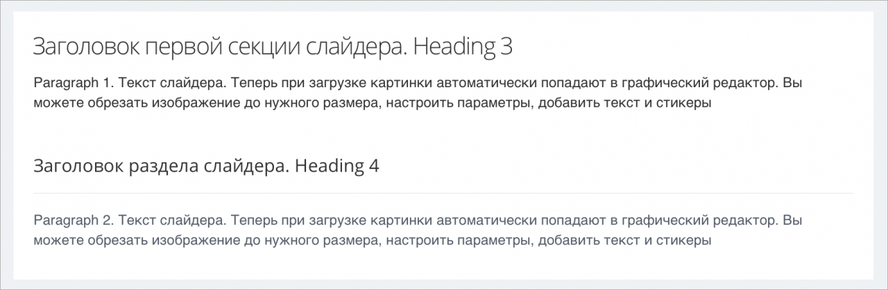
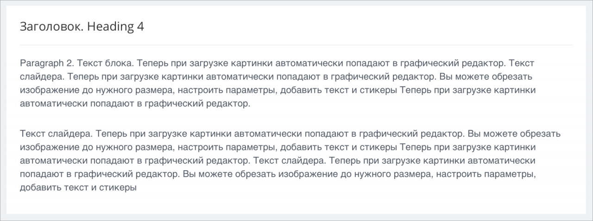
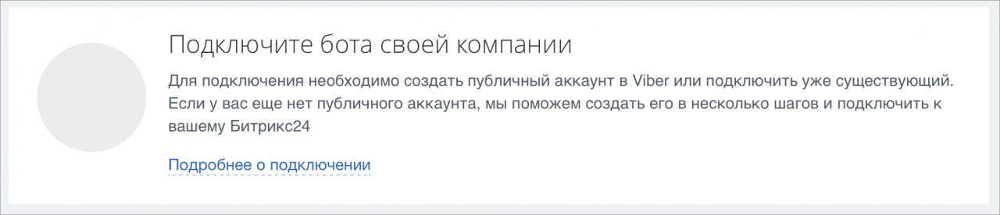
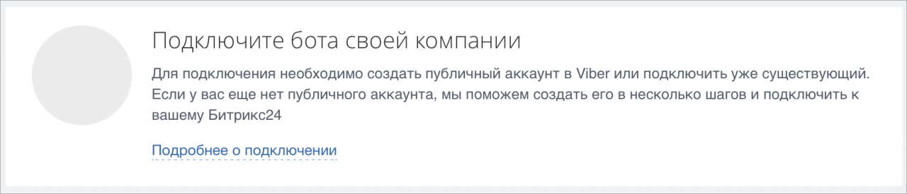
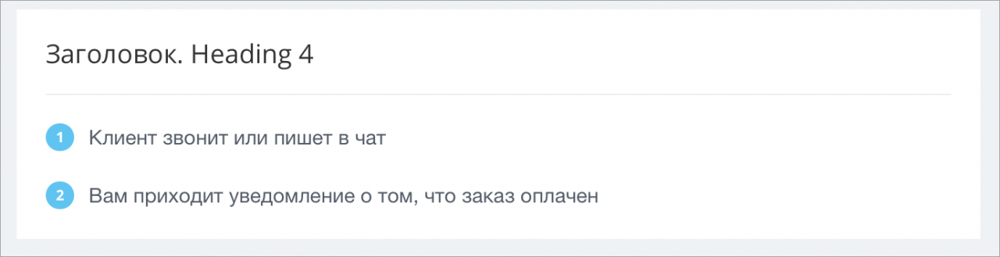
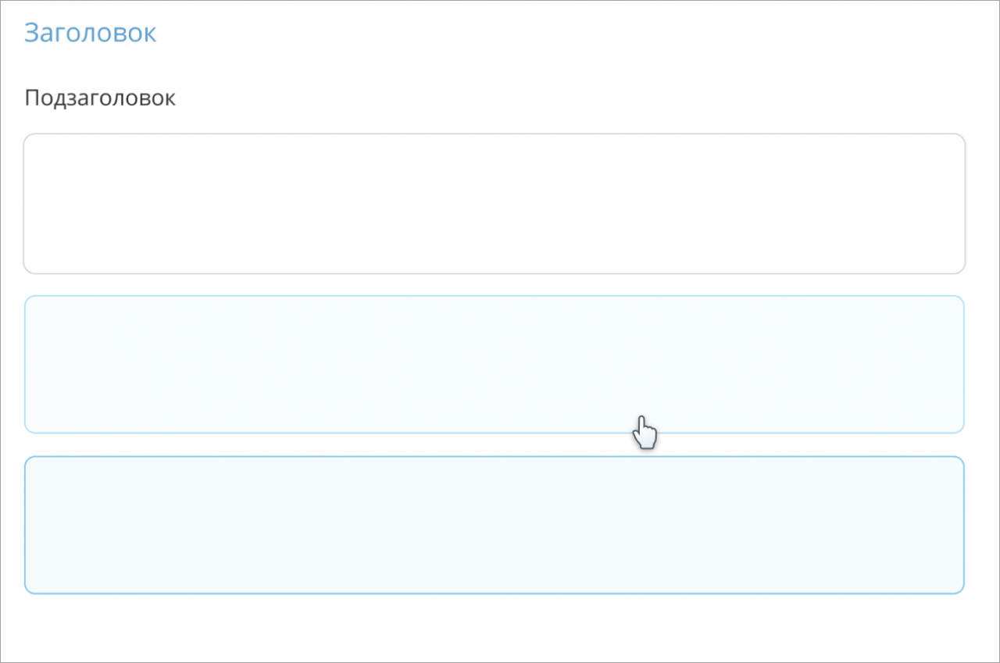
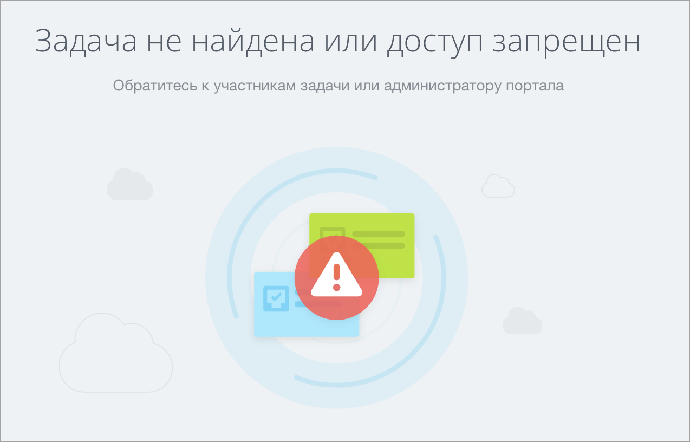

# Типовое использование

Источник: https://dev.1c-bitrix.ru/api_d7/bitrix/ui/sidepanel_content/index.php

### Подключение на PHP-странице

Если в слайдере необходимо вывести типовой контент, то обратите внимание на примеры, приведенные ниже.

### Подключение на PHP-странице

```
\Bitrix\Main\UI\Extension::load('ui.sidepanel-content');
```

**Важно**. Внешней обёрткой является блок `ui-slider-section`. Он разделяет контент на секции. Внутренней оберткой является блок `ui-slider-content-box`. Он разделяет контент внутри секций.

**Заголовки**: `ui-slider-heading-1`, `ui-slider-heading-2`, `ui-slider-heading-3`, `ui-slider-heading-4`.

**Подзаголовок**: `ui-slider-subtitle`.

**Текстовые блоки**: `ui-slider-paragraph`, `ui-slider-paragraph-2`.

**Ссылка**: `ui-slider-link`.

### Примеры верстки

 

```
<div class="ui-slider-section">
	<div class="ui-slider-content-box">
		<div class="ui-slider-heading-2">Заголовок первой секции слайдера. Heading 3</div>
		<p class="ui-slider-paragraph">Paragraph 1. Текст слайдера. Теперь при загрузке картинки автоматически попадают в графический редактор. Вы можете обрезать изображение до нужного размера, настроить параметры, добавить текст и стикеры</p>
	</div>
	<div class="ui-slider-content-box">
		<div class="ui-slider-heading-4">Заголовок раздела слайдера. Heading 4</div>
		<p class="ui-slider-paragraph-2">Paragraph 2. Текст слайдера. Теперь при загрузке картинки автоматически попадают в графический редактор. Вы можете обрезать изображение до нужного размера, настроить параметры, добавить текст и стикеры</p>
	</div>
</div>
```

 

```
<div class="ui-slider-section">
	<div class="ui-slider-heading-4">Заголовок. Heading 4</div>
	<p class="ui-slider-paragraph-2">Paragraph 2. Текст блока. Теперь при загрузке картинки автоматически попадают в графический редактор. Текст слайдера. Теперь при загрузке картинки автоматически попадают в графический редактор. Вы можете обрезать изображение до нужного размера, настроить параметры, добавить текст и стикеры Теперь при загрузке картинки автоматически попадают в графический редактор.</p>
	<p class="ui-slider-paragraph-2">Текст слайдера. Теперь при загрузке картинки автоматически попадают в графический редактор. Вы можете обрезать изображение до нужного размера, настроить параметры, добавить текст и стикеры Теперь при загрузке картинки автоматически попадают в графический редактор. Текст слайдера. Теперь при загрузке картинки автоматически попадают в графический редактор. Вы можете обрезать изображение до нужного размера, настроить параметры, добавить текст и стикеры</p>
</div>
```

### Позиционирование иконки

**Важно**: модификатор `ui-slider-section-icon-center` позиционирует иконку по центру, а с помощью `ui-slider-section-icon` иконка остается сверху.

 

 

```
<div class="ui-slider-section ui-slider-section-icon-center">
	<span class="ui-icon ui-slider-icon">
		<i></i>
	</span>
	<div class="ui-slider-content-box">
		<div class="ui-slider-heading-3">Подключите бота своей компании</div>
		<div class="ui-slider-inner-box">
			<p class="ui-slider-paragraph-2">Для подключения необходимо создать публичный аккаунт в Viber или подключить уже существующий. Если у вас еще нет публичного аккаунта, мы поможем создать его в несколько шагов и подключить к вашему Битрикс24</p>
			<a href="#" class="ui-slider-link">Подробнее о подключении</a>
		</div>
	</div>
</div>
```

### Внутренняя вложенность

**Важно**:в примере ниже меняется внутренняя вложенность, нужно обратить внимание на блоки `ui-slider-content-box`. Они разделяют верстку на верхнюю часть и нижнюю. Здесь появляется модификатор `ui-slider-section-column`, который добавляет свойство `flex-direction: column`, чтобы блоки `ui-slider-content-box` располагались друг под другом

```
<div class="ui-slider-section ui-slider-section-icon ui-slider-section-column">
	<div class="ui-slider-content-box">
		<div class="ui-icon ui-slider-icon">
			<i></i>
		</div>
		<div class="ui-slider-content-box">
			<div class="ui-slider-heading-3">Настройте двусторонний обмен с 1С контактами, компаниями, платежными документами в реальном режиме времени по самой современной модели RestAPI-подключения.</div>
			<div class="crm-onec-header-futures-container">
				<div class="crm-onec-header-futures-block">
					<span class="crm-onec-header-futures">
						<span class="crm-onec-header-futures-icon icon-1"></span>
						<span class="crm-onec-header-futures-text">Простое подключение</span>
					</span>
				</div>
				<div class="crm-onec-header-futures-block">
					<span class="crm-onec-header-futures">
						<span class="crm-onec-header-futures-icon icon-2"></span>
						<span class="crm-onec-header-futures-text">Легкая настройка</span>
					</span>
				</div>
				<div class="crm-onec-header-futures-block">
					<span class="crm-onec-header-futures">
						<span class="crm-onec-header-futures-icon icon-3"></span>
						<span class="crm-onec-header-futures-text">Обмен в реальном времени</span>
					</span>
				</div>
			</div>
			<hr class="crm-onec-separator">
			<div class="crm-onec-install-description">Нажмите кнопку "скачать", и Установщик проверит, соответствует ли ваша конфигурация 1С модулю интеграции Битрикс24.</div>
		</div>
	</div>
	<div class="ui-slider-content-box">
		<hr class="crm-onec-separator">
		<div class="crm-onec-button">
			<div class="ui-btn ui-btn-primary">Скачать</div>
			<div class="ui-btn ui-btn-default">Продолжить настройку</div>
		</div>
	</div>
</div>
```

### Заголовок



```
<div class="ui-slider-section">
	<div class="ui-slider-heading-4">Заголовок. Heading 4</div>
	<ul class="ui-slider-list">
		<li class="ui-slider-list-item">
			<span class="ui-slider-list-text">Клиент звонит или пишет в чат</span>
		</li>
		<li class="ui-slider-list-item">
			<span class="ui-slider-list-text">Вам приходит уведомление о том, что заказ оплачен</span>
		</li>
	</ul>
</div>
```

### Подзаголовок



```
<div class="ui-slider-section">
	<div class="ui-slider-heading-1">Заголовок</div>
	<div class="ui-slider-subtitle">Подзаголовок</div>
		<div class="ui-slider-frame --no-hover">
			<div>Фрейм без :hover</div>
		</div>
		<div class="ui-slider-frame">
			<div>Фрейм c hover, стандартное поведение</div>
		</div>
		<div class="ui-slider-frame --active">
			<div>Фрейм в состоянии active</div>
		</div>
		<div class="ui-slider-frame --last-element">
			<div>Фрейм без нижнего отступа</div>
		</div>
</div>
```

### Пример



```
<div class="ui-slider-no-access">
	<div class="ui-slider-no-access-inner">
		<div class="ui-slider-no-access-title">Задача не найдена или доступ запрещен</div>
		<div class="ui-slider-no-access-subtitle">Обратитесь к участникам задачи или администратору портала</div>
		<div class="ui-slider-no-access-img">
			<div class="ui-slider-no-access-img-inner"></div>
		</div>
	</div>
</div>
```
