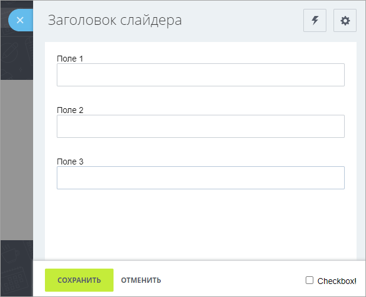
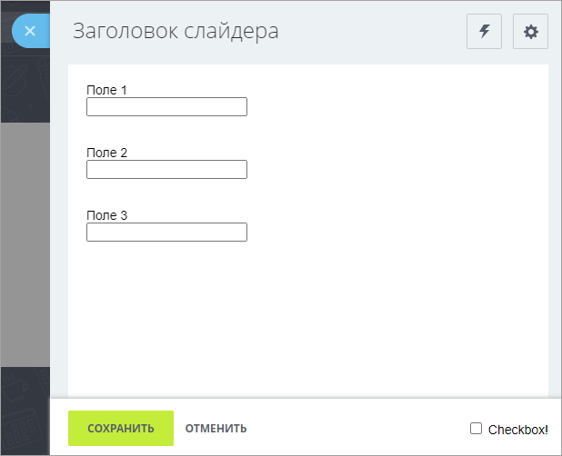

# Контентный слайдер. Верстка

Источник: https://dev.1c-bitrix.ru/api_d7/bitrix/ui/sidepanel_layout/index.php

### Начало работы

При работе с контентным слайдером иногда требуется вывести стандартный интерфейс с заголовком, контентом с отступами, панелью с кнопками сохранения и закрытия.



В этом случае приходится при открытии слайдера в параметре `contentCallback` указывать верстку, копируя или верстая заново.

Также, если из iframe-слайдера открыть контентный слайдер, то контент отобразится без стилей. Это вызвано тем, что необходимые ui-экстешны подключаются в документе iframe-слайдера, а контентный слайдер создается в документе top-окна.



Экстеншн `ui.sidepanel.layout` решает эти задачи подобно компоненту [ui.sidepanel.wrapper](../sidepanel_wrapper/index.php.md).

### Использование

Доступно с v22.400.200.

```
\Bitrix\Main\UI\Extension::load('ui.sidepanel.layout');
```

Рассмотрим типовой случай. Нужно открыть слайдер в типовом шаблоне с:

- заголовком
- тулбаром с кнопкой настройки
- формой на основе ui.forms
- панелью с кнопками


```
import {Layout} from 'ui.sidepanel.layout';

BX.SidePanel.Instance.open("demo:my-example", {
	width: 800,
	contentCallback: () => {
		return Layout.createContent({
			extensions: ['ui.forms'],
			title: 'Заголовок слайдера',
			toolbar ({Button})
			{
				return [
					new Button({
						icon: Button.Icon.SETTING,
						color: Button.Color.LIGHT_BORDER,
						onclick: () => alert('Settings!')
					}),
				];
			},
			content ()
			{
				return `
					<div>Поле 1</div>
					<div class="ui-ctl ui-ctl-textbox ui-ctl-w100">
						<input type="text" class="ui-ctl-element">
					</div><br><br>

					<div>Поле 2</div>
					<div class="ui-ctl ui-ctl-textbox ui-ctl-w100">
						<input type="text" class="ui-ctl-element">
					</div><br><br>

					<div>Поле 3</div>
					<div class="ui-ctl ui-ctl-textbox ui-ctl-w100">
						<input type="text" class="ui-ctl-element">
					</div>
				`;
			},
			buttons ({cancelButton, SaveButton})
			{
				return [
					new SaveButton({
						onclick: () => {
							alert('saved!');
							BX.SidePanel.Instance.close();
						}
					}),
					cancelButton,
				];
			},
		});
	},
});
```

Как видим в коде, в `contentCallback` возвращаем результат вызова `Layout.createContent`. Настройка верстки делается через параметры вызова `Layout.createContent`.
