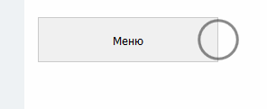

# Введение

Источник: https://dev.1c-bitrix.ru/api_d7/bitrix/ui/spotlight/introduction.php

**Spotlight** — элемент интерфейса в виде пульсирующего круга. При наведении курсора на круг, появляется диалог с подсказкой.

Область применения — показать старым или новым пользователям новинки продукта.

Spotlight можно показать 2 способами:

1. Подключить js-расширение spotlight и воспользоваться JavaScript API.
2. Подключить на странице компонент bitrix:spotlight с нужными настройками.

Дополнительно существует [PHP API](https://dev.1c-bitrix.ru/api_d7/bitrix/main/ui/spotlight/methods.php), c помощью которого можно узнать доступность подсказки для конкретного пользователя.
