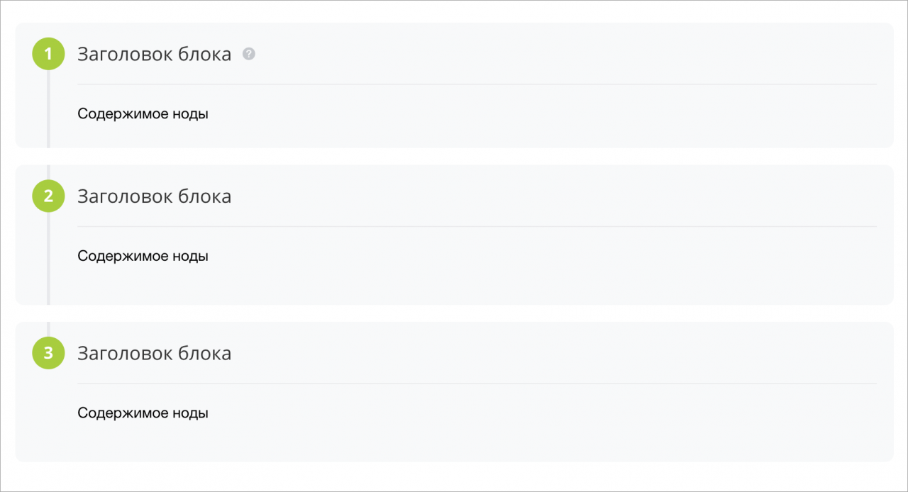

# Компонент-обёртка для пошаговых блоков

Источник: https://dev.1c-bitrix.ru/api_d7/bitrix/ui/stepbystep/index.php

### Подключение

Компонент `ui.stepbystep` является оберткой для вывода контента в пошаговых блоках.



### Подключение на PHP-странице

```
\Bitrix\Main\UI\Extension::load('ui.stepbystep');
```

### Подключение в JS

```
import {StepByStep} from 'ui.stepbystep';
```

### Использование

В js-коде необходимо инициализировать расширение и в target передать ноду, в которую будет рендериться контент.

### Пример вызова

```
const step = new BX.UI.StepByStep({
	target: document.querySelector('[data-role="step-by-step"]'),
	content: [
		{
			html: [
				{
					header: {
						title: 'Заголовок блока',
						hint: 'Текст подсказки hint'
					},
					node: `
						<div>
							Содержимое ноды
						</div>
					`,
				}
			]
		},
		{
			html: [
				{
					header: `Заголовок блока`,
					node: `
						<div>
							<p>Содержимое ноды</p>
						</div>
					`,
					nodeClass: 'my-class',
					backgroundColor: 'transparent'
				}
			]
		},
		{
			html: [
				{
					header: `Заголовок блока`,
					node: `
						<div>
							<p>Содержимое ноды</p>
						</div>
					`,
				}
			]
		}
	]
});

step.init();
```

В параметр `target` (*Node*) необходимо передать элемент, в который будет происходить рендер содержимого.

В параметр `content` (*45*) необходимо передать массив объектов. Объект содержит в себе заголовок и контент шага.

В параметр `header` (*string*), (*object*) необходимо передать строку, которая является заголовком шага, либо объект состоящий из заголовка title (string) и текста подсказки `hint` (*string*).

В параметр `node` (*Node*) передается контент блока.

В параметр `backgroundColor` (*tring*) передается цвет фона шагов (по умолчанию серый).
