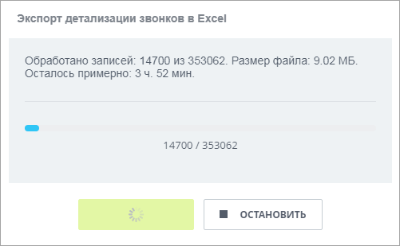
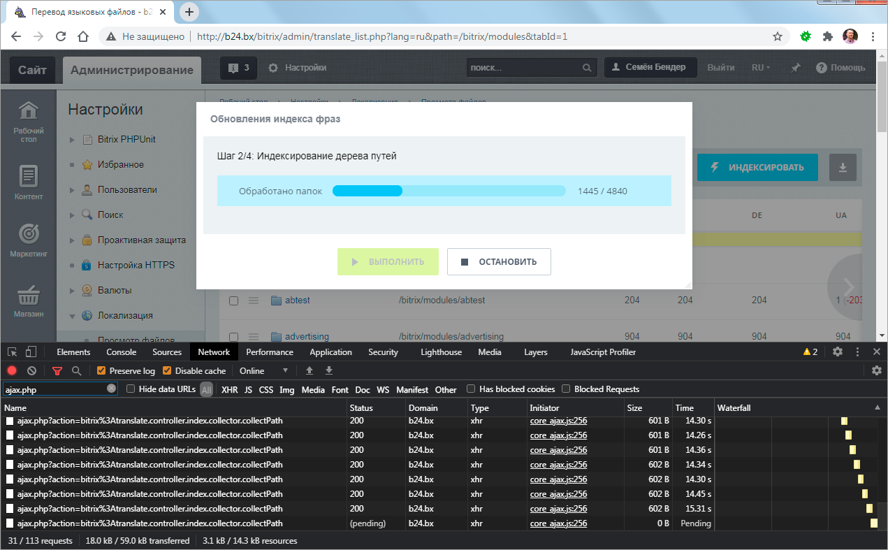
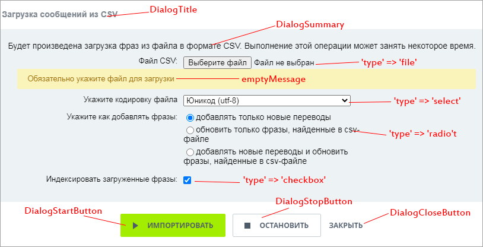
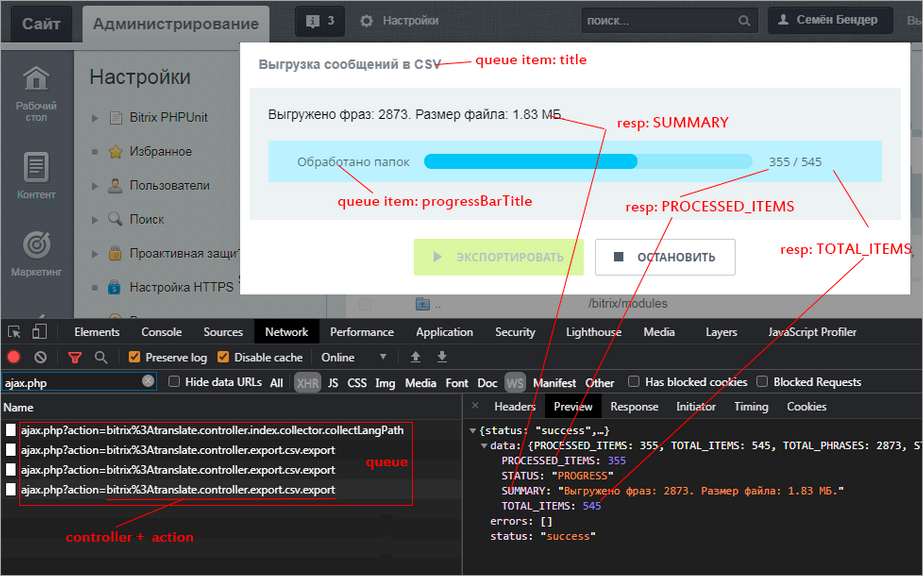
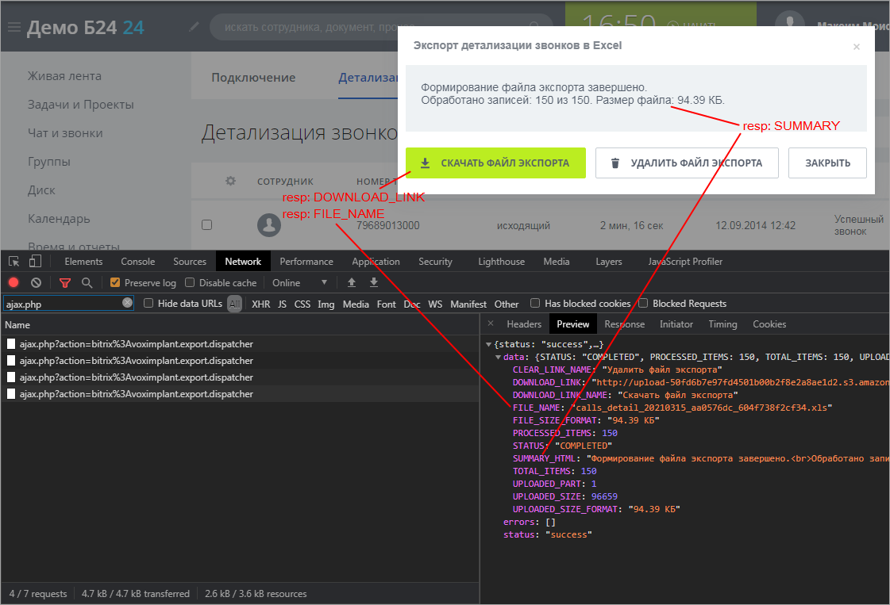

# Общее

Источник: https://dev.1c-bitrix.ru/api_d7/bitrix/ui/stepprocessing/basics.php

### Общий принцип работы

Универсальный диалог для запуска и контроля длительных пошаговых процессов. Серверная часть - [ajax-контроллер](https://dev.1c-bitrix.ru/learning/course/index.php?COURSE_ID=43&LESSON_ID=6436). Область применения — везде, где длительность работы скрипта превышает ограничение по времени жизни *php*-хита и есть возможность дробления процесса на порции/шаги.

Примеры использования этого механизма:

			экспорт

                    

		, импорт,

			индексация

                    

		, объёмные групповые действия.

### Общий принцип работы:

1. Формируется последовательная очередь заданий для ajax-контроллера или набора контроллеров.
2. Пользователь до старта процесса на диалоге может указать параметры запроса. Доступные типы полей: *select, checkbox, radio, file, textarea*.
3. После старта браузер шлет одинаковые запросы к контроллеру текущего пункта очереди, последовательно отрабатывая очередь заданий. Параметры, заданные на старте, повторяются на всех хитах к контроллеру, за исключением поля типа файл.
4. Ответ контроллера должен содержать статус процесса (продолжай/выполнено) и данные о прогрессе (всего/прогресс). При получении статуса "выполнено" выполняется переход к следующему пункту очереди.
5. Прогресс в ходе процесса отображается прогресс-баром и текстовыми аннотациями.
6. Процесс может прерваться на ошибке, выводимой на диалог.
7. Процесс также может быть прерван пользователем либо обработчиком события, или со стороны сервера при отправке поля *finalize* в ответе.
8. Если результатом работы процесса является файл, то на финальном шаге процесса можно вывести кнопку со ссылкой для скачивания файла и кнопку для удаления файла на сервере.

### Подключение

```
//php
\Bitrix\Main\UI\Extension::load("ui.stepprocessing");
```

```
//es6
import { Process, ProcessManager } from 'ui.stepprocessing';
```

### Инициализация процесса

Пример стартового диалога c полями для ввода пользователем:

 

Пример добавления нового экземпляра процесса в реестр процессов на странице.

```
// PHP
?><stript>
BX.UI.StepProcessing.ProcessManager.create(<?=Json::encode([
	'id' => 'import', // Уникальный идентификатор процесса в контексте страницы
	'controller' => 'bitrix:awesome.dancer', // дефолтый контроллер процесса
	'messages' => [
		// Для всех сообщений уже имеются фразы по-умолчанию.
		// Переопределение фразы необходимо для кастомизации под конкретную задачу.
		'DialogTitle' => Loc::getMessage('DialogTitle'), // Заголовок диалога
		'DialogSummary' => Loc::getMessage('DialogSummary'), // Аннотация на стартовом диалоге
		'DialogStartButton' => Loc::getMessage('DialogStartButton'), // Кнопка старт
		'DialogStopButton' => Loc::getMessage('DialogStopButton'), // Кнопка стоп
		'DialogCloseButton' => Loc::getMessage('DialogCloseButton'), // Кнопка закрыть
		'RequestCanceling' => Loc::getMessage('RequestCanceling'), // Аннотация, выводимая при прерывании процесса. По-умолчанию: 'Прерываю...'"
		'RequestCanceled' => Loc::getMessage('RequestCanceled'), // Аннотация, выводимая если процесс прерван
		'RequestCompleted' => Loc::getMessage('RequestCompleted'), // Текст на финальном диалоге успешного завершения
		'DialogExportDownloadButton' => Loc::getMessage('DialogExportDownloadButton'), // Кнопка для скачивания файла
		'DialogExportClearButton' => Loc::getMessage('DialogExportClearButton'), // Кнопка удаления файла
	],

	// Очередь заданий
	'queue' => [
		[
			'action' => 'tango', // действие контроллера
			'title' => Loc::getMessage('ACTION_UPLOAD', ['#NUM#' => 1, '#LEN#' => 3]), // аннотация диалога на шаге
			'progressBarTitle' => Loc::getMessage('ACTION_UPLOAD_PROGRESS'), // короткая аннотация для прогресс-бара
		],
		[
			'action' => 'swing',
			'title' => Loc::getMessage('IMPORT_CSV', ['#NUM#' => 2, '#LEN#' => 3]),
			'progressBarTitle' => Loc::getMessage('IMPORT_CSV_PROGRESS'),
		],
		[
			'controller' => 'bitrix:awesome.dancer.fest', // отдельный контроллер на шаге
			'params' => ['checkIndex' => 'Y'], // дополнительные параметры, добавляемые в запрос
			'action' => 'rumba',
			'title' => Loc::getMessage('INDEX', ['#NUM#' => 3, '#LEN#' => 3]),
			'progressBarTitle' => Loc::getMessage('INDEX_PROGRESS'),
		],
		...
		[
			'action' => 'finalize',
			'finalize' => true, // финальный шаг не отображается пользователю
		],
	],

	// параметры, добавляемые в запрос на всех хитах к контроллеру
	'params' => [
		'path' => "/bitrix/modules", // список {name: value}
		...
	],

	// поля, выводимые на стартовом диалоге
	'optionsFields' => [
		'csvFile' => [
			'name' => 'csvFile',// уникальное имя в рамках диалога
			'type' => 'file', // тип поля 'checkbox' | 'select' | 'radio' | 'text' | 'file'
			'title' => Loc::getMessage('UPLOAD_FILE'), // наименование поля
			'obligatory' => true, // обязателен для заполнения
			'emptyMessage' => Loc::getMessage('UPLOAD_FILE_ERROR'),//текст ошибки если не заполнено
		],
		'encodingIn' => [
			'name' => 'encodingIn',
			'type' => 'select',
			'title' => Loc::getMessage('ENCODING'),
			'list' => [
				'utf-8' => Loc::getMessage('ENCODING'),// список {value: title}
				...
			],
			'value' => 'utf-8',// значение по-умолчанию
			'multiple' => true, // селектор множественного выбора. Только для полей 'checkbox' | 'select'
		],
		...
	],
	'eventHandlers' => [
		'StateChanged' => '', // js-function обработчик на события StateChanged
		'RequestStart' => '', // js-function обработчик на события RequestStart
		'RequestStop' => '', // js-function обработчик на события RequestStop
		'RequestFinalize' => '', // js-function обработчик на события RequestFinalize
	],
	'showButtons' => [
		'start' => true, // вывести кнопку Старт. По-умолчанию: true
		'stop' => true, // вывести кнопку Стоп. По-умолчанию: true
		'close' => true, // вывести кнопку Закрыть. По-умолчанию: true
	],
])?>);
```

```
// javascript
var progress = (new BX.UI.StepProcessing.Process({
	'id': 'awesome',
	'controller': 'bitrix:awesome.dancer'
})

	.setQueue([{..}, {..}])// установить всю очередь заданий
	.addQueueAction({...}) // добавить отдельное задание

	// установить поля на стартовый диалог
	.setOptionsFields({
		'name': {...},
		...
	})
	// добвить отдельное поле
	.addOptionsField('name', {...})

	// параметры запроса
	.setParams({'key': 'any value'})
	.setParam('key', 'any value')

	// функции коллбеки
	.setHandlers({
		'StateChanged': function(ProcessState, ProcessResult){},
		'RequestStart': function(FormData){},
		'RequestStop': function(){},
		'RequestFinalize': function(){}
	})
	.setHandler('StateChanged', function(){})

	// фразы, выводимые на диалог и кнопки
	.setMessages({
		'DialogTitle': '', // Эти обязательно необходимо определить
		'DialogSummary': '', // Эти обязательно необходимо определить
		'DialogStartButton': 'Старт',
		'DialogStopButton': 'Стоп',
		'DialogCloseButton': 'Закрыть',
		'RequestCanceling': 'Отменяю..',
 		'RequestCanceled': 'Процесс остановлен',
		'RequestCompleted': 'Готово!',
		'DialogExportDownloadButton': 'Скачать файл',
		'DialogExportClearButton': 'Удалить файл'
	})
	.setMessage('DialogStartButton', 'Старт')

	.showDialog()
	.start();
```

### Отображение диалога

`ProcessManager.get(код процесса)` - получение ссылки на инстанс процесса по его уникальному коду.

`Process.showDialog()` - отображение диалога.

```
HTML
<button onclick="BX.UI.StepProcessing.ProcessManager.get('import').showDialog()" class="ui-btn ui-btn-primary">Импорт CSV</button>
```

### Старт процесса из js

`Process.start()` - стартует выполнение очереди заданий

```
//javascript
	BX.UI.StepProcessing.ProcessManager.get('smthng')
	.setParams(BX.ajax.prepareForm(form).data) // копирует параметры с формы на странице
	.showDialog() // отобразить диалог
	.start(/* номер задания в очереди */); // стартует выполнение очереди.
```

### Ответ контроллера

Ответ ajax-контроллера должен содержать обязательные поля:

- `TOTAL_ITEMS` - Общий объём элементов в обработке. Целое число;
- `PROCESSED_ITEMS` - Число уже обработанных элементов;
- `STATUS` - Статус выполнения текущего задания. Принимаются только два значения:

  - `PROGRESS` - задание еще не окончено, необходимо повторить запрос с теми же параметрами;
  - `COMPLETED` - задание выполнено, можно переходить к следующему;
- `SUMMARY` - Текстовая аннотация к результату выполненного действия.

Необязательные поля:

- `FINALIZE` - досрочно завершить текущий процесс;
- `WARNING` - текст предупреждения об нефатальных для процесса проблемах, который будет выведен на диалог;
- `NEXT_CONTROLLER` - в следующем запросе принудительно переключиться на этот контроллер;
- `NEXT_ACTION` - в следующем запросе выполнить это действие;
- `DOWNLOAD_LINK` - ссылка на скачивание сформированного файла;
- `FILE_NAME` - наименование файла для атрибута ссылки вида &lt;a href="https://dev.1c-bitrix.ru/api_d7/bitrix/ui/stepprocessing/${downloadLink}" download="${fileName}"&gt;;
- `DOWNLOAD_LINK_NAME` - Текст, выводимый на кнопку для скачивания файла;
- `CLEAR_LINK_NAME` - Текст, выводимый на кнопку для удаления файла.

А также любые дополнительные поля для обработки в обработчиках событий и функции колбек `StateChanged`.

```
//JSON
{
	"data":
		{
			"PROCESSED_ITEMS":355,
			"TOTAL_ITEMS":545,
			"STATUS":"PROGRESS",
			"SUMMARY":"Обработано 355 из 545 штук"
		},
	"status":"success", // стандартное поле ajax-контроллера BX.ajax
	"errors":[] // стандартное поле ajax-контроллера со списком ошибок
}
```

### Виды диалогов

Промежуточный вид диалога процесса:

 

Финальный вид диалога, с кнопками для скачивания файла:

 

### Функции колбеки на экземпляре процесса

В ходе цикла обработки очереди заданий вызываются следующие колбеки непосредственно в контексте экземпляра процесса:

- `StateChanged` - При смене состояния процесса на стороне клиента.
- Состояние процесса принимает следующие значения:

  - `ProcessState.intermediate` - ожидание действия пользователя;
  - `ProcessState.running` - процесс в работе;
  - `ProcessState.completed` - выполнено;
  - `ProcessState.stopped` - процесс прерван;
  - `ProcessState.error` - процесс остановлен из-за ошибки;
  - `ProcessState.canceling` - процесс прерывается.
- `RequestStart` - Колбек вызывается непоследственно перед ajax вызовом.
- `RequestStop` - Колбек вызывается при остановке процесса пользователем. Контроллер должен реализовать действие с именем cancel.
- `RequestFinalize` - Колбек вызывается при выполнении задания с параметром finalize, предназначенного для освобождения ресурсов и очистки временных данных. Контроллер должен реализовать действие с именем *finalize*.
- `StepCompleted` - Колбек вызывается если шаг очереди закончен.

```
// javascript
var progress = (new BX.UI.StepProcessing.Process({
		'id': 'awesome',
		'controller': 'bitrix:awesome.dancer'
	}))
	.setHandler(
		BX.UI.StepProcessing.ProcessCallback.StateChanged,
		function(ProcessState, ProcessResult){
		}
	)
	.setHandler(
		BX.UI.StepProcessing.ProcessCallback.RequestStart,
		function(FormData){
		}
	)
	.setHandler(
		BX.UI.StepProcessing.ProcessCallback.RequestStop,
		function(actionData){
		}
	)
	.setHandler(
		BX.UI.StepProcessing.ProcessCallback.RequestFinalize,
		function(actionData){
		}
	);
```

**Функции колбеки на отдельном шаге процесса**

Если требуется передавать или обрабатывать данные между отдельными итерациями одного шага, можно установить функции коллбеки на действии. Типы коллбеков полностью идентичны устанавливаемым на экземпляре процесса. Коллбек на действии имеет приоритет над аналогичным колбеком на экземпляре процесса, и будет вызван только он.

```
javascript
//javascript
var progress = (new BX.UI.StepProcessing.Process({
	'id': 'awesome',
	'controller': 'bitrix:awesome.dancer'
}))
	.addQueueAction({
'action': 'someaction',
'handlers': {
'StepCompleted': function (state, result)
{
/** @type {BX.UI.StepProcessing.Process} this */
}
}
})
```

### События, эмитируемые в глобал

В ходе цикла обработки очереди заданий выбрасываются следующие события:

- `BX.UI.StepProcessing.StateChanged` - Событие выбрасывается при смене состояния процесса.
- `BX.UI.StepProcessing.BeforeRequest` - Событие выбрасывается непосредственно перед ajax вызовом.
- `BX.UI.StepProcessing.Dialog.Shown` - Событие сразу после показа диалога.
- `BX.UI.StepProcessing.Dialog.Closed` - Событие сразу после закрытия диалога.
- `BX.UI.StepProcessing.Dialog.Start` - Событие после нажатия кнопки Старт.
- `BX.UI.StepProcessing.Dialog.Stop` - Событие после нажатия кнопки Стоп.

Подписка на событие:

```
// javascript
BX.Event.EventEmitter.subscribe(BX.UI.StepProcessing.ProcessEvent.BeforeRequest, function(event){
	/** @type {BX.Main.Event.BaseEvent} event */
	/** @type {BX.UI.StepProcessing.Process} process */
	var process = event.data.process ? event.data.process : {};
	var params = event.data.actionData ? event.data.actionData : {};

	...
});
```
