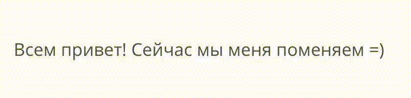

# Анимация смены текста

Источник: https://dev.1c-bitrix.ru/api_d7/bitrix/ui/textanimate/index.php

Javascript-расширение `ui.textanimate` осуществляет анимированную смену текста. Помогает показать изменение текстовой информации на странице.



**Подключение на PHP-странице:**

```
\Bitrix\Main\UI\Extension::load("ui.textanimate");
```

**Подключение в jS**

```
import {TextAnimate} from 'ui.textanimate';
```

**Использование**

В js-коде необходимо инициализировать анимацию у блока с текстом и передать в инициализацию новую строку. См. пример.

```
<div class="target-text">

var animate = new BX.UI.TextAnimate({
	container: document.querySelector('.target-text'),
	interval: 10
});

mask.init('Новый текст');
```

В параметр `container` необходимо передать элемент инпута. Параметр `interval` задаёт интервал смены символов (не обязателен).
