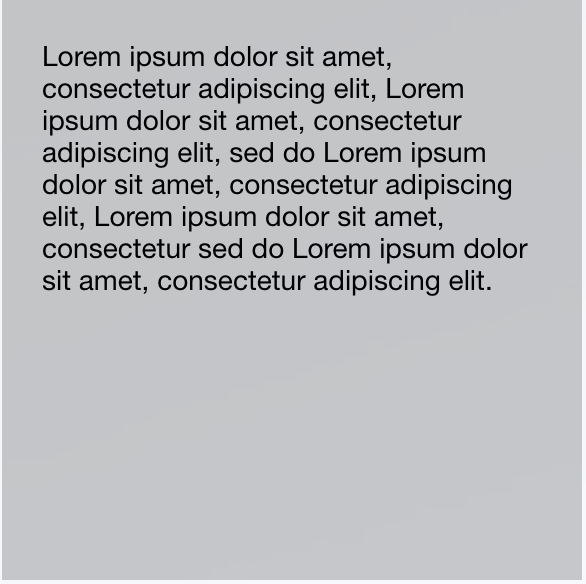
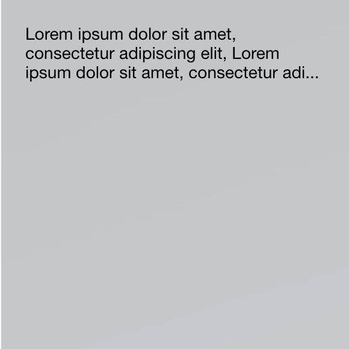

# Сокращение текста по высоте

Источник: https://dev.1c-bitrix.ru/api_d7/bitrix/ui/textcrop/index.php

### Описание

Javascript-расширение **ui.textcrop** осуществляет сокращение текста по высоте по заданному количеству строк. При сокращении подставляется троеточие в конце обрезанного текста и добавляется полный текст в атрибут `title`.

| Исходный вид блока: | После применения экстеншена: |
| --- | --- |
|  |  |

### Подключение и использование

#### Подключение

Подключение на PHP-странице

```
\Bitrix\Main\UI\Extension::load('ui.textcrop');
```

Подключение в jS

```
import {TextCrop} from 'ui.textcrop';
```

#### Использование

В js-коде необходимо инициализировать расширение и в target передать ноду, для которой нужно выполнить сокращение текста.

```
<div data-role="target">
	"Lorem ipsum dolor sit amet, consectetur adipiscing elit, Lorem ipsum dolor sit amet, consectetur adipiscing elit.
</div>

let text = new BX.UI.TextCrop({
	rows: 2,
	target: document.querySelector('[data-role="target"]'),
});

text.init();
```

В параметр **rows** необходимо передать количество строк, до которых хотите сократить текст.

В параметр **target** необходимо передать элемент который необходимо обрезать.
