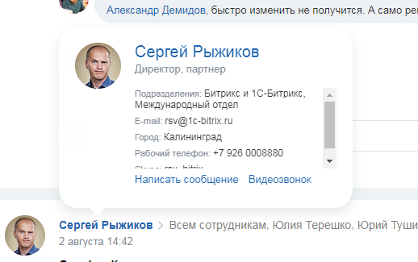

# ui.tooltip

Источник: https://dev.1c-bitrix.ru/api_d7/bitrix/ui/tooltip/index.php

Javascript-расширение ui.tooltip позволяет отображать карточку пользователя, которая

			всплывает при наведении

                    

		 на определенный элемент. Доступно с ui 17.6.6.

#### Подключение на PHP-странице

```
\Bitrix\Main\UI\Extension::load("ui.tooltip");
```

#### Использование

Чтобы карточка автоматически отображалась при наведении курсора на элемент, необходимо задать ему html-атрибут `bx-tooltip-user-id`. В этом атрибуте указывается идентификатор пользователя (ID):

```
<a href="https://dev.1c-bitrix.ru/company/personal/user/5/" bx-tooltip-user-id="5">Константин Константинопольский</a>
```

Чтобы "повесить" класс на всплывающую карточку (например, установить с его помощью стиль z-index), используйте атрибут `bx-tooltip-classname`:

```
<a href="https://dev.1c-bitrix.ru/company/personal/user/5/" bx-tooltip-user-id="5" bx-tooltip-classname="intranet-user-selector-tooltip">Константин Константинопольский</a>
```
