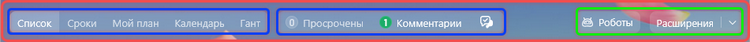

# Панель действий

Источник: https://dev.1c-bitrix.ru/api_d7/bitrix/ui/ui_actions_bar.php

Расширение `ui.actions-bar` задает стили для компоновки панели действий. Оно управляет выравниванием, отступами и расположением секций, таких как счетчики `ui.counterpanel` и навигационные панели `ui.navigationpanel`, а также кнопками действий в правой части.

### Подключение

**JS (ES6)**

```
import { RightButtons } from 'ui.actions-bar';

const options = {
    buttonsContainer: document.getElementById('buttons-container'),
    collapsable: true
};

const rightButtons = new RightButtons(options);
rightButtons.init();
```

**JS (ES5)**

```
var RightButtons = require('ui.actions-bar').RightButtons;

var options = {
    buttonsContainer: document.getElementById('buttons-container'),
    collapsable: true
};

var rightButtons = new RightButtons(options);
rightButtons.init();
```

**PHP**

```
 'Новая кнопка',
    'color' => Color::SUCCESS,
    'size' => Size::SMALL,
    'useAirDesign' => true
]);

// Получаем HTML-код кнопки
$buttonHtml = $button->render();
?>

```

> Использование класса `RightButtons` не является обязательным. Он предназначен только для автоматического сжатия кнопок при недостатке места. Можно подключить расширение `ui.actions-bar` и использовать его стили для компоновки панели без дополнительной логики.

### Использование с ui.counterpanel и ui.navigationpanel

Расширение `ui.actions-bar` позволяет располагать счетчик `ui.counterpanel` и навигационную панель `ui.navigationpanel`, используя специальные CSS-классы:

- `ui-actions-bar` — основной контейнер панели. Обозначен красной рамкой на изображении ниже.
- `ui-actions-bar__panel` — контейнеры для счетчиков `ui.counterpanel` и навигационной панели `ui.navigationpanel`. Обозначены синими рамками.
- `ui-actions-bar__buttons` — контейнер для кнопок. Обозначен зеленой рамкой.



Пример структуры:

```

...

Кнопка 1
       Кнопка 2

```

Расширение управляет выравниванием, отступами и гибкостью между секциями. Оно также позволяет расширить одну из секций на всю доступную ширину с помощью класса `--wide`.

### Класс RightButtons

Класс `RightButtons` управляет кнопками в правой части панели. При недостатке места он не скрывает кнопки, а сжимает их с помощью API кнопок: текст убирает и оставляет только иконку. Это позволяет сохранить видимость кнопки, но уменьшить занимаемое пространство.

> `RightButtons` может влиять на внешний вид старых кнопок. Он автоматически приводит их к новому стилю, что может быть нежелательным побочным эффектом. Если нужно сохранить прежний внешний вид кнопок, не используйте `RightButtons`.

**Методы класса**

| Метод | Описание | Параметры | Возвращаемое значение |
| --- | --- | --- | --- |
| `init(): void` | Инициализирует компонент, создает наблюдателей за изменением размера и содержимого контейнера | — | — |

**Параметры конструктора RightButtonsOptions**

| Параметр
`тип` | Описание | Обяз. |
| --- | --- | --- |
| buttonsContainer
`HTMLElement` | DOM-элемент, содержащий кнопки | Да |
| collapsable
`boolean` | Флаг указывает, нужно ли включить автоматическое сжатие кнопок при недостатке места | Нет |

### Примеры использования

Простой пример с контейнером и кнопками

```
const options = {
    buttonsContainer: document.getElementById('buttons-container'),
    collapsable: true
};

const rightButtons = new RightButtons(options);
rightButtons.init();
```

Пример с динамическим добавлением кнопки через API

```
import { Button, ButtonColor, ButtonSize } from 'ui.buttons';

const button = new Button({
    text: 'Новая кнопка',
    color: ButtonColor.DEFAULT,
    size: ButtonSize.SMALL,
    useAirDesign: true
});

const buttonElement = button.render();
document.getElementById('buttons-container').appendChild(buttonElement);

// После добавления кнопки, необходимо перезапустить инициализацию
rightButtons.init();
```

### Дополнительная информация

- Расширение использует `ResizeObserver` и `MutationObserver` для отслеживания изменений в DOM и автоматического управления кнопками.
