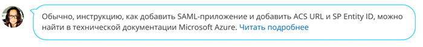
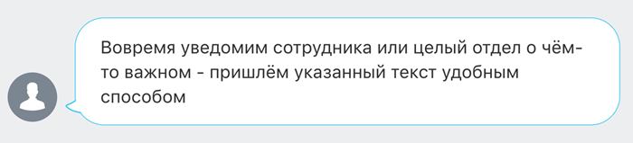
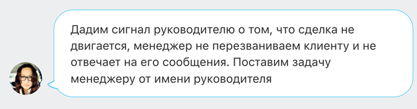

# Блок с советом

Источник: https://dev.1c-bitrix.ru/api_d7/bitrix/ui/ui_advice.php

Компонент ui_advice отображает блок с советом.



#### Подключение

JS

```
import {Advice} from 'ui.advice';
```

PHP

```
\Bitrix\Main\UI\Extension::load("ui.advice");
```

#### Параметры

| Параметр<br>`тип` | Описание |
| --- | --- |
| avatarImg<br>`string` | Аватар. Укажите путь до изображения с аватаром.<br><br>Если аватар не указан, используется значение по умолчанию.<br><br> |
| anglePosition<br>`string` | Позиция уголка. Задает положение аватара и уголка относительно сообщения. <br><br>Принимает два значения:<br><br>- `'top'` — вверху<br>- `'bottom'` — внизу<br><br>Значения хранятся в Advice.AnglePosition |
| content<br>`string` | Cодержимое блока с советом. Поддерживает HTML элементы |

#### Примеры

1. Пример с контентом в виде текста
  ```
  import {Advice} from 'ui.advice';
  const container = document.body;
  const contentString = `Дадим сигнал руководителю о том, что сделка не двигается,
      менеджер не перезванивает клиенту и не отвечает на его сообщения.
      Поставим задачу менеджеру от имени руководителя`;
  const advice = new Advice({
      avatarImg: '../images/avatarImg.png',
      content: contentString,
      anglePosition: Advice.AnglePosition.BOTTOM,
  });
  advice.renderTo(container);
  ```
  
2. Пример с контентом в виде HTML элемента
  ```
  import {Advice} from 'ui.advice';
  const container = document.body;
  const contentString = `Обычно, инструкцию, как добавить SAML-приложениеи добавить
  ACS URL и SP Entity ID, можно найти в технической документации Microsoft Azure`;
  const adviceText = Dom.create('span', {
      children: [
          `${contentString} `
      ],
  });
  const readMoreLink = Dom.create('a', {
      props: {
          text: contentString,
      },
      attrs: {
          target: '_blank',
          href: '/link',
      }
  });
  const adviceContent = Dom.create('div', {
      children: [
          adviceText,
          readMoreLink,
      ]
  });
  const advice = new Advice({
      avatarImg: '../images/avatarImg.png',
      content: adviceContent,
      anglePosition: Advice.AnglePosition.TOP,
  });
  advice.renderTo(container);
  ```
  
