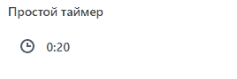
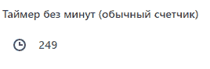

# Таймер обратного отсчета

Источник: https://dev.1c-bitrix.ru/api_d7/bitrix/ui/ui_countdown.php

Расширение `ui.countdown` добавляет таймер обратного отсчета. Доступно с версии ui 24.200.400.


#### Подключение

JS

```
import { Countdown } from 'ui.countdown'; // es6
new Countdown(props);

new BX.UI.Countdown(props); // es5
```

PHP

```
\Bitrix\Main\UI\Extension::load('ui.countdown');
```

#### Параметры

| Параметр<br>`тип` | Описание |
| --- | --- |
| props<br>`Object` | Коллекция параметров |

**Параметр** `props`

| Параметр<br>`тип` | Описание |
| --- | --- |
| seconds<br>`number` | Количество секунд для обратного отсчета. По умолчанию — `0` |
| node<br>`HTMLElement` | Ссылка на DOM-элемент, в котором будет выведен таймер.<br>        <br>        <br><br>Внутри этого элемента будет только таймер. При инициализации таймера все дочерние элементы будут очищены. |
| showIcon<br>`boolean` | Показывать ли иконку перед таймером. По умолчанию — `true` |
| iconClass<br>`string \| null` | CSS класс для своей иконки. <br>        <br><br>По умолчанию `ui-icon-set --clock-2` — иконка часиков, как на картинке в начале.<br><br> <br>        <br><br>При использовании сета иконок из ui-icon-set подключите [соответствующий пакет](icon_set/index.php.md) |
| showMinutes<br>`boolean` | Делить ли секунды на минуты. По умолчанию — `true`.<br>        <br>        <br><br>Например, если передали `150` секунд:<br><br>        <br>- при значении `true` таймер начнет отсчет с `2:30`<br>- при значении `false` — обратный отсчет чисел со `150` секунд |
| interval<br>`number` | Интервал между тактами в миллисекундах для регулировки скорости отсчета. По умолчанию — `1000`.<br>        <br><br>Примеры:<br><br>        <br>- При значении `1000` отсчет идет со скоростью 1 элемент в секунду<br>- При значении `200` отсчет идет со скоростью 5 элементов в секунду |
| needStartImmediately<br>`boolean` | Начать ли отсчет автоматически. Может иметь значения:<br>        <br>- `true` — запускать отсчет автоматически при инициализации<br>- `false` — дождаться команды старта<br><br>        <br><br>По умолчанию — `true` |
| hideAfterEnd<br>`boolean` | Скрывать таймер после окончания отсчета. По умолчанию равен `false` — таймер останавливается на нуле |
| onTimerEnd<br>`function` | Колбэк, вызываемый при достижении нуля. Например, можно сделать кнопку активной |

#### Примеры использования

1. Простой таймер на 20 секунд
  ```
      <div id="simple-timer"></div>
      import { Countdown } from 'ui.countdown'; // es6
      new Countdown({
          seconds: 20,
          node: document.querySelector('#simple-timer'),
      });
  ```
  
2. Таймер без минут (обычный счетчик)
  ```
      <div id="simple-timer"></div>
      import { Countdown } from 'ui.countdown'; // es6
      new Countdown({
          seconds: 250,
          showMinutes: false,
          node: document.querySelector('#long-timer-without-minutes'),
      });
  ```
  
3. Таймер с колбэком
  ```
      <div id="callback"></div>
      <div id="button" style="margin-left: 20px;"></div>
      import { Countdown } from 'ui.countdown'; // es6
      import { Button, ButtonSize, ButtonColor } from 'ui.button';
      const button = new Button({
          text: 'Отправить',
          size: ButtonSize.SMALL,
          color: ButtonColor.PRIMARY,
      });
      button.renderTo(document.querySelector('#button'));
      new Countdown({
          seconds: 5,
          node: document.querySelector('#callback'),
          onTimerEnd: () => {
              button.setDisabled();
          },
      });
  ```
