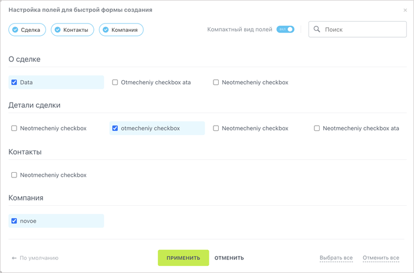

# Диалог Форма быстрых полей

Источник: https://dev.1c-bitrix.ru/api_d7/bitrix/ui/ui_dialogs_checkbox_list.php

Компонент `ui.dialogs.checkbox-list` выводит попап с чекбоксами для настройки вывода вашего контента.



#### Подключение

JS

```
import {CheckboxList} from 'ui.dialogs.checkbox-list';
```

PHP

```
\Bitrix\Main\UI\Extension::load('ui.dialogs.checkbox-list');
```

#### Использование

В js-коде необходимо инициализировать расширение и передать json.

#### Параметры

Обязательные параметры отмечены *

| Параметр<br>`тип` | Описание |
| --- | --- |
| popupOptions<br>`popupOptions` | Добавление параметров в popup |
| columnCount<br>`number` | Количество столбцов при отображении popup. По умолчанию имеет значение `4` |
| lang*<br>`object` | Заголовок окна title `string`. <br>        <br>        <br><br>При необходимости возможно заменить фразы на кнопках:<br><br>        <br>- switcher `string` — текст вместо «Компактный вид полей»<br>- placeholder `string` — placeholder поля поиска<br>- defaultBtn `string` — текст ссылки «По умолчанию»<br>- acceptBtn `string` — текст кнопки «Применить»<br>- cancelBtn `string` — текст кнопки «Отменить»<br>- selectAllBtn `string` — текст ссылки «Выбрать все»<br>- deselectAllBtn `string` — текст ссылки «Отменить все» |
| compactField<br>`object` | Значение `switcher`:<br>        <br>- value `boolean` — его текущее состояние<br>- defaultValue `boolean` — значение по умолчанию |
| sections<br>`array` | Массив объектов с данными о секции:<br>        <br>- title `string` — заголовок секции<br>- key `string` — уникальный ключ<br>- value `boolean` — включена или выключена секция |
| categories*<br>`array` | Массив объектов с описаниями категорий:<br>        <br>- title `string` — заголовок категории<br>- key `string` — уникальный ключ<br>- sectionKey `string` — ключ секции, к которой относится категория |
| options*<br>`Array` | Массив объектов с описаниями опций в виде чекбоксов:<br>        <br>- title `string` — заголовок опции<br>- value `boolean` — включена или выключена опция<br>- defaultValue `boolean` — значение, которое будет установлено после клика по «← По умолчанию»<br>- categoryKey `string` — ключ категории к которой относится опция<br>- id `string` — уникальный `id` |
| events*<br>`object` | Передается событие onApply. Оно срабатывает при нажатии на кнопку Применить. |

#### Методы

| Метод | Описание |
| --- | --- |
| `show(): void` | Отображает диалог на странице |
| `show(): void` | Скрывает диалог на странице |

#### Пример вызова

```
const checkboxList = new BX.UI.CheckboxList({
    popupOptions: {
        width: 1100,
    },
    columnCount: 4,
    lang: {
        title: 'Настройка полей для быстрой формы создания',
    },
    compactField: {
        value: true,
        defaultValue: true,
    },
    sections: [
        {
            key: 'SECTION_1',
            title: 'Сделка',
            value: true,
        },
    ],
    categories: [
        {
            title: 'О сделке',
            sectionKey: 'SECTION_1',
            key: 'about'
        },
    ],
    options: [
        {
            title: 'Дата',
            value: true,
            categoryKey: 'about',
            defaultValue: true,
            id: '1',
        },
        {
            title: 'Не отмеченный чекбокс',
            value: false,
            categoryKey: 'about',
            defaultValue: true,
            id: '2',
        },
    ],
    events: {
        onApply: (event) => {
            console.log("event.data",  event.data.fields);
        },
    },
});

checkboxList.show();
```
