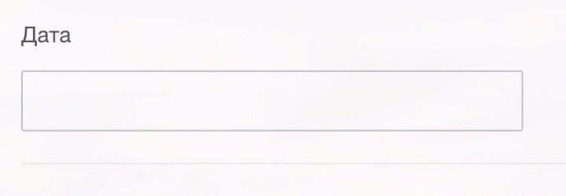

# Маска ввода

Источник: https://dev.1c-bitrix.ru/api_d7/bitrix/ui/ui_inputmask.php

Расширение `ui.inputmask` осуществляет ввод в инпут по заранее заданной маске.

> Внимание. На текущий момент расширение работает только с числовыми символами маски.



#### Подключение

JS

```
import {Mask} from 'ui.inputmask';
```

PHP

```
\Bitrix\Main\UI\Extension::load("ui.inputmask");
```

#### Использование

В js-коде необходимо инициализировать маску у поля ввода.

```
    <input type="text" class="target-input">

    const mask = new Mask({
    	container: document.querySelector('.target-input'),
    	mask: '+7 (xxx) xxx xxxx'
    });

    mask.init()
```

В параметр `container` необходимо передать элемент инпута.

Параметр `mask` задает необходимую маску для ввода, где `x` обозначает положение символа при вводе маски.
